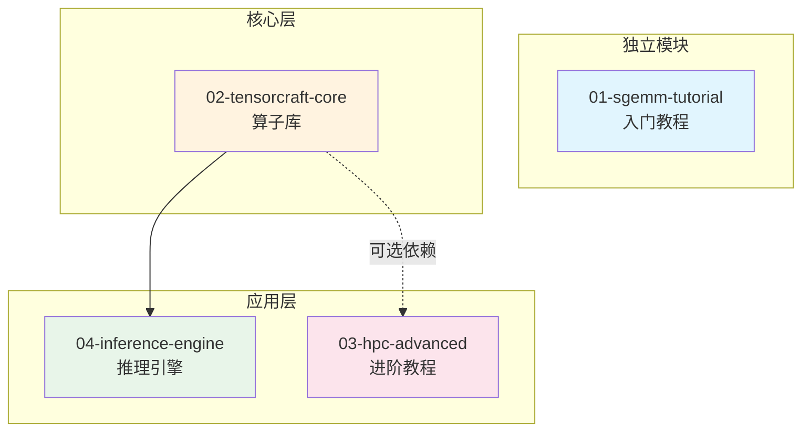

# 🚀 CUDA Kernel Academy

<p align="center">
  <b>从零到极致：系统性学习 CUDA 高性能算子开发</b><br>
  <i>A Comprehensive Learning Path for High-Performance CUDA Kernel Development</i>
</p>

<p align="center">
  
  
  
  
</p>

---

## 📖 项目简介

**CUDA Kernel Academy** 是一个系统性的 CUDA 高性能计算学习项目，包含从入门到进阶的完整学习路径。本项目整合了4个相互关联的子项目，形成一个渐进式的学习体系。

## 🎯 项目特色

- **渐进式学习路径**：从简单的 SGEMM 到复杂的推理引擎
- **工业级代码质量**：Modern C++17/20，完整的测试覆盖
- **最新架构支持**：支持 Volta 到 Hopper/Blackwell 架构
- **实战导向**：每个模块都有可运行的 benchmark 和示例

## 📁 项目结构

```
cuda-kernel-academy/
├── common/                     # 🔧 共享基础设施
│   └── include/cuda_academy/   # 统一的工具库
├── 01-sgemm-tutorial/          # 🎓 入门：SGEMM 优化教程
├── 02-tensorcraft-core/        # 🔧 核心：高性能算子库
├── 03-hpc-advanced/            # 🚀 进阶：CUDA 13 新特性
├── 04-inference-engine/        # 🧠 应用：推理引擎框架
├── docs/                       # 📚 文档
│   ├── CODING_STYLE.md         # 代码风格指南
│   └── integration_examples.md # 集成示例
├── .clang-format               # 代码格式化配置
└── README.md
```

## 🗺️ 学习路径

```
┌─────────────────────────────────────────────────────────────────────────────┐
│                           CUDA Kernel Academy                                │
├─────────────────────────────────────────────────────────────────────────────┤
│                                                                             │
│  ┌─────────────────────────────────────────────────────────────────────┐   │
│  │ Level 1: 入门 (1-2周)                                                │   │
│  │ 📂 01-sgemm-tutorial                                                 │   │
│  │ • 从零实现 SGEMM                                                     │   │
│  │ • 5种优化版本：Naive → Tiled → Bank-Free → Double Buffer → Tensor Core│   │
│  │ • 简单 Makefile 构建，无外部依赖                                      │   │
│  └────────────────────────────────┬────────────────────────────────────┘   │
│                                   │                                         │
│                                   ▼                                         │
│  ┌─────────────────────────────────────────────────────────────────────┐   │
│  │ Level 2: 核心库 (2-3周)                                              │   │
│  │ 📂 02-tensorcraft-core                                               │   │
│  │ • Header-only 算子库                                                 │   │
│  │ • GEMM / Attention / Convolution / Normalization / Sparse           │   │
│  │ • 工业级 API 设计，Python 绑定                                        │   │
│  └────────────────────────────────┬────────────────────────────────────┘   │
│                                   │                                         │
│                    ┌──────────────┴──────────────┐                          │
│                    ▼                              ▼                          │
│  ┌─────────────────────────────┐  ┌─────────────────────────────┐          │
│  │ Level 3: 进阶 (3-4周)       │  │ Level 4: 应用 (4-6周)       │          │
│  │ 📂 03-hpc-advanced          │  │ 📂 04-inference-engine      │          │
│  │ • CUDA 13 新特性            │  │ • 完整推理引擎框架          │          │
│  │ • TMA / Cluster / FP8       │  │ • Memory Pool / Stream Mgr  │          │
│  │ • Register Tiling           │  │ • Auto-tuner / Quantization │          │
│  │ • Software Pipelining       │  │ • MNIST Demo                │          │
│  │ • RapidCheck 属性测试       │  │                             │          │
│  └─────────────────────────────┘  └─────────────────────────────┘          │
│                                                                             │
└─────────────────────────────────────────────────────────────────────────────┘
```

## 🔗 模块依赖关系



## 📊 模块对比

| 特性 | 01-sgemm-tutorial | 02-tensorcraft-core | 03-hpc-advanced | 04-inference-engine |
|------|-------------------|---------------------|-----------------|---------------------|
| **定位** | 入门教程 | 核心算子库 | 进阶教程 | 应用框架 |
| **难度** | ⭐ | ⭐⭐ | ⭐⭐⭐ | ⭐⭐⭐ |
| **构建系统** | Makefile | CMake | CMake | CMake |
| **C++标准** | C++17 | C++17/20 | C++20 | C++17 |
| **外部依赖** | 无 | 无 | CUTLASS, RapidCheck | tensorcraft-core |
| **GEMM优化** | 5级 | 4级 | 7级 | 依赖核心库 |
| **Tensor Core** | WMMA | WMMA | WMMA + MMA PTX | 依赖核心库 |
| **CUDA 13特性** | ❌ | ❌ | ✅ TMA/Cluster/FP8 | ❌ |
| **Python绑定** | ❌ | ✅ pybind11 | ✅ Nanobind | ❌ |
| **属性测试** | ❌ | ❌ | ✅ RapidCheck | ❌ |

## 🛠️ 快速开始

### 环境要求

| 依赖 | 最低版本 | 推荐版本 |
|------|----------|----------|
| CUDA Toolkit | 11.0 | 12.0+ |
| CMake | 3.20 | 3.24+ |
| C++ 编译器 | GCC 9 / Clang 10 | GCC 11+ |
| GPU 架构 | sm_70 (Volta) | sm_80+ (Ampere) |

### 克隆仓库

```bash
git clone https://github.com/yourusername/cuda-kernel-academy.git
cd cuda-kernel-academy
```

### 构建各模块

```bash
# Level 1: SGEMM 教程 (Makefile)
cd 01-sgemm-tutorial
make GPU_ARCH=sm_86
./build/sgemm_benchmark

# Level 2: 核心算子库 (CMake)
cd ../02-tensorcraft-core
mkdir build && cd build
cmake .. -DCMAKE_BUILD_TYPE=Release
make -j$(nproc)
ctest --output-on-failure

# Level 3: 进阶教程 (CMake)
cd ../../03-hpc-advanced
mkdir build && cd build
cmake .. -DCMAKE_BUILD_TYPE=Release -GNinja
ninja
ctest --output-on-failure

# Level 4: 推理引擎 (CMake)
cd ../../04-inference-engine
mkdir build && cd build
cmake .. -DCMAKE_BUILD_TYPE=Release
make -j$(nproc)
./benchmark
```

## 📚 核心技术覆盖

### GEMM 优化路径

| 优化级别 | 技术 | 性能提升 | 模块 |
|----------|------|----------|------|
| Level 1 | Naive (三层循环) | 基准 | 01, 02, 03 |
| Level 2 | Shared Memory Tiling | 5-10x | 01, 02, 03 |
| Level 3 | Bank Conflict Free | +10-30% | 01 |
| Level 4 | Double Buffering | +10-20% | 01, 02, 03 |
| Level 5 | Register Tiling | +50% | 03 |
| Level 6 | Tensor Core (WMMA) | 3-4x | 01, 02, 03 |
| Level 7 | Tensor Core (MMA PTX) | +10% | 03 |
| Level 8 | Software Pipelining | +10% | 03 |

### 算子覆盖

| 类别 | 算子 | 模块 |
|------|------|------|
| **Elementwise** | ReLU, GeLU, SiLU, Sigmoid | 02, 03 |
| **Normalization** | LayerNorm, RMSNorm, BatchNorm | 02, 03 |
| **GEMM** | FP32, FP16, INT8 | 01, 02, 03 |
| **Attention** | FlashAttention, RoPE, MoE TopK | 02, 03 |
| **Convolution** | Conv2D, Im2Col, Winograd | 02, 03 |
| **Sparse** | SpMV, SpMM (CSR/CSC) | 02 |
| **Quantization** | INT8, FP8 | 03, 04 |

## 🎓 学习建议

### 初学者 (1-2周)

1. 从 `01-sgemm-tutorial` 开始
2. 理解 CUDA 编程模型和内存层次
3. 掌握 Coalescing、Tiling、Bank Conflict 概念
4. 完成 5 种 SGEMM 优化版本

### 进阶者 (2-4周)

1. 学习 `02-tensorcraft-core` 的 API 设计
2. 理解 Attention、Convolution 等复杂算子
3. 尝试在自己的项目中集成 tensorcraft

### 专家 (4-8周)

1. 深入 `03-hpc-advanced` 的 CUDA 13 特性
2. 学习 Register Tiling 和 Software Pipelining
3. 使用 RapidCheck 进行属性测试
4. 构建完整的推理引擎 (`04-inference-engine`)

## 🤝 贡献指南

欢迎贡献！请先阅读 [代码风格指南](docs/CODING_STYLE.md)。

### 代码规范

- **C++ 标准**: C++17 (最低), C++20 (推荐)
- **命名规范**: snake_case (函数/变量), PascalCase (类/结构体)
- **格式化**: 使用 `.clang-format` 配置
- **错误处理**: 使用 `CA_CUDA_CHECK` 宏

### 贡献方向

- 🐛 Bug 修复
- 📝 文档改进
- ⚡ 性能优化
- 🧪 测试覆盖
- 🆕 新算子实现

## 📄 License

MIT License - 详见 [LICENSE](LICENSE) 文件

## 🙏 致谢

- [NVIDIA CUTLASS](https://github.com/NVIDIA/cutlass) - 高性能 GEMM 模板库
- [FlashAttention](https://github.com/Dao-AILab/flash-attention) - IO-aware Attention
- [Simon Boehm's CUDA Tutorials](https://siboehm.com/articles/22/CUDA-MMM) - GEMM 优化教程

---

<p align="center">
  <b>Happy CUDA Hacking! 🚀</b>
</p>
