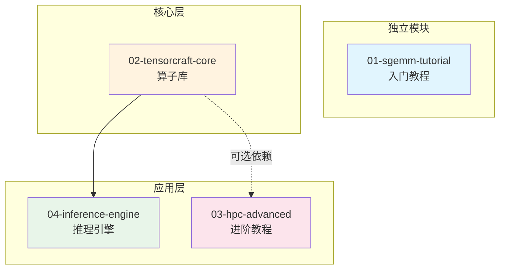

# CUDA Kernel Academy

[English](README.md) | 简体中文

<p align="center">
  <b>从零到极致：系统性学习 CUDA 高性能算子开发</b><br>
  <i>A Comprehensive Learning Path for High-Performance CUDA Kernel Development</i>
</p>

<p align="center">
  <a href="https://github.com/LessUp/cuda-kernel-academy/actions/workflows/ci.yml"></a>
  
  
  <a href="LICENSE"></a>
  
  <br/>
  <a href="https://github.com/LessUp/cuda-kernel-academy/stargazers"></a>
  
  <a href="https://github.com/LessUp/cuda-kernel-academy/issues"></a>
  <a href="CONTRIBUTING.md"></a>
  <a href="https://lessup.github.io/cuda-kernel-academy/"></a>
</p>

---

## � 目录

- [项目简介](#-项目简介)
- [项目特色](#-项目特色)
- [项目结构](#-项目结构)
- [学习路径](#%EF%B8%8F-学习路径)
- [快速开始](#%EF%B8%8F-快速开始)
- [核心技术覆盖](#-核心技术覆盖)
- [文档](#-文档)
- [贡献指南](#-贡献指南)
- [致谢](#-致谢)

## �📖 项目简介

**CUDA Kernel Academy** 是一个系统性的 CUDA 高性能计算学习项目，包含从入门到进阶的完整学习路径。本项目整合了4个相互关联的子项目，形成一个渐进式的学习体系。

## 🎯 项目特色

- **渐进式学习路径**：从简单的 SGEMM 到复杂的推理引擎
- **工业级代码质量**：Modern C++17/20，完整的测试覆盖
- **最新架构支持**：支持 Volta 到 Hopper/Blackwell 架构
- **实战导向**：每个模块都有可运行的 benchmark 和示例

## 📁 项目结构

```
cuda-kernel-academy/
├── common/                     # 🔧 共享基础设施
│   └── include/cuda_academy/   # 统一的工具库
├── 01-sgemm-tutorial/          # 🎓 入门：SGEMM 优化教程
├── 02-tensorcraft-core/        # 🔧 核心：高性能算子库
├── 03-hpc-advanced/            # 🚀 进阶：CUDA 13 新特性
├── 04-inference-engine/        # 🧠 应用：推理引擎框架
├── examples/                   # 💡 独立示例代码
│   ├── 01_basic_gemm/
│   └── 02_tensor_operations/
├── docs/                       # 📚 文档
│   ├── INSTALLATION.md         # 安装指南
│   ├── CODING_STYLE.md         # 代码风格指南
│   ├── FAQ.md                  # 常见问题
│   ├── TROUBLESHOOTING.md      # 故障排除
│   └── integration_examples.md # 集成示例
├── .github/                    # ⚙️ GitHub 配置 (CI/模板)
├── CMakeLists.txt              # 根级构建系统
├── CMakePresets.json            # CMake 预设
├── CONTRIBUTING.md             # 贡献指南
├── CHANGELOG.md                # 变更日志
├── .clang-format               # 代码格式化配置
└── README.md
```

## 🗺️ 学习路径

```
┌─────────────────────────────────────────────────────────────────────────────┐
│                           CUDA Kernel Academy                                │
├─────────────────────────────────────────────────────────────────────────────┤
│                                                                             │
│  ┌─────────────────────────────────────────────────────────────────────┐   │
│  │ Level 1: 入门 (1-2周)                                                │   │
│  │ 📂 01-sgemm-tutorial                                                 │   │
│  │ • 从零实现 SGEMM                                                     │   │
│  │ • 5种优化版本：Naive → Tiled → Bank-Free → Double Buffer → Tensor Core│   │
│  │ • 简单 Makefile 构建，无外部依赖                                      │   │
│  └────────────────────────────────┬────────────────────────────────────┘   │
│                                   │                                         │
│                                   ▼                                         │
│  ┌─────────────────────────────────────────────────────────────────────┐   │
│  │ Level 2: 核心库 (2-3周)                                              │   │
│  │ 📂 02-tensorcraft-core                                               │   │
│  │ • Header-only 算子库                                                 │   │
│  │ • GEMM / Attention / Convolution / Normalization / Sparse           │   │
│  │ • 工业级 API 设计，Python 绑定                                        │   │
│  └────────────────────────────────┬────────────────────────────────────┘   │
│                                   │                                         │
│                    ┌──────────────┴──────────────┐                          │
│                    ▼                              ▼                          │
│  ┌─────────────────────────────┐  ┌─────────────────────────────┐          │
│  │ Level 3: 进阶 (3-4周)       │  │ Level 4: 应用 (4-6周)       │          │
│  │ 📂 03-hpc-advanced          │  │ 📂 04-inference-engine      │          │
│  │ • CUDA 13 新特性            │  │ • 完整推理引擎框架          │          │
│  │ • TMA / Cluster / FP8       │  │ • Memory Pool / Stream Mgr  │          │
│  │ • Register Tiling           │  │ • Auto-tuner / Quantization │          │
│  │ • Software Pipelining       │  │ • MNIST Demo                │          │
│  │ • RapidCheck 属性测试       │  │                             │          │
│  └─────────────────────────────┘  └─────────────────────────────┘          │
│                                                                             │
└─────────────────────────────────────────────────────────────────────────────┘
```

## 🔗 模块依赖关系



## 📊 模块对比

| 特性 | 01-sgemm-tutorial | 02-tensorcraft-core | 03-hpc-advanced | 04-inference-engine |
|------|-------------------|---------------------|-----------------|---------------------|
| **定位** | 入门教程 | 核心算子库 | 进阶教程 | 应用框架 |
| **难度** | ⭐ | ⭐⭐ | ⭐⭐⭐ | ⭐⭐⭐ |
| **构建系统** | Makefile | CMake | CMake | CMake |
| **C++标准** | C++17 | C++17/20 | C++20 | C++17 |
| **外部依赖** | 无 | 无 | CUTLASS, RapidCheck | tensorcraft-core |
| **GEMM优化** | 5级 | 4级 | 7级 | 依赖核心库 |
| **Tensor Core** | WMMA | WMMA | WMMA + MMA PTX | 依赖核心库 |
| **CUDA 13特性** | ❌ | ❌ | ✅ TMA/Cluster/FP8 | ❌ |
| **Python绑定** | ❌ | ✅ pybind11 | ✅ Nanobind | ❌ |
| **属性测试** | ❌ | ❌ | ✅ RapidCheck | ❌ |

## 🛠️ 快速开始

### 环境要求

| 依赖 | 最低版本 | 推荐版本 |
|------|----------|----------|
| CUDA Toolkit | 11.0 | 12.0+ |
| CMake | 3.20 | 3.24+ |
| C++ 编译器 | GCC 9 / Clang 10 | GCC 11+ |
| GPU 架构 | sm_70 (Volta) | sm_80+ (Ampere) |

### 一键构建（推荐）

```bash
git clone https://github.com/LessUp/cuda-kernel-academy.git
cd cuda-kernel-academy

# 使用 CMake Presets 一键构建
cmake --preset default
cmake --build build/default
ctest --test-dir build/default --output-on-failure
```

> 💡 查看所有可用预设：`cmake --list-presets`（包括 debug / ampere / hopper / minimal 等）

### 单独构建入门教程

```bash
# SGEMM 教程使用 Makefile（零依赖，适合初学者）
cd 01-sgemm-tutorial
make GPU_ARCH=sm_86
./build/sgemm_benchmark
```

更多构建选项请参考 [docs/INSTALLATION.md](docs/INSTALLATION.md)。

## 📚 核心技术覆盖

### GEMM 优化路径

| 优化级别 | 技术 | 性能提升 | 模块 |
|----------|------|----------|------|
| Level 1 | Naive (三层循环) | 基准 | 01, 02, 03 |
| Level 2 | Shared Memory Tiling | 5-10x | 01, 02, 03 |
| Level 3 | Bank Conflict Free | +10-30% | 01 |
| Level 4 | Double Buffering | +10-20% | 01, 02, 03 |
| Level 5 | Register Tiling | +50% | 03 |
| Level 6 | Tensor Core (WMMA) | 3-4x | 01, 02, 03 |
| Level 7 | Tensor Core (MMA PTX) | +10% | 03 |
| Level 8 | Software Pipelining | +10% | 03 |

### 算子覆盖

| 类别 | 算子 | 模块 |
|------|------|------|
| **Elementwise** | ReLU, GeLU, SiLU, Sigmoid | 02, 03 |
| **Normalization** | LayerNorm, RMSNorm, BatchNorm | 02, 03 |
| **GEMM** | FP32, FP16, INT8 | 01, 02, 03 |
| **Attention** | FlashAttention, RoPE, MoE TopK | 02, 03 |
| **Convolution** | Conv2D, Im2Col, Winograd | 02, 03 |
| **Sparse** | SpMV, SpMM (CSR/CSC) | 02 |
| **Quantization** | INT8, FP8 | 03, 04 |

## 🎓 学习建议

| 阶段 | 时长 | 模块 | 核心目标 |
|------|------|------|----------|
| 🌱 初学者 | 1–2 周 | `01-sgemm-tutorial` | 掌握 CUDA 编程模型、完成 5 种 SGEMM 优化 |
| 📊 进阶者 | 2–4 周 | `02-tensorcraft-core` | 理解工业级 API 设计、集成算子库 |
| 🚀 专家 | 4–8 周 | `03-hpc-advanced` + `04-inference-engine` | CUDA 13 特性、构建完整推理引擎 |

## 📚 文档

| 文档 | 说明 |
|------|------|
| [📦 安装指南](docs/INSTALLATION.md) | 详细的环境搭建和构建步骤 |
| [🎨 代码风格](docs/CODING_STYLE.md) | C++/CUDA 编码规范 |
| [🔗 集成示例](docs/integration_examples.md) | 在你的项目中使用本库 |
| [❓ 常见问题](docs/FAQ.md) | FAQ |
| [🔧 故障排除](docs/TROUBLESHOOTING.md) | 常见错误及解决方案 |
| [📝 变更日志](CHANGELOG.md) | 版本发布记录 |

## 🤝 贡献指南

欢迎各种形式的贡献！🐛 Bug 修复 · ⚡ 性能优化 · 📝 文档改进 · 🧪 测试覆盖 · 🆕 新算子实现

请参阅 **[CONTRIBUTING.md](CONTRIBUTING.md)** 了解完整的开发流程和代码规范。

## 📄 License

MIT License — 详见 [LICENSE](LICENSE)

## 🙏 致谢

- [NVIDIA CUTLASS](https://github.com/NVIDIA/cutlass) — 高性能 GEMM 模板库
- [FlashAttention](https://github.com/Dao-AILab/flash-attention) — IO-aware Attention
- [Simon Boehm's CUDA Tutorials](https://siboehm.com/articles/22/CUDA-MMM) — GEMM 优化教程

---

<p align="center">
  <b>Happy CUDA Hacking! 🚀</b><br/><br/>
  如果这个项目对你有帮助，请给一个 ⭐ Star — 这是对我们最大的支持！<br/>
  <a href="https://github.com/LessUp/cuda-kernel-academy/discussions">💬 加入讨论</a> ·
  <a href="https://github.com/LessUp/cuda-kernel-academy/issues/new?template=bug_report.yml">🐛 报告 Bug</a> ·
  <a href="https://github.com/LessUp/cuda-kernel-academy/issues/new?template=feature_request.yml">✨ 功能建议</a>
</p>
