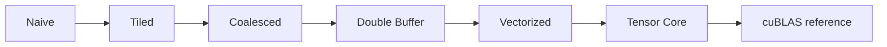
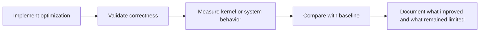

# Benchmarks

This page explains what benchmark evidence in CUDA Kernel Academy is meant to prove, and what it is not meant to prove.

- **For kernel readers**: use it to connect optimization steps to measured deltas.
- **For library and systems readers**: use it to see which claims are local kernel wins versus end-to-end integration signals.
- **For cautious readers**: read the caveats first; some values are placeholder reference numbers rather than a universal performance promise.

## How to read benchmark evidence in this repo

Benchmark data in this repository should be interpreted as **teaching evidence**, not marketing copy.

1. **SGEMM ladders** show the direction and relative impact of optimization steps.
2. **Module-level tables** show what each module is trying to validate.
3. **Comparisons to cuBLAS** are a sanity check, not a claim that the repo should replace cuBLAS in every case.

::: tip Measured data only
[rtx3060-laptop-2026-08-17](./rtx3060-laptop-2026-08-17) contains the only
repository-measured numbers currently published. Placeholder figures have been
removed from this page.
:::

## SGEMM optimization ladder (measured, 1024^3)

Hardware: RTX 3060 Laptop, sm_86. See the linked page for full method and all sizes.

| Kernel | TFLOPS (FP32) | vs cuBLAS |
| --- | ---: | ---: |
| Naive | 0.58 | 10.4% |
| Tiled | 0.92 | 16.6% |
| Bank Conflict Free | 0.66 | 11.8% |
| Double Buffer | 0.68 | 12.2% |
| Tensor Core WMMA | 1.09 | 19.6% |
| cuBLAS | 5.58 | 100% |

<BenchmarkChart
  title="SGEMM optimization ladder (FP32, RTX 3060 Laptop measured)"
  unit="TFLOPS"
  :data="[
    { name: 'Naive', value: 0.58 },
    { name: 'Tiled', value: 0.92 },
    { name: 'Bank Conflict Free', value: 0.66 },
    { name: 'Double Buffer', value: 0.68 },
    { name: 'Tensor Core WMMA', value: 1.09 },
    { name: 'cuBLAS', value: 5.58 }
  ]"
/>

<BenchmarkChart
  title="Relative progress toward cuBLAS"
  unit="% of cuBLAS"
  type="line"
  :data="[
    { name: 'Naive', value: 10.4 },
    { name: 'Tiled', value: 16.6 },
    { name: 'Bank Conflict Free', value: 11.8 },
    { name: 'Double Buffer', value: 12.2 },
    { name: 'Tensor Core WMMA', value: 19.6 },
    { name: 'cuBLAS', value: 100 }
  ]"
/>

Full result file and reproducibility notes: [RTX 3060 Laptop, 2026-08-17](./rtx3060-laptop-2026-08-17).

## What each module's benchmarks are trying to prove

| Module | Typical evidence | What that evidence means | What it does **not** mean |
| --- | --- | --- | --- |
| [01-SGEMM Tutorial](/en/modules/01-sgemm) | Step-by-step TFLOPS and bandwidth gains | Individual kernel transformations are doing real work. | A single tuned SGEMM generalizes to every operator. |
| [02-TensorCraft Core](/en/modules/02-tensorcraft) | Correctness, reusable operator behavior, library-level overhead checks | Abstractions can remain lightweight enough for performance-sensitive code. | Every abstraction is free on every architecture. |
| [03-HPC Advanced](/en/modules/03-hpc) | Higher ceilings from register tiling, WMMA, CUTLASS-style ideas, or FlashAttention-inspired kernels | Advanced techniques can move the ceiling closer to hardware limits. | The same technique is always the best choice for every GPU or problem size. |
| [04-Inference Engine](/en/modules/04-inference) | Throughput, latency, and runtime behavior under streams or memory-pool reuse | Kernel work still matters when placed inside a larger execution pipeline. | End-to-end speedup comes only from the kernel; orchestration matters too. |

## How to interpret the SGEMM ladder

Read the ladder as a chain of questions:

- **Naive → Tiled**: did shared-memory reuse remove the most obvious waste?
- **Tiled → Coalesced**: are memory transactions better aligned with how the GPU wants to fetch data?
- **Coalesced → Double Buffer**: are compute and data movement overlapped more effectively?
- **Double Buffer → Vectorized / Tensor Core**: are you now benefiting from hardware-specific throughput features rather than only generic cleanup?

The value of this ladder is that it matches the repository structure: the early modules teach the steps, and the later modules show how those steps evolve inside more realistic systems.

## Common mistakes when reading these numbers

- **Mistake: treating cuBLAS percentage as the only score.** In this repo, the learning value is often in understanding *why* each jump happened.
- **Mistake: comparing across architectures without context.** The same kernel can move very differently on Volta, Ampere, Ada, or Hopper.
- **Mistake: ignoring correctness and integration cost.** A faster kernel that does not compose cleanly with the later modules is not a meaningful repo-wide win.

## Benchmark workflow inside this repository

This workflow is why the benchmark page belongs in an academy-style site: it teaches readers how to connect code changes, architectural reasoning, and evidence.

## Foundational references for interpreting results

<ReferenceBlock
  :references="[
    {
      id: '1',
      authors: 'Volkov, V. and Demmel, J. W.',
      title: 'Benchmarking GPUs to Tune Dense Linear Algebra',
      venue: 'SC',
      year: 2008
    },
    {
      id: '2',
      authors: 'Boehm, Simon',
      title: 'How to Optimize a CUDA Matmul Kernel',
      venue: 'Technical article',
      year: 2022,
      url: 'https://siboehm.com/articles/22/CUDA-MMM'
    },
    {
      id: '3',
      authors: 'NVIDIA',
      title: 'CUDA C++ Best Practices Guide',
      venue: 'CUDA Toolkit documentation',
      year: 2024,
      url: 'https://docs.nvidia.com/cuda/cuda-c-best-practices-guide/'
    }
  ]"
/>

## Study next

- To understand why these numbers are arranged in this order, read [01-SGEMM Tutorial](/en/modules/01-sgemm).
- To understand how these optimizations feed system design, read [System Architecture](/en/whitepaper/architecture).
- To decide which benchmark lens matters for your current goal, follow the [Roadmap](/en/roadmap).
