# Benchmarks

Performance benchmark summary for CUDA Kernel Academy modules.

## SGEMM Optimization Path

Placeholder data for RTX 4090 class GPU:

| Kernel | TFLOPS (FP32) | Bandwidth (GB/s) | vs cuBLAS |
|--------|---------------|-------------------|-----------|
| Naive | 0.5 | 20 | 2% |
| Tiled | 2.1 | 85 | 10% |
| Coalesced | 4.5 | 180 | 22% |
| Double Buffer | 8.2 | 320 | 40% |
| Vectorized | 12.5 | 480 | 60% |
| Tensor Core | 18.0 | 700 | 85% |
| cuBLAS | 21.0 | 820 | 100% |

```mermaid
flowchart LR
    Naive["Naive<br/>0.5 TFLOPS"] -->|"4×"| Tiled["Tiled<br/>2.1 TFLOPS"]
    Tiled -->|"2.1×"| Coalesced["Coalesced<br/>4.5 TFLOPS"]
    Coalesced -->|"1.8×"| DoubleBuffer["Double Buffer<br/>8.2 TFLOPS"]
    DoubleBuffer -->|"1.5×"| Vectorized["Vectorized<br/>12.5 TFLOPS"]
    Vectorized -->|"1.4×"| TensorCore["Tensor Core<br/>18.0 TFLOPS"]
    TensorCore -->|"1.17×"| CuBLAS["cuBLAS<br/>21.0 TFLOPS"]

    style Naive fill:#161b22,stroke:#76B900,color:#e6edf3
    style Tiled fill:#161b22,stroke:#76B900,color:#e6edf3
    style Coalesced fill:#161b22,stroke:#76B900,color:#e6edf3
    style DoubleBuffer fill:#161b22,stroke:#76B900,color:#e6edf3
    style Vectorized fill:#161b22,stroke:#76B900,color:#e6edf3
    style TensorCore fill:#161b22,stroke:#76B900,color:#e6edf3
    style CuBLAS fill:#161b22,stroke:#76B900,color:#e6edf3
```

## Interactive Charts

Interactive charts are rendered by the BenchmarkChart component.

## References

[^1]: Volkov, V., and Demmel, J. W. "Benchmarking GPUs to Tune Dense Linear Algebra." *SC'08*.
[^2]: Simon Boehm. "How to Optimize a CUDA Matmul Kernel." 2022. https://siboehm.com/articles/22/CUDA-MMM
