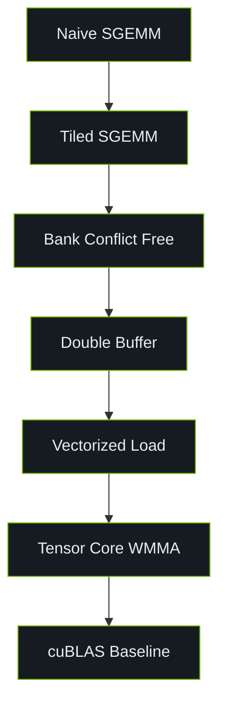

# 01-SGEMM Tutorial

This module is the entry point of CUDA Kernel Academy, focusing on the progressive optimization of SGEMM.

## Learning Path



## Build

This module is a standalone tutorial and does not participate in the root CMake build.

```bash
cd 01-sgemm-tutorial
make GPU_ARCH=sm_86
./build/sgemm_benchmark
```

## Sub-topics

- [Naive SGEMM](./01/sgemm-naive.md)
- [Tiled SGEMM](./01/sgemm-tiled.md)
- [Bank Conflict Free](./01/sgemm-bank-conflict.md)
- [Double Buffer SGEMM](./01/sgemm-double-buffer.md)
- [Tensor Core SGEMM](./01/sgemm-tensor-core.md)

## References

[^1]: NVIDIA. "CUDA C++ Programming Guide," v12.6. 2024. https://docs.nvidia.com/cuda/cuda-c-programming-guide/
[^2]: Simon Boehm. "How to Optimize a CUDA Matmul Kernel." 2022. https://siboehm.com/articles/22/CUDA-MMM
[^3]: Volkov, V., and Demmel, J. W. "Benchmarking GPUs to Tune Dense Linear Algebra." *SC'08*.
