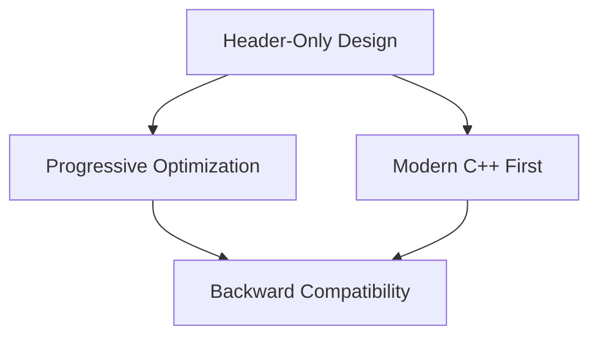

# 02-TensorCraft Core

TensorCraft Core is the core operator library of CUDA Kernel Academy, providing production-grade CUDA kernel implementations. It uses a header-only design for easy integration.

## Design Principles



## Core Features

| Feature | Description |
|---------|-------------|
| **Header-Only** | Zero compile dependencies |
| **Multi-Arch** | Volta (sm_70) to Hopper (sm_90) |
| **Python Bindings** | pybind11 Python interface |
| **Full Tests** | GoogleTest unit tests |
| **Benchmarks** | Google Benchmark performance tests |

## Quick Start

```bash
mkdir build && cd build
cmake .. -DCMAKE_BUILD_TYPE=Release
make -j$(nproc)
ctest --output-on-failure
```

## Sub-topics

- [Architecture](./02/architecture.md)
- [API Reference](./02/api-reference.md)
- [Optimization Guide](./02/optimization-guide.md)

## References
