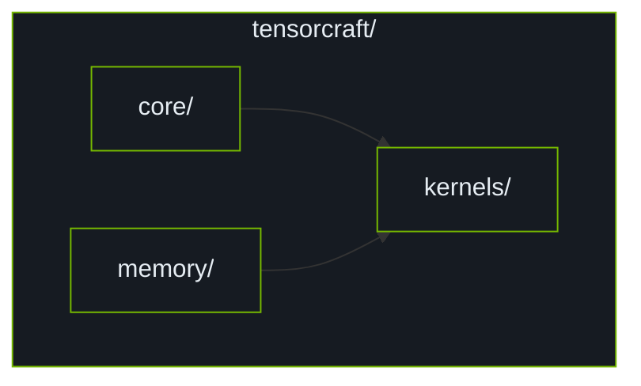

# TensorCraft Core Architecture

This document describes the overall architecture and design decisions of TensorCraft Core.

## Module Architecture

## Core Layer

Provides infrastructure: `cuda_check.hpp`, `features.hpp`, `type_traits.hpp`.

## Memory Layer

Provides memory abstractions: `AlignedVector`, `Tensor`, `MemoryPool`.

## Kernels Layer

Operator implementations: GEMM, Attention, Normalization, Conv2D, Sparse, Fusion.

## References

[^1]: NVIDIA. "CUDA C++ Programming Guide," v12.6. 2024. https://docs.nvidia.com/cuda/cuda-c-programming-guide/
[^2]: NVIDIA CUTLASS. https://github.com/NVIDIA/cutlass
