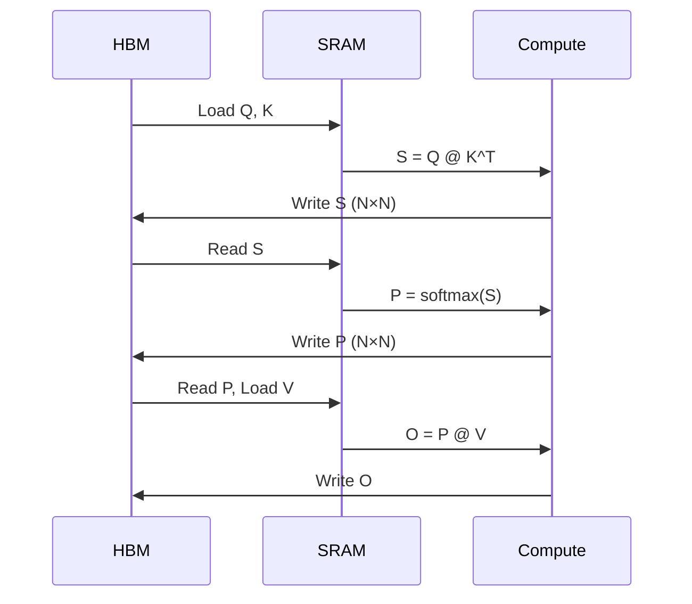
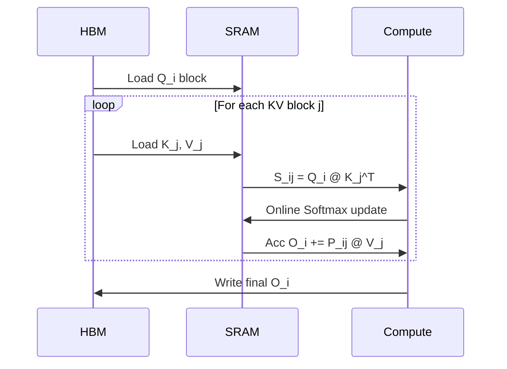

# FlashAttention

::: warning Teaching kernel, not the portfolio authority
The `03-hpc-advanced` FlashAttention sources explain tiling and online softmax only. Forward+backward, WMMA, FlashDecoding, and measured numbers live in [cuflash-attn](https://github.com/open-infra-ai/cuflash-attn). The Triton reference is [triton-fused-ops](https://github.com/open-infra-ai/triton-fused-ops).
:::

::: warning Performance numbers are teaching placeholders
The TFLOPS, speedup and memory figures on this page are reference values, not results reproduced by this repository on a pinned hardware/software stack. Re-measure on your own GPU before quoting them.
:::

FlashAttention uses tiling and online softmax to compute attention without materializing the full N×N attention matrix in HBM.

## Standard Attention Problem

## FlashAttention Data Flow

Total HBM access: O(N) vs O(N²) for standard attention.

## References
