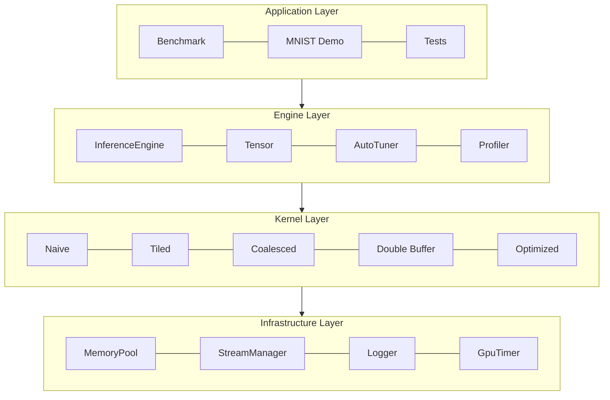

# Inference Engine Architecture

Architecture design of the Mini-Inference Engine.

## System Architecture

## Core Components

- **InferenceEngine**: Manages forward propagation
- **Tensor**: N-dimensional GPU tensor with basic ops
- **MemoryPool**: Caches GPU allocations
- **StreamManager**: CUDA stream management

## References
