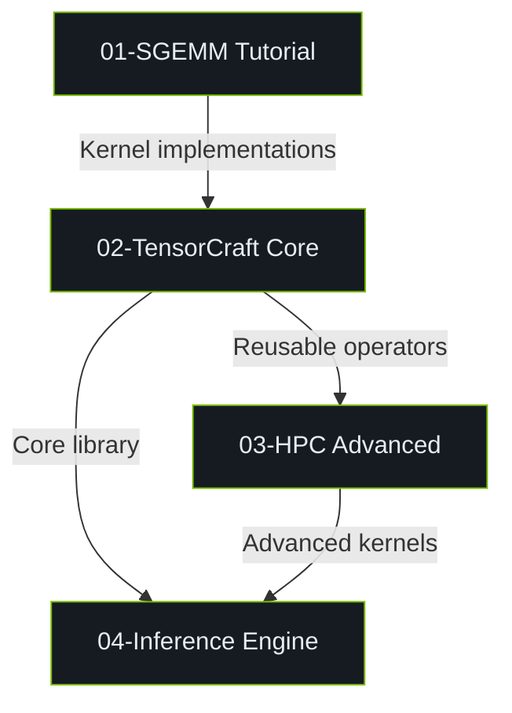

# Roadmap

Systematic learning path from SGEMM fundamentals to inference systems.

## Learning Stages

```mermaid
journey
    title CUDA Kernel Academy Learning Path
    section Stage 1: Fundamentals
      SGEMM Basics: 5: Naive GEMM
      Shared Memory: 5: Tiling and Bank Conflict
      Double Buffer: 4: Hiding memory latency
    section Stage 2: Core Library
      TensorCraft Core: 5: Industrial API design
      Modern C++ CUDA: 4: Concepts / constexpr if
      Kernel Fusion: 4: Fusion and Epilogue
    section Stage 3: Advanced HPC
      GEMM Optimization: 5: Register Tiling / WMMA
      FlashAttention: 4: Tiling + Online Softmax
      CUDA 13 Features: 3: TMA / Cluster / FP8
    section Stage 4: Inference System
      Inference Engine: 5: Memory pool / Stream / Tensor
      Performance Tuning: 4: AutoTuner / Profiler
      Quantized Inference: 3: INT8 / FP8 deployment
```

## Project Architecture



## References

[^1]: NVIDIA. "CUDA C++ Programming Guide," v12.6. 2024. https://docs.nvidia.com/cuda/cuda-c-programming-guide/
[^2]: Dao, T., et al. "FlashAttention." *NeurIPS* 2022. https://arxiv.org/abs/2205.14135
