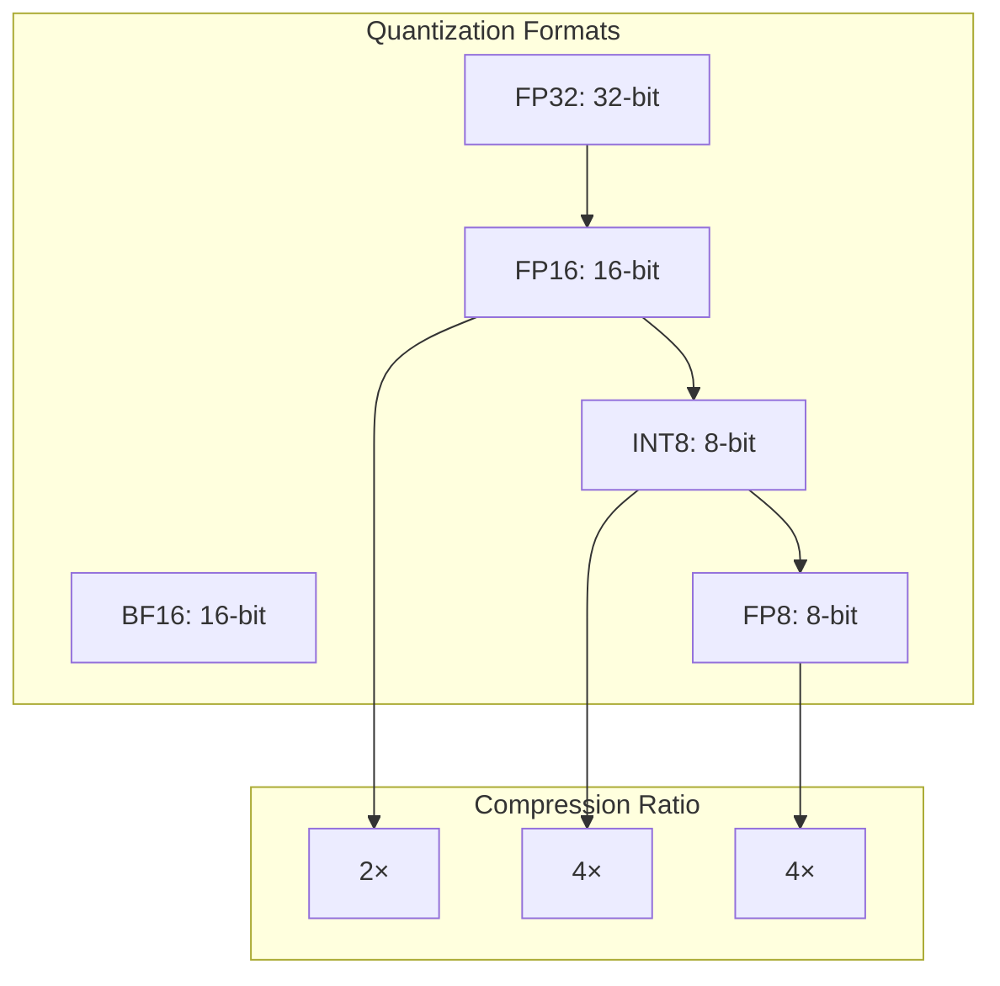

# Advanced Technology Showcase

This document showcases cutting-edge technology implementations in CUDA Kernel Academy, including FlashAttention, CUDA 12/13 features, quantization techniques, and advanced convolution algorithms.

## FlashAttention Algorithm

### Problem Background

Standard Attention computation requires instantiating the full N×N attention matrix:

```mermaid
flowchart TB
    subgraph Memory Problem
        Q[Query: N×d]
        K[Key: N×d]
        V[Value: N×d]
        ATTN[Attention: N×N<br/>O(N²) memory!]
    end
    
    Q --> ATTN
    K --> ATTN
    V --> ATTN
    
    ATTN -->|Memory bottleneck| PROB[Cannot handle long sequences]
```

### FlashAttention Core Idea

**Tiled computation + Recomputation strategy**:

```mermaid
flowchart TB
    subgraph Tiling Strategy
        Q1[Q tile: Br×d]
        K1[K tile: Bc×d]
        V1[V tile: Bc×d]
        
        Q1 --> S[S tile: Br×Bc]
        K1 --> S
        S --> O[Output tile: Br×d]
        V1 --> O
    end
    
    Note: Memory from O(N²) to O(N)
```

### Performance Comparison

| Implementation | Memory Complexity | Long Sequence Support |
|----------------|-------------------|----------------------|
| Standard Attention | O(N²) | N ≤ 1024 |
| FlashAttention | O(N) | N ≥ 64K |

---

## CUDA 12/13 Features

### 1. Tensor Memory Accelerator (TMA)

TMA is an asynchronous memory transfer unit new to Hopper architecture:

```mermaid
flowchart TB
    subgraph Traditional
        CODE[Code]
        CODE -->|Sync| LDCPY[cuMemcpy]
        LDCPY -->|Block| GPU[GPU Compute]
    end
    
    subgraph TMA
        CODE2[Code]
        CODE2 -->|Async| TMA[TMA Unit]
        TMA -->|Independent| GPU2[GPU Compute]
        Note: TMA parallel with compute
    end
```

### 2. Thread Block Clusters

Clusters allow multiple thread blocks to cooperate:

```cpp
__cluster_launch__(2)  // 2 blocks form a cluster
__global__ void cluster_kernel() {
    // Intra-cluster synchronization
    cluster_barrier::wait();
    
    // Cross-block shared memory access (new feature)
    extern __cluster__ float shared_mem[];
}
```

### 3. FP8 Support

Hopper natively supports FP8 computation:

```cpp
#include <cuda_fp8.h>

__global__ void fp8_gemm(
    const __nv_fp8_e4m3* A,
    const __nv_fp8_e4m3* B,
    __nv_bf16* C,
    int M, int N, int K) {
    
    // FP8 Tensor Core operations
    // E4M3 format: 1 sign + 4 exponent + 3 mantissa
    // Range: ±448, precision: ~3 bits
}
```

---

## Quantization Techniques

### Quantization Types



### INT8 Quantization Implementation

```cpp
struct QuantizedTensor {
    int8_t* data;
    float scale;      // Scale factor
    int size;
    
    // Quantize from FP32
    static QuantizedTensor from_fp32(const float* src, int size) {
        // 1. Calculate max absolute value
        float max_abs = 0;
        for (int i = 0; i < size; i++) {
            max_abs = max(max_abs, fabsf(src[i]));
        }
        
        // 2. Calculate scale factor
        float scale = max_abs / 127.0f;
        
        // 3. Quantize
        auto* data = new int8_t[size];
        for (int i = 0; i < size; i++) {
            data[i] = static_cast<int8_t>(round(src[i] / scale));
        }
        
        return {data, scale, size};
    }
};
```

---

## Winograd Convolution

### Algorithm Principle

Winograd converts convolution to matrix multiplication:

```
Standard convolution: m×r multiplications
Winograd: m×m multiplications (when output tile is m×m, kernel is r×r)

Speedup: r×r / m×m
For 3×3 convolution, m=2: speedup = 9/4 ≈ 2.25×
```

---

## RoPE (Rotary Position Embedding)

### Principle

RoPE encodes position information through rotation:

```mermaid
flowchart LR
    X[Input vector x]
    POS[Position m]
    ROT[Rotation matrix Rm]
    OUT[Position-encoded output]
    
    X --> ROT
    POS --> ROT
    ROT --> OUT
    
    Note: Rm = rotation angle θi * m
```

### Implementation

```cpp
__global__ void rope_kernel(
    float* x,           // [seq_len, dim]
    int seq_len,
    int dim,
    int max_position) {
    
    int seq = blockIdx.x;
    int i = threadIdx.x * 2;  // Dimension pair
    
    if (seq < seq_len && i < dim) {
        // Calculate rotation angle
        float theta = powf(10000.0f, -2.0f * (i / 2) / dim);
        float angle = seq * theta;
        
        // Rotation
        float x0 = x[seq * dim + i];
        float x1 = x[seq * dim + i + 1];
        
        float cos_angle = cosf(angle);
        float sin_angle = sinf(angle);
        
        x[seq * dim + i] = x0 * cos_angle - x1 * sin_angle;
        x[seq * dim + i + 1] = x0 * sin_angle + x1 * cos_angle;
    }
}
```

---

## Summary

This document showcases cutting-edge technologies in CUDA Kernel Academy:

1. **FlashAttention**: O(N) memory attention computation
2. **TMA**: Hopper asynchronous memory transfer
3. **Thread Block Clusters**: Cross-block cooperation
4. **FP8**: Next-generation quantization format
5. **Winograd**: Efficient convolution algorithm
6. **RoPE**: Rotary position encoding

These technologies represent the frontier of CUDA kernel optimization, worthy of in-depth study and practice.
