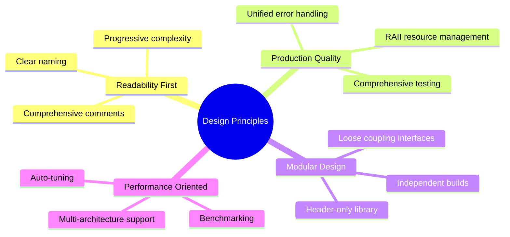
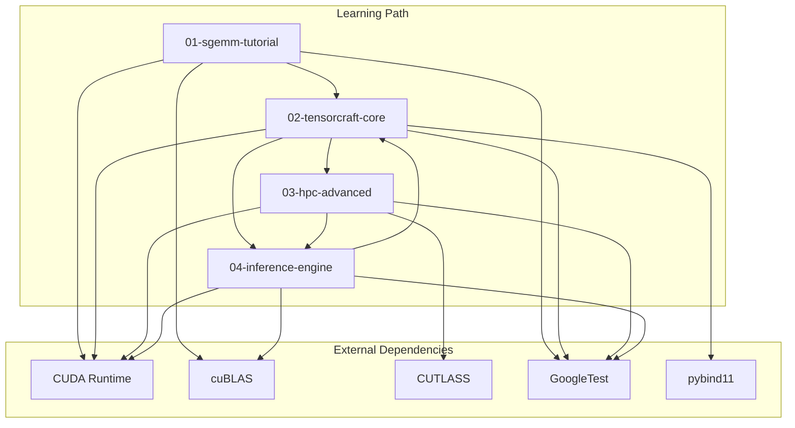
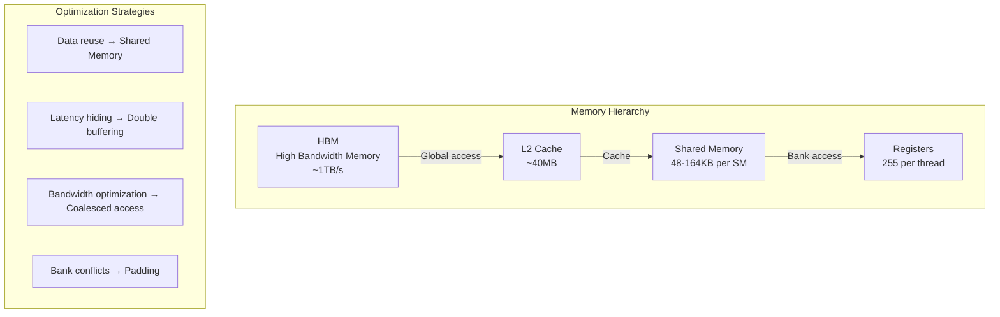

# System Architecture Design

CUDA Kernel Academy's system architecture follows the dual principles of "progressive learning" and "production-grade practice". This document provides an in-depth analysis of the overall architecture, module dependencies, build system design, and core design patterns.

## Design Philosophy

### Core Positioning

This project is positioned as a learning project **"between entry-level examples and production frameworks"**:

- **Not a toy project**: Code quality, error handling, and API design follow production standards
- **Not a heavyweight framework**: Maintains readability, avoids over-abstraction
- **Progressive path**: Gradual evolution from naive implementations to optimized versions

### Architecture Principles



## Module Architecture

### Overall Dependencies



### Module Responsibilities

| Module | Responsibility | Build System | Key Features |
|--------|---------------|--------------|--------------|
| **01-sgemm-tutorial** | SGEMM optimization introduction | Makefile | Standalone, self-contained, teaching-oriented |
| **02-tensorcraft-core** | Reusable operator library | CMake | Header-only, multi-arch, Python bindings |
| **03-hpc-advanced** | Advanced optimization patterns | CMake | CUTLASS integration, CUDA 12/13 features |
| **04-inference-engine** | End-to-end inference | CMake | Memory pool, stream management, AutoTuner |

## Build System Design

### Dual Build System Strategy

The project adopts a **hybrid build system** design:

```
Project Root
├── CMakeLists.txt          # Main build system (modules 02-04)
├── cmake/                  # Shared CMake modules
│   ├── CudaArch.cmake      # CUDA architecture detection
│   ├── Dependencies.cmake  # Dependency management
│   └── Testing.cmake       # Test configuration
└── 01-sgemm-tutorial/
    └── Makefile            # Standalone build system (teaching-oriented)
```

#### Why Keep Makefile?

```mermaid
flowchart LR
    subgraph Makefile Advantages
        A1[Zero-dependency learning]
        A2[Direct commands]
        A3[Fast iteration]
    end
    
    subgraph CMake Advantages
        B1[Cross-platform]
        B2[Dependency management]
        B3[IDE integration]
    end
    
    A1 --> Teaching Module
    A2 --> Teaching Module
    A3 --> Teaching Module
    
    B1 --> Production Modules
    B2 --> Production Modules
    B3 --> Production Modules
```

## Core Design Patterns

### 1. RAII Resource Management

All GPU resources are managed using RAII pattern:

```cpp
// Tensor class: Automatic GPU memory management
class Tensor {
public:
    Tensor(size_t size) : data_(cuda_malloc(size)), size_(size) {}
    ~Tensor() { cudaFree(data_); }
    
    // Move semantics
    Tensor(Tensor&& other) noexcept;
    Tensor& operator=(Tensor&& other) noexcept;
    
    // Disable copy
    Tensor(const Tensor&) = delete;
    Tensor& operator=(const Tensor&) = delete;
    
private:
    void* data_;
    size_t size_;
};
```

### 2. Unified Error Handling

```cpp
// Error check macro hierarchy
#define TC_CUDA_CHECK(call)          // Check return value
#define TC_CUDA_CHECK_LAST()         // Check last error
#define TC_CUDA_SYNC_CHECK()         // Sync and check (for debugging)

// Usage example
TC_CUDA_CHECK(cudaMemcpy(dst, src, size, cudaMemcpyDeviceToDevice));
TC_CUDA_SYNC_CHECK();  // Catch async errors during debugging
```

### 3. Version Enumeration Pattern

```cpp
enum class GemmVersion {
    Naive,           // Basic implementation
    Tiled,           // Tiled optimization
    DoubleBuffer,    // Double buffering
    TensorCore,      // Tensor Core acceleration
    Auto             // Auto-select best
};

// Runtime selection
template<GemmVersion V>
void gemm(const Tensor& A, const Tensor& B, Tensor& C);
```

## Memory Hierarchy Optimization Strategy

### GPU Memory Hierarchy



---

## Summary

CUDA Kernel Academy's architecture design balances **teaching clarity** with **engineering quality**:

1. **Modularity**: Clear responsibility division, progressive dependencies
2. **Dual build system**: Makefile for teaching + CMake for production
3. **RAII first**: All resources automatically managed, no memory leaks
4. **Testability**: Unit tests, integration tests, property tests coverage
5. **Extensibility**: Version enumeration, registration mechanism, plugin architecture

This architecture is suitable for learning CUDA optimization principles while serving as a reference template for production-grade code.
