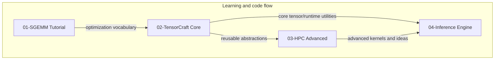

# System Architecture Design

This page is for readers who already know the repo has four modules and now want to understand the technical contract between them.

- **Use this page when** you need the big picture before diving into implementation details.
- **Read it together with** [01-SGEMM Tutorial](/en/modules/01-sgemm), [TensorCraft design](/en/whitepaper/tensorcraft-design), and [Inference engine design](/en/whitepaper/inference-engine-design).
- **Treat it as a reading map**: the goal is not just “what files exist,” but “why this repo teaches kernels in this order.”

## Architecture at a glance

<SystemArchitectureDiagram />

CUDA Kernel Academy is intentionally positioned between two extremes:

- **More structured than a folder of CUDA examples**: each module has a clear teaching purpose and a place in the larger system story.
- **Lighter than a production framework**: abstractions are kept readable so the connection between optimization idea and code remains visible.

The architecture therefore follows a progression from **single-kernel reasoning** to **library design** to **advanced optimization patterns** to **system-level inference integration**.

## How to read the repository by architectural layer

| Layer | Primary module | What this layer teaches | What it produces for later layers | Read next |
| --- | --- | --- | --- | --- |
| Kernel fundamentals | [01-SGEMM Tutorial](/en/modules/01-sgemm) | Tiling, memory hierarchy, bank conflicts, double buffering, vectorization, Tensor Core transition | A concrete optimization vocabulary | [Benchmarks](/en/benchmarks/) |
| Reusable infrastructure | [02-TensorCraft Core](/en/modules/02-tensorcraft) | Turning one-off kernels into reusable APIs, resource management, and operator boundaries | Library scaffolding for later modules | [TensorCraft design](/en/whitepaper/tensorcraft-design) |
| Performance frontier | [03-HPC Advanced](/en/modules/03-hpc) | CUTLASS-style thinking, FlashAttention, register tiling, newer CUDA features | Advanced kernel patterns and performance intuition | [Advanced showcase](/en/whitepaper/advanced-showcase) |
| System integration | [04-Inference Engine](/en/modules/04-inference) | How optimized kernels become part of a stream-aware inference pipeline | End-to-end evidence that the earlier work composes | [Inference engine design](/en/whitepaper/inference-engine-design) |

## Why the module graph looks the way it does

The most important dependency is **conceptual**, not only build-time:

- Module 01 explains *why* specific kernel transformations matter.
- Module 02 decides which of those transformations deserve stable interfaces.
- Module 03 explores techniques that are too advanced or architecture-specific for the beginner path.
- Module 04 validates whether the earlier abstractions remain useful once execution becomes asynchronous and system-oriented.

## Why the repo keeps two build systems

The build split is a teaching choice, not accidental drift.

| Build path | Used by | Why it exists in this repo | What readers should infer |
| --- | --- | --- | --- |
| Standalone `Makefile` | `01-sgemm-tutorial/` | Keeps the first module close to the metal and easy to run in isolation. | Early learning should minimize build-system noise. |
| Root / module CMake | `02`–`04`, `common/`, `examples/` | Supports cross-module dependencies, presets, testing, and shared infrastructure. | Later modules are about engineering reuse, not just isolated kernels. |

::: info Repository-specific implication
`01-sgemm-tutorial/` is deliberately outside the root CMake graph. That separation reinforces its role as the “open the code and understand the kernel” starting point, while the later modules model the reality of shared infrastructure.
:::

## How evidence moves through the repository

This matters because the repo does not treat benchmarks as isolated charts.

1. **An optimization idea appears first as a teaching example.**
2. **Reusable parts are promoted into shared infrastructure.**
3. **Advanced kernels test how far the same ideas can scale.**
4. **Inference integration checks whether the optimization still helps in a system context.**
5. **Benchmarks document the evidence, but also its limits.**

## How to interpret architecture claims with benchmark evidence

Architecture pages and benchmark pages should be read together.

- A faster SGEMM kernel is meaningful only if [benchmark methodology](/en/benchmarks/) explains the comparison point and limitations.
- A reusable abstraction is valuable only if later modules still use it without hiding the optimization story.
- An inference-engine claim is stronger when it shows that stream scheduling, memory reuse, and kernel choice compose cleanly rather than as isolated demos.

In practice, this means you should ask two questions while reading:

1. **What optimization concept is being taught?**
2. **Where does that concept reappear later as reusable code or measurable evidence?**

## Foundational papers and external anchors for this architecture

<ReferenceBlock
  :references="[
    {
      id: '1',
      authors: 'Volkov, V. and Demmel, J. W.',
      title: 'Benchmarking GPUs to Tune Dense Linear Algebra',
      venue: 'SC',
      year: 2008
    },
    {
      id: '2',
      authors: 'Boehm, Simon',
      title: 'How to Optimize a CUDA Matmul Kernel',
      venue: 'Technical article',
      year: 2022,
      url: 'https://siboehm.com/articles/22/CUDA-MMM'
    },
    {
      id: '3',
      authors: 'Dao, Tri et al.',
      title: 'FlashAttention: Fast and Memory-Efficient Exact Attention with IO-Awareness',
      venue: 'NeurIPS',
      year: 2022,
      url: 'https://arxiv.org/abs/2205.14135'
    },
    {
      id: '4',
      authors: 'NVIDIA',
      title: 'CUDA C++ Programming Guide',
      venue: 'CUDA Toolkit documentation',
      year: 2024,
      url: 'https://docs.nvidia.com/cuda/cuda-c-programming-guide/'
    }
  ]"
/>

## Study next

- Want the code-first path? Go back to [01-SGEMM Tutorial](/en/modules/01-sgemm).
- Want the library boundary details? Continue with [TensorCraft design](/en/whitepaper/tensorcraft-design).
- Want to understand what the architecture achieves in practice? Open [Benchmarks](/en/benchmarks/) and [Roadmap](/en/roadmap) side by side.
