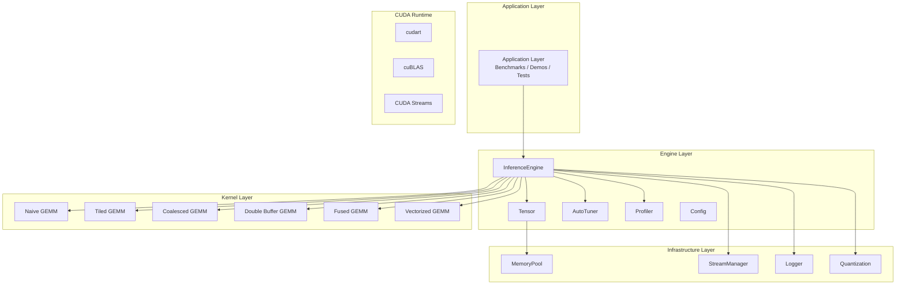
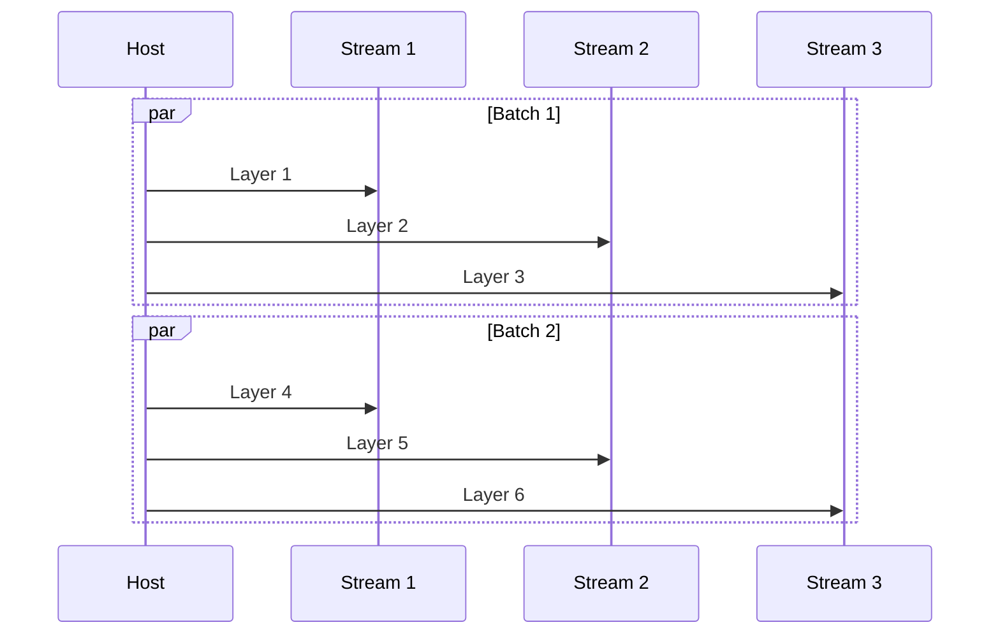

# Inference Engine Design

This document details the architecture design, core component implementation, and performance optimization strategies of the 04-Inference Engine module.

## Overall Architecture

### Layered Design



### Core Component Responsibilities

| Component | Responsibility | Key Features |
|-----------|---------------|--------------|
| InferenceEngine | Inference coordinator | Weight loading, forward pass, layer management |
| Tensor | GPU tensor abstraction | N-dimensional array, move semantics, auto-release |
| MemoryPool | Memory pool management | Cached allocation, 256-byte aligned, Best-fit strategy |
| StreamManager | Stream management | Multi-stream concurrency, round-robin allocation |
| AutoTuner | Parameter auto-tuning | Kernel parameter search, performance recording |
| Profiler | Performance analysis | Timestamp recording, overhead statistics |

## Memory Pool Design

### Design Motivation

Frequent `cudaMalloc`/`cudaFree` brings significant overhead:

```
cudaMalloc latency: ~10-50 μs
cudaFree latency: ~5-20 μs
Inference batches: thousands per second
```

### Core Implementation

```cpp
class MemoryPool {
public:
    // Allocate memory (256-byte aligned)
    void* allocate(size_t size) {
        size = align256(size);
        
        // Best-fit search
        Block* best = find_best_fit(size);
        if (best) {
            best->in_use = true;
            return best->ptr;
        }
        
        // Create new block
        return create_block(size);
    }
    
    // Deallocate memory (return to cache)
    void deallocate(void* ptr) {
        Block* block = find_block(ptr);
        if (block) {
            block->in_use = false;
        }
    }
    
private:
    struct Block {
        void* ptr;
        size_t size;
        bool in_use;
        Block* next;
    };
    
    Block* free_list_ = nullptr;
    size_t align256(size_t n) { return (n + 255) & ~255; }
};
```

## Stream Management Design

### Multi-stream Concurrency



### Round-robin Allocation

```cpp
class StreamManager {
public:
    cudaStream_t get_stream() {
        return streams_[next_stream_++ % streams_.size()];
    }
    
    void synchronize_all() {
        for (auto& s : streams_) {
            cudaStreamSynchronize(s);
        }
    }
    
private:
    std::vector<cudaStream_t> streams_;
    size_t next_stream_ = 0;
};
```

---

## Summary

04-Inference Engine is a teaching demonstration of how kernels, memory pools and streams fit together. It is intentionally **not** a production-grade inference engine: it runs MLP-style weights, has no real tokenizer/scheduler/KV-cache integration.

1. **Layered design**: Clear responsibility division, easy to understand and extend
2. **RAII resource management**: All GPU resources automatically managed, no leaks
3. **Memory pool**: Eliminate allocation overhead, improve throughput
4. **Multi-stream concurrency**: Maximize GPU utilization
5. **Auto-tuning**: Adapt to different hardware and input sizes
6. **Progressive optimization**: Seven-level kernel evolution path

This architecture serves as a reference template for practical inference systems.
