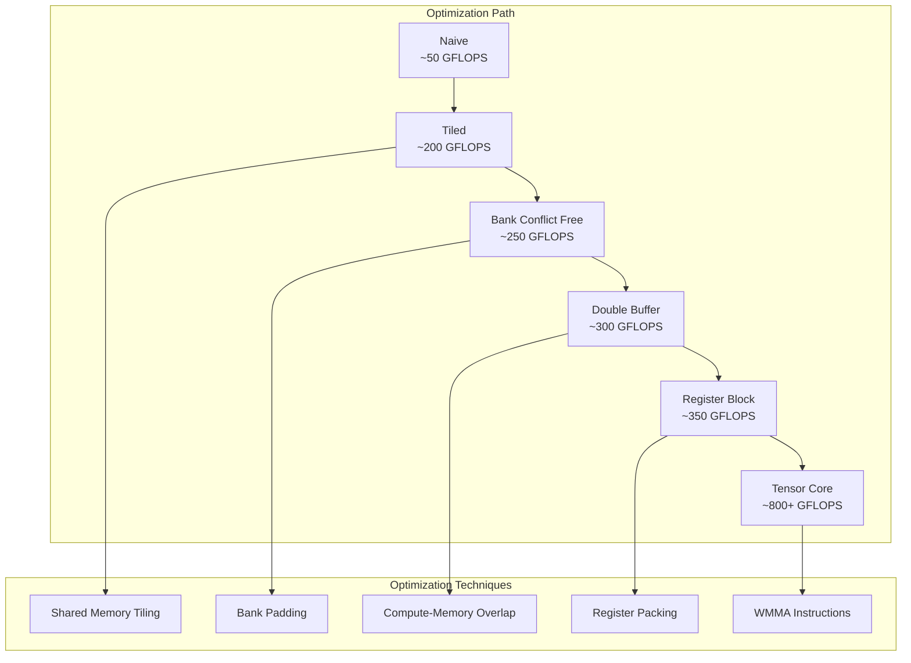
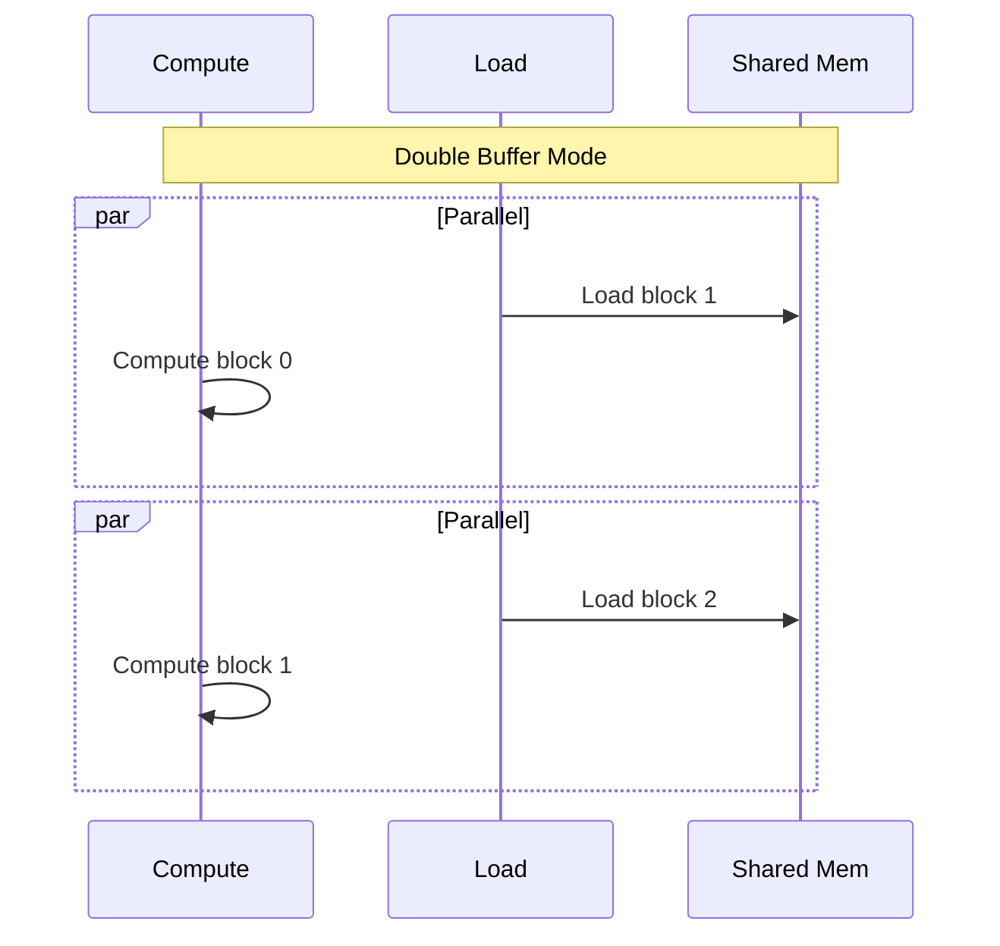

# SGEMM Optimization Journey

::: warning Performance numbers are teaching placeholders
The GFLOPS values below are illustrative reference numbers, not repository-reproduced measurements.
:::

This document records the complete optimization path from the most basic SGEMM implementation to the high-performance Tensor Core version. Each step includes principle analysis, code implementation, and performance comparison.

## Optimization Ladder Overview



## Level 1: Naive Implementation

### Principle

The most direct matrix multiplication implementation, each thread computes one element of the output matrix:

```
C[i,j] = Σ A[i,k] * B[k,j]  for k = 0 to K-1
```

### Implementation

```cpp
__global__ void sgemm_naive(int M, int N, int K,
                            const float* A, const float* B, float* C) {
    int i = blockIdx.y * blockDim.y + threadIdx.y;
    int j = blockIdx.x * blockDim.x + threadIdx.x;
    
    if (i < M && j < N) {
        float sum = 0.0f;
        for (int k = 0; k < K; k++) {
            sum += A[i * K + k] * B[k * N + j];
        }
        C[i * N + j] = sum;
    }
}
```

### Performance Analysis

| Metric | Value |
|--------|-------|
| Global memory accesses | 2 × M × N × K |
| Access pattern | Non-coalesced (B matrix) |
| Performance | ~50 GFLOPS |
| Relative to cuBLAS | ~5% |

---

## Level 2: Shared Memory Tiling

### Principle

Tile matrices into Shared Memory to exploit data locality:

- Each thread block computes a `BM × BN` output tile
- Tiles are loaded from global memory to Shared Memory
- Threads compute in Shared Memory, reducing global access

### Performance Analysis

| Metric | Naive | Tiled |
|--------|-------|-------|
| Global accesses | 2MNK | 2MNK/(BM×BN) × (BM + BN) |
| Performance | ~50 GFLOPS | ~200 GFLOPS |
| Speedup | 1× | 4× |

---

## Level 3: Bank Conflict Elimination

### Solution: Padding

```cpp
// Add one column of padding to eliminate bank conflicts
template<int BM, int BN, int BK>
__global__ void sgemm_bank_free(...) {
    // Key: BK + 1 eliminates bank conflicts
    __shared__ float As[BM][BK + 1];
    __shared__ float Bs[BK + 1][BN];
    // ... rest of code same
}
```

### Performance

| Version | Performance | Improvement |
|---------|-------------|-------------|
| Tiled | ~200 GFLOPS | - |
| Bank Conflict Free | ~250 GFLOPS | +25% |

---

## Level 4: Double Buffering

### Principle

Overlap computation with memory loading:



| Version | Performance | Improvement |
|---------|-------------|-------------|
| Bank Conflict Free | ~250 GFLOPS | - |
| Double Buffer | ~300 GFLOPS | +20% |

---

## Level 5: Register Blocking

### Principle

Each thread computes `TM × TN` output elements, maximizing register utilization.

### Constraint Calculation

```
threads_per_block = (BM/TM) × (BN/TN) ≤ 1024
shared_memory = (BM×BK + BK×BN) × 4 ≤ 48KB
registers_per_thread = TM×TN + TM + TN + overhead ≤ 255

Typical: BM=128, BN=128, BK=8, TM=8, TN=8
→ Threads = 256, Shared Mem = 8KB, Registers = 80 ✓
```

---

## Level 6: Tensor Core (WMMA)

### Principle

Use Tensor Core hardware to accelerate matrix multiplication:

```mermaid
flowchart LR
    subgraph WMMA Operation
        A[16×16 Matrix A] --> TC[Tensor Core]
        B[16×16 Matrix B] --> TC
        C[16×16 Accumulator] --> TC
        TC --> D[16×16 Result]
    end
    
    Note: Single instruction completes 16×16×16 = 4096 multiply-adds
```

### Performance Comparison

| Version | Performance | vs cuBLAS |
|---------|-------------|-----------|
| Naive | ~50 GFLOPS | 5% |
| Tiled | ~200 GFLOPS | 20% |
| Bank Conflict Free | ~250 GFLOPS | 25% |
| Double Buffer | ~300 GFLOPS | 30% |
| Register Block | ~350 GFLOPS | 35% |
| Tensor Core | ~800+ GFLOPS | 80%+ |

---

## Summary

SGEMM optimization follows the **"reduce global access → optimize local access → exploit hardware features"** path:

1. **Naive → Tiled**: Use Shared Memory to reduce global access
2. **Tiled → Bank Free**: Eliminate Shared Memory bank conflicts
3. **Bank Free → Double Buffer**: Hide memory latency
4. **Double Buffer → Register Block**: Maximize register utilization
5. **Register Block → Tensor Core**: Leverage dedicated hardware

Each step targets specific performance bottlenecks, ultimately achieving 80%+ of cuBLAS performance.
