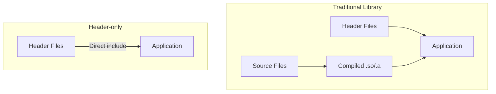

# TensorCraft Core Design

TensorCraft Core (02-tensorcraft-core) is a **teaching-grade design study** for a reusable CUDA operator library. This whitepaper describes the intended design patterns; the executable headers are the source of truth and deliberately do not implement every sketch shown here.

## Design Philosophy

### Header-only Architecture



### Core Advantages

| Feature | Traditional | Header-only |
|---------|-------------|-------------|
| Integration complexity | Requires compile/link | Just include headers |
| Dependency management | Must install dependencies | Zero dependencies |
| Template support | Limited | Full support |
| Compile time | Fast | Slower |
| Binary size | Small | Larger |

## Multi-Architecture Support

### CUDA Architecture Enumeration

```cpp
namespace tensorcraft {

enum class CudaArch {
    Volta = 70,       // SM_70: Volta
    Turing = 75,      // SM_75: Turing
    Ampere = 80,      // SM_80: A100
    Ampere86 = 86,    // SM_86: RTX 3090
    Ada = 89,         // SM_89: RTX 4090
    Hopper = 90       // SM_90: H100
};

// Runtime detection
CudaArch detect_arch() {
    int device;
    cudaGetDevice(&device);
    
    cudaDeviceProp prop;
    cudaGetDeviceProperties(&prop, device);
    
    return static_cast<CudaArch>(prop.major * 10 + prop.minor);
}

} // namespace tensorcraft
```

## Unified Error Handling

### Error Check Macro Hierarchy

```cpp
namespace tensorcraft {

// Basic check: return value
#define TC_CUDA_CHECK(call)                                          \
    do {                                                              \
        cudaError_t err = call;                                       \
        if (err != cudaSuccess) {                                     \
            throw CudaError(err, __FILE__, __LINE__, #call);          \
        }                                                             \
    } while (0)

// Last error check: async errors
#define TC_CUDA_CHECK_LAST()                                         \
    do {                                                              \
        cudaError_t err = cudaGetLastError();                         \
        if (err != cudaSuccess) {                                     \
            throw CudaError(err, __FILE__, __LINE__, "last error");   \
        }                                                             \
    } while (0)

// Sync check: catch async errors (for debugging)
#define TC_CUDA_SYNC_CHECK()                                         \
    do {                                                              \
        cudaError_t err = cudaDeviceSynchronize();                    \
        if (err != cudaSuccess) {                                     \
            throw CudaError(err, __FILE__, __LINE__, "sync");         \
        }                                                             \
    } while (0)

} // namespace tensorcraft
```

## GEMM Interface Design

### Version Enumeration

```cpp
namespace tensorcraft {

enum class GemmVersion {
    Naive,          // Basic implementation
    Tiled,          // Shared Memory tiling
    DoubleBuffer,   // Double buffering
    // Tensor Core / auto-tuning are deliberately NOT generic enum values.
    // WMMA is exposed separately as launch_gemm_wmma(half*, half*, float*).
};

} // namespace tensorcraft
```

### Unified Interface

```cpp
template<typename T>
class Gemm {
public:
    struct Config {
        GemmVersion version = GemmVersion::Tiled;
        int BM = 128, BN = 128, BK = 8;  // Tile sizes
        int TM = 8, TN = 8;               // Thread tiles
        cudaStream_t stream = 0;          // CUDA stream
    };
    
    // Execute GEMM: C = alpha * A * B + beta * C
    void operator()(const Tensor<T>& A,
                    const Tensor<T>& B,
                    Tensor<T>& C,
                    const Config& config = {},
                    float alpha = 1.0f,
                    float beta = 0.0f);
};

} // namespace tensorcraft
```

---

## Summary

TensorCraft Core demonstrates design patterns worth studying before building a production CUDA operator library:

1. **Header-only**: Zero-dependency integration, direct include usage
2. **Multi-architecture support**: Full support from Volta to Hopper
3. **Unified error handling**: Three-level macro checking, clear error messages
4. **Version enumeration**: Runtime selection of different implementations
5. **Operator fusion**: Reduce memory access, improve performance
6. **Python bindings**: Seamless integration with Python ecosystem
7. **Comprehensive testing**: Correctness verification + performance benchmarks

This design serves as a reference template for practical operator library development.
