# 性能基准测试

本文档汇总 CUDA Kernel Academy 各模块的性能基准数据。

## SGEMM 优化路径性能

以下数据为 RTX 4090 级别 GPU 的占位参考值：

| Kernel | TFLOPS (FP32) | Bandwidth (GB/s) | vs cuBLAS |
|--------|---------------|-------------------|-----------|
| Naive | 0.5 | 20 | 2% |
| Tiled | 2.1 | 85 | 10% |
| Coalesced | 4.5 | 180 | 22% |
| Double Buffer | 8.2 | 320 | 40% |
| Vectorized | 12.5 | 480 | 60% |
| Tensor Core | 18.0 | 700 | 85% |
| cuBLAS | 21.0 | 820 | 100% |

```mermaid
flowchart LR
    Naive["Naive<br/>0.5 TFLOPS"] -->|"4×"| Tiled["Tiled<br/>2.1 TFLOPS"]
    Tiled -->|"2.1×"| Coalesced["Coalesced<br/>4.5 TFLOPS"]
    Coalesced -->|"1.8×"| DoubleBuffer["Double Buffer<br/>8.2 TFLOPS"]
    DoubleBuffer -->|"1.5×"| Vectorized["Vectorized<br/>12.5 TFLOPS"]
    Vectorized -->|"1.4×"| TensorCore["Tensor Core<br/>18.0 TFLOPS"]
    TensorCore -->|"1.17×"| CuBLAS["cuBLAS<br/>21.0 TFLOPS"]

    style Naive fill:#161b22,stroke:#76B900,color:#e6edf3
    style Tiled fill:#161b22,stroke:#76B900,color:#e6edf3
    style Coalesced fill:#161b22,stroke:#76B900,color:#e6edf3
    style DoubleBuffer fill:#161b22,stroke:#76B900,color:#e6edf3
    style Vectorized fill:#161b22,stroke:#76B900,color:#e6edf3
    style TensorCore fill:#161b22,stroke:#76B900,color:#e6edf3
    style CuBLAS fill:#161b22,stroke:#76B900,color:#e6edf3
```

## 交互式图表

<BenchmarkChart
  title="SGEMM Optimization Ladder (FP32, RTX 4090)"
  unit="TFLOPS"
  :data="[
    { name: 'Naive', value: 0.5 },
    { name: 'Tiled', value: 2.1 },
    { name: 'Coalesced', value: 4.5 },
    { name: 'Double Buffer', value: 8.2 },
    { name: 'Vectorized', value: 12.5 },
    { name: 'Tensor Core', value: 18.0 },
    { name: 'cuBLAS', value: 21.0, color: '#ffffff' }
  ]"
/>

## 模块性能对比

### 01-SGEMM Tutorial

| 矩阵大小 | Naive | Tiled | Double Buffer | cuBLAS |
|----------|-------|-------|---------------|--------|
| 512 × 512 | 15 GFLOPS | 180 GFLOPS | 220 GFLOPS | 280 GFLOPS |
| 1024 × 1024 | 18 GFLOPS | 350 GFLOPS | 450 GFLOPS | 520 GFLOPS |
| 2048 × 2048 | 20 GFLOPS | 480 GFLOPS | 620 GFLOPS | 750 GFLOPS |

### 03-HPC Advanced

| 优化级别 | TFLOPS (FP32) | 相对提升 |
|----------|---------------|----------|
| Naive | 0.5 | 1.0× |
| Shared Memory | 2.0 | 4.0× |
| Double Buffer | 3.5 | 7.0× |
| Register Tiling | 6.0 | 12.0× |
| WMMA | 50+ | 100× |
| MMA PTX | 60+ | 120× |
| Pipeline | 70+ | 140× |

## References

[^1]: NVIDIA. "CUDA C++ Programming Guide," v12.6. 2024. https://docs.nvidia.com/cuda/cuda-c-programming-guide/
[^2]: Volkov, V., and Demmel, J. W. "Benchmarking GPUs to Tune Dense Linear Algebra." *SC'08*.
[^3]: Simon Boehm. "How to Optimize a CUDA Matmul Kernel." 2022. https://siboehm.com/articles/22/CUDA-MMM
