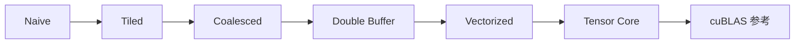
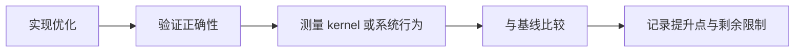

# 性能基准测试

这个页面解释 CUDA Kernel Academy 里的 benchmark 证据究竟想说明什么，以及它不能说明什么。

- **对 kernel 读者**：它帮助你把优化步骤和测量增益对应起来。
- **对库设计与系统读者**：它帮助你分辨哪些结论只是局部 kernel 提升，哪些是端到端集成信号。
- **对谨慎读者**：请先看限制说明；这里有些数值是占位参考值，而不是通用性能承诺。

## 如何阅读这个仓库里的 benchmark 证据

这个仓库里的 benchmark 更像 **教学证据**，而不是营销文案。

1. **SGEMM 阶梯图** 展示的是优化方向和相对收益。
2. **模块级表格** 说明每个模块到底在验证什么。
3. **与 cuBLAS 的对比** 是合理性校验，不代表仓库里的实现要在所有场景里取代 cuBLAS。

::: warning 限制条件同样重要
本页部分数值是针对 RTX 4090 级别 GPU 的占位参考值。它们适合帮助你理解优化阶梯的形状，但真实验证仍然必须在你自己的 GPU、编译器、时钟状态和 CUDA 版本上完成。
:::

## SGEMM 优化阶梯

| Kernel | TFLOPS (FP32) | Bandwidth (GB/s) | vs cuBLAS |
| --- | ---: | ---: | ---: |
| Naive | 0.5 | 20 | 2% |
| Tiled | 2.1 | 85 | 10% |
| Coalesced | 4.5 | 180 | 22% |
| Double Buffer | 8.2 | 320 | 40% |
| Vectorized | 12.5 | 480 | 60% |
| Tensor Core | 18.0 | 700 | 85% |
| cuBLAS | 21.0 | 820 | 100% |

<BenchmarkChart
  title="SGEMM 优化阶梯（FP32，RTX 4090 级别参考值）"
  unit="TFLOPS"
  :data="[
    { name: 'Naive', value: 0.5 },
    { name: 'Tiled', value: 2.1 },
    { name: 'Coalesced', value: 4.5 },
    { name: 'Double Buffer', value: 8.2 },
    { name: 'Vectorized', value: 12.5 },
    { name: 'Tensor Core', value: 18.0 },
    { name: 'cuBLAS', value: 21.0 }
  ]"
/>

<BenchmarkChart
  title="相对 cuBLAS 的逼近程度"
  unit="% of cuBLAS"
  type="line"
  :data="[
    { name: 'Naive', value: 2 },
    { name: 'Tiled', value: 10 },
    { name: 'Coalesced', value: 22 },
    { name: 'Double Buffer', value: 40 },
    { name: 'Vectorized', value: 60 },
    { name: 'Tensor Core', value: 85 },
    { name: 'cuBLAS', value: 100 }
  ]"
/>

## 每个模块的 benchmark 试图证明什么

| 模块 | 常见证据 | 这些证据意味着什么 | 它 **不** 代表什么 |
| --- | --- | --- | --- |
| [01-SGEMM 教程](/zh/modules/01-sgemm) | 分阶段 TFLOPS 与带宽提升 | 单个 kernel 变换确实带来了实质收益。 | 一个调优好的 SGEMM 会自然推广到所有算子。 |
| [02-TensorCraft Core](/zh/modules/02-tensorcraft) | 正确性、可复用算子行为、库级开销检查 | 抽象层仍然足够轻，适合性能敏感代码。 | 所有抽象在所有架构上都没有代价。 |
| [03-HPC 进阶](/zh/modules/03-hpc) | 来自寄存器分块、WMMA、CUTLASS 风格思路或 FlashAttention 的更高上限 | 高级技术确实能把性能天花板推近硬件极限。 | 同一种技术总是所有 GPU、所有规模下的最佳选择。 |
| [04-Inference Engine](/zh/modules/04-inference) | 吞吐、延迟，以及 stream / memory pool 复用下的运行行为 | kernel 优化放进完整执行管线后仍然有效。 | 端到端加速完全由 kernel 单独决定；调度同样重要。 |

## 如何理解 SGEMM 阶梯图

建议把这条阶梯读成一串问题：

- **Naive → Tiled**：shared memory 重用是否消除了最明显的浪费？
- **Tiled → Coalesced**：内存访问是否更符合 GPU 喜欢的事务组织方式？
- **Coalesced → Double Buffer**：计算与数据搬运是否重叠得更好？
- **Double Buffer → Vectorized / Tensor Core**：你是否开始利用硬件特定吞吐能力，而不只是做通用清理？

这条阶梯有价值，是因为它与仓库结构是同构的：前面的模块教你这些步骤，后面的模块再展示这些步骤如何进入更真实的系统环境。

## 阅读这些数字时最常见的误区

- **误区：只把 cuBLAS 百分比当作唯一指标。** 在这个仓库里，更重要的是理解每一次跳跃为什么发生。
- **误区：脱离架构背景跨 GPU 直接比较。** 同一个 kernel 在 Volta、Ampere、Ada、Hopper 上的表现可能完全不同。
- **误区：忽视正确性和集成成本。** 如果一个更快的 kernel 不能顺利进入后续模块，它就不是仓库层面的真实收益。

## 这个仓库里的 benchmark 工作流

这也是为什么 benchmark 页面本身属于 academy 风格站点的一部分：它在教读者如何把代码变更、架构判断和证据联系起来。

## 解读这些结果最重要的外部参考

<ReferenceBlock
  :references="[
    {
      id: '1',
      authors: 'Volkov, V. and Demmel, J. W.',
      title: 'Benchmarking GPUs to Tune Dense Linear Algebra',
      venue: 'SC',
      year: 2008
    },
    {
      id: '2',
      authors: 'Boehm, Simon',
      title: 'How to Optimize a CUDA Matmul Kernel',
      venue: 'Technical article',
      year: 2022,
      url: 'https://siboehm.com/articles/22/CUDA-MMM'
    },
    {
      id: '3',
      authors: 'NVIDIA',
      title: 'CUDA C++ Best Practices Guide',
      venue: 'CUDA Toolkit documentation',
      year: 2024,
      url: 'https://docs.nvidia.com/cuda/cuda-c-best-practices-guide/'
    }
  ]"
/>

## 接下来读什么

- 想理解这些数字为什么按这个顺序排列：去看 [01-SGEMM 教程](/zh/modules/01-sgemm)。
- 想理解这些优化如何进入系统设计：去看 [系统架构](/zh/whitepaper/architecture)。
- 想判断当前阶段该优先关注哪类 benchmark：跟着 [路线图](/zh/roadmap) 往下读。
