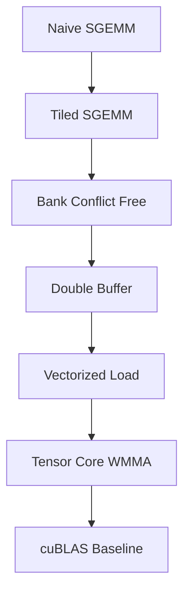

# 01-SGEMM 教程

本模块是 CUDA Kernel Academy 的入门教程，聚焦于 SGEMM 的渐进式优化过程。

## 内容概览

- Naive SGEMM
- Shared-memory tiled SGEMM
- Bank-conflict-free SGEMM
- Double-buffered SGEMM
- Tensor Core / WMMA SGEMM
- 与 cuBLAS 对比的 benchmark
- 基于 GoogleTest 的正确性测试

## 目录结构

```text
01-sgemm-tutorial/
├── src/
│   ├── kernels/
│   ├── utils/
│   └── main.cu
├── tests/
│   └── test_sgemm.cu
├── Makefile
└── README.md
```

## 构建方式

该模块是**独立教程模块**，不参与根目录 CMake 构建。

### 构建 benchmark

```bash
cd 01-sgemm-tutorial
make GPU_ARCH=sm_86
./build/sgemm_benchmark
```

### 运行测试

```bash
cd 01-sgemm-tutorial
make test
```

说明：

- `make test` 依赖系统可用的 GoogleTest（例如通过包管理器安装 `gtest` / `libgtest-dev`）。
- `GPU_ARCH` 可按本机 GPU 调整，例如 `sm_80`、`sm_86`、`sm_89`、`sm_90`。

## 学习路径



<OptimizationLadder />

## 适合什么人

- 想理解 CUDA GEMM 优化基本路径的学习者
- 想从最小示例入手理解 shared memory、bank conflict、double buffering、WMMA 的读者

## 相关模块

- [02-TensorCraft Core](./02-tensorcraft.md)
- [03-HPC Advanced](./03-hpc.md)
- [04-Inference Engine](./04-inference.md)

## References

[^1]: NVIDIA. "CUDA C++ Programming Guide," v12.6. 2024. https://docs.nvidia.com/cuda/cuda-c-programming-guide/
[^2]: Simon Boehm. "How to Optimize a CUDA Matmul Kernel." 2022. https://siboehm.com/articles/22/CUDA-MMM
[^3]: Volkov, V., and Demmel, J. W. "Benchmarking GPUs to Tune Dense Linear Algebra." *SC'08*.
[^4]: NVIDIA CUTLASS. https://github.com/NVIDIA/cutlass
