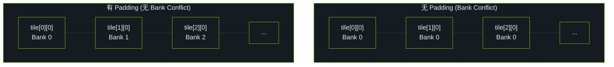

# Bank Conflict Free SGEMM

Shared Memory 被分为 32 个 Bank，每个 Bank 宽度为 4 字节。当同一 Warp 中的多个线程同时访问同一个 Bank 时，就会发生 Bank Conflict，导致访问串行化。

## Bank Conflict 示例

```cpp
// 有 Bank Conflict: 所有线程访问同一个 Bank
__shared__ float smem[32][32];
float val = smem[threadIdx.x][0];  // 所有线程访问 Bank 0

// 无 Bank Conflict: 每个线程访问不同 Bank
float val = smem[0][threadIdx.x];  // 线程 i 访问 Bank i
```

## Padding 消除 Bank Conflict

```cpp
// 矩阵转置中的 Bank Conflict
__shared__ float tile[32][32];  // 列访问时有 Bank Conflict

// 添加 Padding
__shared__ float tile[32][32 + 1];  // +1 消除 Bank Conflict
```

原理：

- 无 Padding: `tile[0][0]`、`tile[1][0]`、`tile[2][0]`、... 都在 Bank 0
- 有 Padding: `tile[0][0]` 在 Bank 0，`tile[1][0]` 在 Bank 1（因为每行多了 1 个元素），`tile[2][0]` 在 Bank 2，...

## 在 Tiled GEMM 中应用

```cpp
constexpr int TILE_SIZE = 32;

// 添加 +1 padding 避免 bank conflict
__shared__ float As[TILE_SIZE][TILE_SIZE + 1];
__shared__ float Bs[TILE_SIZE][TILE_SIZE + 1];
```

## Bank 布局示意



## References

[^1]: NVIDIA. "CUDA C++ Best Practices Guide." https://docs.nvidia.com/cuda/cuda-c-best-practices-guide/
[^2]: NVIDIA. "CUDA C++ Programming Guide," v12.6. 2024. https://docs.nvidia.com/cuda/cuda-c-programming-guide/
