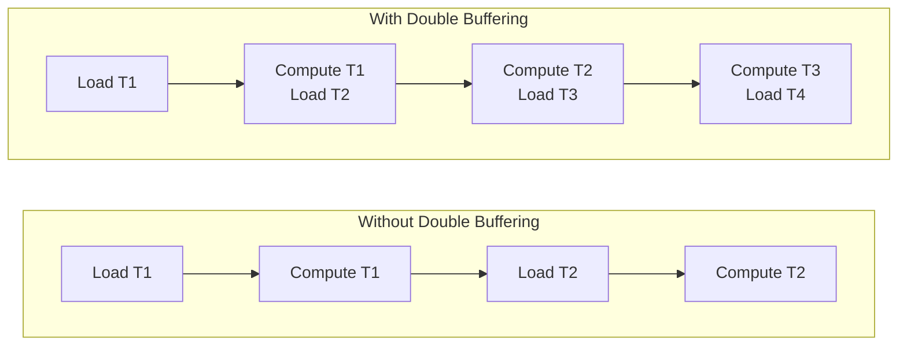

# Double Buffer SGEMM

使用双缓冲技术，在计算当前 Tile 的同时预取下一个 Tile，从而隐藏内存延迟。

## 优化思路

```cpp
__global__ void gemm_double_buffer_kernel(const float* A, const float* B, float* C,
                                           int M, int N, int K) {
    __shared__ float As[2][TILE_SIZE][TILE_SIZE];  // 双缓冲
    __shared__ float Bs[2][TILE_SIZE][TILE_SIZE];

    int row = blockIdx.y * TILE_SIZE + threadIdx.y;
    int col = blockIdx.x * TILE_SIZE + threadIdx.x;
    float sum = 0.0f;

    int write_stage = 0;
    int read_stage = 0;

    // 预取第一个 Tile
    load_tile(As[write_stage], Bs[write_stage], A, B, 0, row, col, M, N, K);
    __syncthreads();

    for (int t = 0; t < num_tiles; ++t) {
        read_stage = write_stage;
        write_stage = 1 - write_stage;

        // 异步加载下一个 Tile
        if (t + 1 < num_tiles) {
            load_tile(As[write_stage], Bs[write_stage], A, B, t + 1, row, col, M, N, K);
        }

        // 计算当前 Tile
        for (int k = 0; k < TILE_SIZE; ++k) {
            sum += As[read_stage][threadIdx.y][k] * Bs[read_stage][k][threadIdx.x];
        }

        __syncthreads();
    }
    // ...
}
```

## 性能提升

- **隐藏内存延迟**: 计算与加载重叠
- **TFLOPS**: ~3.5

## 时间线对比



## References
