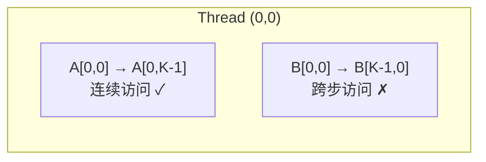

# Naive SGEMM

每个线程计算输出矩阵 C 的一个元素。这是理解 CUDA GEMM 的最小起点。

## 实现思路

```cpp
__global__ void gemm_naive_kernel(const float* A, const float* B, float* C,
                                   int M, int N, int K) {
    int row = blockIdx.y * blockDim.y + threadIdx.y;
    int col = blockIdx.x * blockDim.x + threadIdx.x;

    if (row < M && col < N) {
        float sum = 0.0f;
        for (int k = 0; k < K; ++k) {
            sum += A[row * K + k] * B[k * N + col];
        }
        C[row * N + col] = sum;
    }
}
```

## 性能分析

- **问题**: 每个元素需要 2K 次全局内存访问
- **带宽利用率**: ~5-10%
- **TFLOPS**: ~0.5 (FP32, RTX 4090)

## 内存访问模式



A 矩阵的访问是连续的（行优先），但 B 矩阵的访问是跨步的（列优先），导致无法充分利用合并访问。

## References

[^1]: NVIDIA. "CUDA C++ Programming Guide," v12.6. 2024. https://docs.nvidia.com/cuda/cuda-c-programming-guide/
[^2]: Simon Boehm. "How to Optimize a CUDA Matmul Kernel." 2022. https://siboehm.com/articles/22/CUDA-MMM
[^3]: Volkov, V., and Demmel, J. W. "Benchmarking GPUs to Tune Dense Linear Algebra." *SC'08*.
