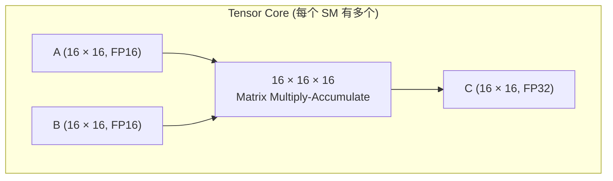

# Tensor Core SGEMM

使用 NVIDIA Tensor Core 进行矩阵乘法，利用专用硬件加速。

## WMMA API

```cpp
#include <mma.h>
using namespace nvcuda;

constexpr int WMMA_M = 16;
constexpr int WMMA_N = 16;
constexpr int WMMA_K = 16;

__global__ void gemm_wmma_kernel(const __half* A, const __half* B, float* C,
                                  int M, int N, int K) {
    // 声明 Fragment
    wmma::fragment<wmma::matrix_a, WMMA_M, WMMA_N, WMMA_K, __half, wmma::row_major> a_frag;
    wmma::fragment<wmma::matrix_b, WMMA_M, WMMA_N, WMMA_K, __half, wmma::row_major> b_frag;
    wmma::fragment<wmma::accumulator, WMMA_M, WMMA_N, WMMA_K, float> c_frag;

    wmma::fill_fragment(c_frag, 0.0f);

    for (int k = 0; k < K; k += WMMA_K) {
        // 加载 Fragment
        wmma::load_matrix_sync(a_frag, A + row * K + k, K);
        wmma::load_matrix_sync(b_frag, B + k * N + col, N);

        // Tensor Core MMA
        wmma::mma_sync(c_frag, a_frag, b_frag, c_frag);
    }

    // 存储结果
    wmma::store_matrix_sync(C + row * N + col, c_frag, N, wmma::mem_row_major);
}
```

## 性能提升

- **Tensor Core 吞吐**: 比 CUDA Core 高 8-16×
- **TFLOPS**: ~50+ (FP16)

## Tensor Core 架构



## MMA PTX

使用 PTX 指令直接控制 Tensor Core，获得更细粒度的控制：

```cpp
__device__ __forceinline__ void mma_m16n8k16_fp16(
    uint32_t* d, const uint32_t* a, const uint32_t* b, const uint32_t* c) {
    asm volatile(
        "mma.sync.aligned.m16n8k16.row.col.f16.f16.f16.f16 "
        "{%0, %1}, "
        "{%2, %3, %4, %5}, "
        "{%6, %7}, "
        "{%8, %9};\n"
        : "=r"(d[0]), "=r"(d[1])
        : "r"(a[0]), "r"(a[1]), "r"(a[2]), "r"(a[3]),
          "r"(b[0]), "r"(b[1]),
          "r"(c[0]), "r"(c[1])
    );
}
```

## References
