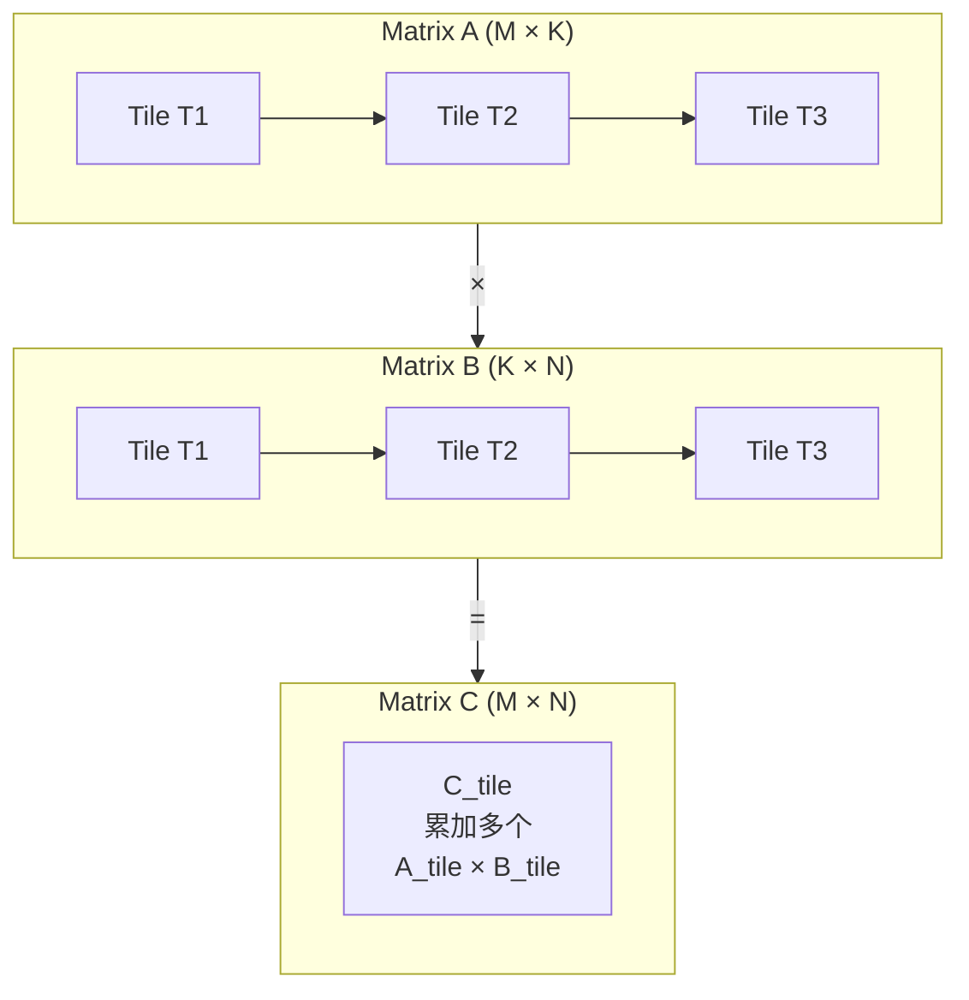

# Tiled SGEMM

将 A 和 B 的子块加载到 Shared Memory，减少全局内存访问。

## 优化思路

```cpp
constexpr int TILE_SIZE = 32;

__global__ void gemm_shared_kernel(const float* A, const float* B, float* C,
                                    int M, int N, int K) {
    __shared__ float As[TILE_SIZE][TILE_SIZE];
    __shared__ float Bs[TILE_SIZE][TILE_SIZE];

    int row = blockIdx.y * TILE_SIZE + threadIdx.y;
    int col = blockIdx.x * TILE_SIZE + threadIdx.x;
    float sum = 0.0f;

    for (int t = 0; t < (K + TILE_SIZE - 1) / TILE_SIZE; ++t) {
        // 协作加载 Tile 到 Shared Memory
        int a_col = t * TILE_SIZE + threadIdx.x;
        int b_row = t * TILE_SIZE + threadIdx.y;

        As[threadIdx.y][threadIdx.x] = (row < M && a_col < K) ? A[row * K + a_col] : 0.0f;
        Bs[threadIdx.y][threadIdx.x] = (b_row < K && col < N) ? B[b_row * N + col] : 0.0f;

        __syncthreads();

        // 计算部分点积
        for (int k = 0; k < TILE_SIZE; ++k) {
            sum += As[threadIdx.y][k] * Bs[k][threadIdx.x];
        }

        __syncthreads();
    }

    if (row < M && col < N) {
        C[row * N + col] = sum;
    }
}
```

## 性能提升

- **全局内存访问减少**: K → K/TILE_SIZE
- **带宽利用率**: ~30-40%
- **TFLOPS**: ~2.0

## Tiling 示意图



每个 Block 处理一个 TILE_SIZE × TILE_SIZE 的输出块，通过迭代加载 K 维度的 Tile 进行累加。

## References

[^1]: NVIDIA. "CUDA C++ Programming Guide," v12.6. 2024. https://docs.nvidia.com/cuda/cuda-c-programming-guide/
[^2]: Simon Boehm. "How to Optimize a CUDA Matmul Kernel." 2022. https://siboehm.com/articles/22/CUDA-MMM
[^3]: NVIDIA CUTLASS. https://github.com/NVIDIA/cutlass
