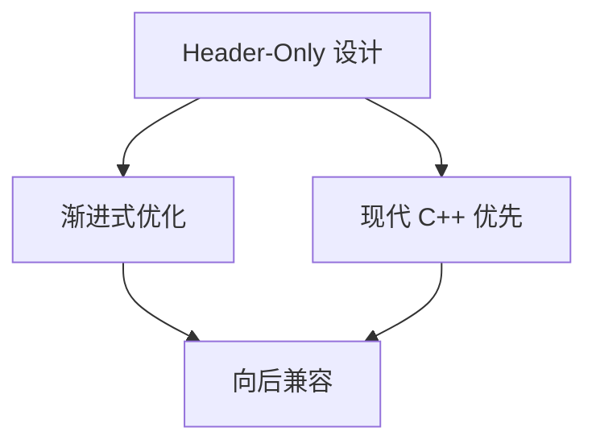
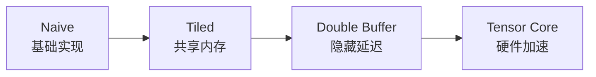

# 02-TensorCraft Core

TensorCraft Core 是 CUDA Kernel Academy 的教学算子库。采用 Header-Only 设计便于阅读和实验，但**不是生产级实现**：边界处理、算子覆盖和性能都按学习目标做了裁剪。

## 模块定位

**前置要求**：完成 `01-sgemm-tutorial`
**后续学习**：`03-hpc-advanced`（进阶）或 `04-inference-engine`（应用）

## 设计原则依赖关系



### 1. Header-Only 设计

核心库采用纯头文件设计，优点：

- **零配置集成**：只需 `#include` 即可使用
- **编译时优化**：模板代码可以完全内联
- **跨平台兼容**：无需预编译库

```cpp
// 使用方式
#include "tensorcraft/kernels/gemm.hpp"
tensorcraft::kernels::gemm(A, B, C, M, N, K);
```

### 2. 渐进式优化

每个算子提供多个优化级别，便于学习和对比：



### 3. 现代 C++ 优先

充分利用 C++17/20/23 特性：

- **Concepts** (C++20): 类型约束
- **constexpr if** (C++17): 编译时分支
- **Structured Bindings** (C++17): 多返回值
- **RAII**: 自动资源管理

### 4. 向后兼容

支持 CUDA 11.0-13.1，通过条件编译处理新特性：

```cpp
#if TC_CUDA_VERSION >= 12000
    // FP8 支持
#endif

#if TC_CUDA_VERSION >= 11080
    // WGMMA 支持
#endif
```

## 核心特性

| 特性 | 描述 |
|------|------|
| **Header-Only** | 纯头文件设计，零编译依赖 |
| **多架构支持** | Volta (sm_70) 到 Hopper (sm_90) |
| **Python 绑定** | pybind11 提供 Python 接口 |
| **完整测试** | GoogleTest 单元测试 |
| **性能基准** | Google Benchmark 性能测试 |

## 目录结构

```text
02-tensorcraft-core/
├── include/tensorcraft/
│   ├── core/
│   │   ├── cuda_check.hpp      # CUDA 错误检查（统一标准）
│   │   ├── features.hpp        # 特性检测
│   │   └── type_traits.hpp     # 类型特征
│   ├── kernels/
│   │   ├── gemm.hpp            # GEMM 实现
│   │   ├── attention.hpp       # Attention 机制
│   │   ├── normalization.hpp   # LayerNorm / RMSNorm
│   │   ├── elementwise.hpp     # 激活函数
│   │   ├── softmax.hpp         # Softmax
│   │   ├── conv2d.hpp          # 卷积
│   │   ├── sparse.hpp          # 稀疏矩阵
│   │   └── fusion.hpp          # 算子融合
│   └── memory/
│       ├── tensor.hpp          # Tensor 封装
│       └── memory_pool.hpp     # 内存池
├── src/python_ops/             # Python 绑定
├── tests/                      # 单元测试
├── benchmarks/                 # 性能基准
├── docs/                       # 文档
└── CMakeLists.txt
```

## 快速开始

### 环境要求

- CMake 3.20+
- CUDA Toolkit 11.0+
- C++17 兼容编译器

### 构建

```bash
mkdir build && cd build
cmake .. -DCMAKE_BUILD_TYPE=Release
make -j$(nproc)

# 运行测试
ctest --output-on-failure

# 运行 benchmark
./benchmarks/gemm_benchmark
```

### 在项目中使用

**方式 1: 作为子目录**

```cmake
add_subdirectory(02-tensorcraft-core)
target_link_libraries(your_target PRIVATE tensorcraft)
```

**方式 2: 直接包含头文件**

```cmake
target_include_directories(your_target PRIVATE
    path/to/02-tensorcraft-core/include)
target_link_libraries(your_target PRIVATE CUDA::cudart)
```

## API 使用示例

### GEMM 矩阵乘法

```cpp
#include "tensorcraft/kernels/gemm.hpp"

using namespace tensorcraft::kernels;

// 选择优化版本
launch_gemm(d_A, d_B, d_C, M, N, K,
            1.0f, 0.0f,                    // alpha, beta
            GemmVersion::Tiled,            // 版本选择
            stream);

// WMMA Tensor Core：half 输入、float 输出；M/N/K 必须为 16 的倍数
#ifdef TC_HAS_WMMA
launch_gemm_wmma(d_A_half, d_B_half, d_C_float, M, N, K);
#endif
```

### Attention 机制

```cpp
#include "tensorcraft/kernels/attention.hpp"

// FlashAttention 风格
float scale = 1.0f / sqrtf(head_dim);
launch_flash_attention(d_Q, d_K, d_V, d_O,
                       batch_size, num_heads, seq_len, head_dim, scale);

// RoPE 位置编码
launch_rope(d_x, d_cos, d_sin, batch_size, seq_len, num_heads, head_dim);
```

## 性能基准

本页**不发布未复现的性能数字**。请在本机运行 `gemm_benchmark`，并记录 GPU、
驱动、CUDA 版本、形状、warmup 和迭代次数。历史表格中未经本机复现的数字
已删除，避免把占位参考值误当成事实。

## 相关模块

| 模块 | 关系 | 说明 |
|------|------|------|
| [01-SGEMM](./01-sgemm.md) | 前置 | SGEMM 基础优化 |
| [03-HPC Advanced](./03-hpc.md) | 扩展 | 进阶优化技术 |
| [04-Inference Engine](./04-inference.md) | 依赖方 | 使用本库构建推理引擎 |

## References
