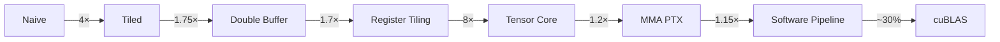

# Kernel 优化指南

本指南解释 TensorCraft Core 中使用的优化技术。

## GEMM 优化路径



### Level 1: Naive Implementation

最简单的 GEMM，每个线程计算一个输出元素：

```cpp
template<typename T>
__global__ void gemm_naive(const T* A, const T* B, T* C, int M, int N, int K) {
    int row = blockIdx.y * blockDim.y + threadIdx.y;
    int col = blockIdx.x * blockDim.x + threadIdx.x;

    if (row < M && col < N) {
        float sum = 0.0f;
        for (int k = 0; k < K; ++k) {
            sum += A[row * K + k] * B[k * N + col];
        }
        C[row * N + col] = sum;
    }
}
```

**问题：**

- 每个线程读取 K 个 A 元素和 K 个 B 元素
- 全局内存读取总量: M × N × 2K
- 算术强度很低

### Level 2: Shared Memory Tiling

将 Tile 加载到共享内存以减少全局内存访问：

```cpp
template<typename T, int TILE_SIZE = 32>
__global__ void gemm_tiled(const T* A, const T* B, T* C, int M, int N, int K) {
    __shared__ float As[TILE_SIZE][TILE_SIZE];
    __shared__ float Bs[TILE_SIZE][TILE_SIZE];

    int row = blockIdx.y * TILE_SIZE + threadIdx.y;
    int col = blockIdx.x * TILE_SIZE + threadIdx.x;
    float sum = 0.0f;

    for (int t = 0; t < (K + TILE_SIZE - 1) / TILE_SIZE; ++t) {
        As[threadIdx.y][threadIdx.x] = A[row * K + t * TILE_SIZE + threadIdx.x];
        Bs[threadIdx.y][threadIdx.x] = B[(t * TILE_SIZE + threadIdx.y) * N + col];
        __syncthreads();

        for (int k = 0; k < TILE_SIZE; ++k) {
            sum += As[threadIdx.y][k] * Bs[k][threadIdx.x];
        }
        __syncthreads();
    }

    C[row * N + col] = sum;
}
```

**改进：**

- 每个 Tile 只加载一次，被使用 TILE_SIZE 次
- 全局内存读取减少 TILE_SIZE 倍
- 合并内存访问模式

### Level 3: Double Buffering

重叠内存加载与计算：

```cpp
template<typename T, int TILE_SIZE = 32>
__global__ void gemm_double_buffer(const T* A, const T* B, T* C, int M, int N, int K) {
    __shared__ float As[2][TILE_SIZE][TILE_SIZE];
    __shared__ float Bs[2][TILE_SIZE][TILE_SIZE];

    // 预取第一个 tile
    As[0][ty][tx] = A[...];
    Bs[0][ty][tx] = B[...];
    __syncthreads();

    for (int t = 0; t < num_tiles; ++t) {
        int curr = t % 2;
        int next = (t + 1) % 2;

        // 预取下一个 tile 的同时计算当前
        if (t + 1 < num_tiles) {
            As[next][ty][tx] = A[...];
            Bs[next][ty][tx] = B[...];
        }

        // 用当前 tile 计算
        for (int k = 0; k < TILE_SIZE; ++k) {
            sum += As[curr][ty][k] * Bs[curr][k][tx];
        }
        __syncthreads();
    }
}
```

**改进：**

- 用计算隐藏内存延迟
- 更好地利用内存带宽

### Level 4: Tensor Cores (WMMA)

使用硬件矩阵乘法单元：

```cpp
#include <mma.h>
using namespace nvcuda::wmma;

__global__ void gemm_wmma(const half* A, const half* B, float* C, int M, int N, int K) {
    fragment<matrix_a, 16, 16, 16, half, row_major> a_frag;
    fragment<matrix_b, 16, 16, 16, half, row_major> b_frag;
    fragment<accumulator, 16, 16, 16, float> c_frag;

    fill_fragment(c_frag, 0.0f);

    for (int k = 0; k < K; k += 16) {
        load_matrix_sync(a_frag, A + warp_row * K + k, K);
        load_matrix_sync(b_frag, B + k * N + warp_col, N);
        mma_sync(c_frag, a_frag, b_frag, c_frag);
    }

    store_matrix_sync(C + warp_row * N + warp_col, c_frag, N, mem_row_major);
}
```

**改进：**

- 硬件加速 16×16×16 矩阵乘法
- 比 FMA 指令高得多的吞吐

## Softmax Optimization

### Online Algorithm

使用运行最大值和和进行单遍 Softmax：

```cpp
float m_prev = -INFINITY;
float l_prev = 0.0f;

for (int i = 0; i < n; ++i) {
    float x = input[i];

    if (x > m_prev) {
        l_prev *= expf(m_prev - x);
        m_prev = x;
    }
    l_prev += expf(x - m_prev);
}

// 归一化
for (int i = 0; i < n; ++i) {
    output[i] = expf(input[i] - m_prev) / l_prev;
}
```

### Warp Shuffle Reduction

使用 warp shuffle 进行高效并行归约：

```cpp
__device__ float warp_reduce_sum(float val) {
    #pragma unroll
    for (int offset = 16; offset > 0; offset /= 2) {
        val += __shfl_down_sync(0xffffffff, val, offset);
    }
    return val;
}
```

## 内存访问优化

### 向量化加载

```cpp
template<typename T, int N>
struct alignas(sizeof(T) * N) AlignedVector {
    T val[N];
};

// 一次加载 4 个 float (128 bits)
using Vec4 = AlignedVector<float, 4>;
Vec4 data = *reinterpret_cast<const Vec4*>(&input[idx]);
```

### 合并访问

```cpp
// 好: 相邻线程访问相邻内存
output[threadIdx.x] = input[threadIdx.x];

// 差: 跨步访问
output[threadIdx.x * stride] = input[threadIdx.x * stride];
```

### Bank Conflict 避免

```cpp
// 无 padding: bank conflicts on column access
__shared__ float tile[32][32];

// 有 padding: no bank conflicts
__shared__ float tile[32][32 + 1];
```

## 分析技巧

### Nsight Compute Metrics

关键监控指标：

1. **Memory Throughput**: 达到峰值带宽的百分比
2. **Compute Throughput**: 达到峰值 FLOPS 的百分比
3. **Occupancy**: 活跃 warp / 最大 warp
4. **Warp Stall Reasons**: warp 等待的原因

### Roofline Analysis

在 Roofline 模型上绘制你的 kernel：

- **内存受限**: 在斜线下方（提高算术强度）
- **计算受限**: 在水平线下方（优化计算）

### 常见瓶颈

1. **低占用率**: 减少寄存器/共享内存使用
2. **内存带宽**: 使用向量化加载，改善合并访问
3. **Bank conflicts**: 给共享内存添加 padding
4. **Warp divergence**: 最小化条件分支

## References

[^1]: NVIDIA. "CUDA C++ Best Practices Guide." https://docs.nvidia.com/cuda/cuda-c-best-practices-guide/
[^2]: Dao, T., et al. "FlashAttention: Fast and Memory-Efficient Exact Attention with IO-Awareness." *NeurIPS* 2022. https://arxiv.org/abs/2205.14135
[^3]: NVIDIA CUTLASS. https://github.com/NVIDIA/cutlass
[^4]: Simon Boehm. "How to Optimize a CUDA Matmul Kernel." 2022. https://siboehm.com/articles/22/CUDA-MMM
