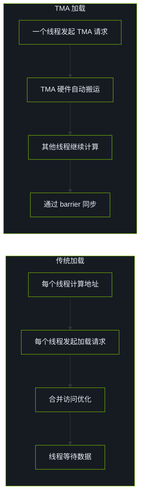
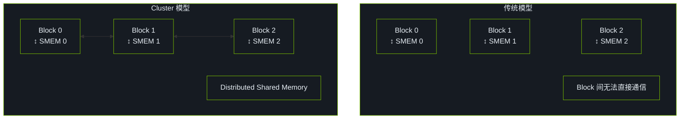

# CUDA 13 & Hopper 架构特性

本文档介绍 CUDA 12/13 时代与 Hopper 相关的新特性，并结合本仓库中的教学性/实验性实现进行说明。

## 1. Hopper 架构概述

### 主要改进

| 特性 | Ampere (A100) | Hopper (H100) | 提升 |
|------|---------------|---------------|------|
| FP16 Tensor Core | 312 TFLOPS | 989 TFLOPS | 3.2× |
| FP8 Tensor Core | - | 1979 TFLOPS | 新增 |
| HBM 带宽 | 2 TB/s | 3.35 TB/s | 1.7× |
| L2 Cache | 40 MB | 50 MB | 1.25× |
| Shared Memory | 164 KB/SM | 228 KB/SM | 1.4× |

### 新特性列表

1. **TMA (Tensor Memory Accelerator)**: 异步数据搬运
2. **Thread Block Clusters**: Block 间协作
3. **Distributed Shared Memory**: 跨 Block 共享内存
4. **FP8 数据类型**: e4m3 和 e5m2
5. **Asynchronous Transaction Barrier**: 异步同步原语

## 2. TMA (Tensor Memory Accelerator)

TMA 是 Hopper 架构引入的硬件单元，专门用于高效的多维数据搬运。

**优势**:

- 解放 SM 计算资源
- 自动处理边界条件
- 支持多维 Tensor 布局

### TMA vs 传统加载



## 3. Thread Block Clusters

### 什么是 Cluster？

Cluster 是多个 Thread Block 的组合，可以协作访问彼此的 Shared Memory。



### Cluster 配置

```cpp
// 编译时配置
__global__ __cluster_dims__(2, 2, 1)
void cluster_kernel(...) {
    // Cluster 大小: 2×2×1 = 4 个 Block
}

// 运行时配置
cudaLaunchConfig_t config;
config.gridDim = {num_blocks_x, num_blocks_y, 1};
config.blockDim = {256, 1, 1};

cudaLaunchAttribute attrs[1];
attrs[0].id = cudaLaunchAttributeClusterDimension;
attrs[0].val.clusterDim = {2, 2, 1};

config.attrs = attrs;
config.numAttrs = 1;

cudaLaunchKernelEx(&config, cluster_kernel, args...);
```

## 4. FP8 数据类型

### FP8 格式

| 格式 | 指数位 | 尾数位 | 范围 | 精度 | 用途 |
|------|--------|--------|------|------|------|
| E4M3 | 4 | 3 | ±240 | 较高 | 权重、激活 |
| E5M2 | 5 | 2 | ±57344 | 较低 | 梯度 |

### FP8 GEMM

```cpp
#include <cuda_fp8.h>

__global__ void fp8_gemm_kernel(
    const __nv_fp8_e4m3* A,
    const __nv_fp8_e4m3* B,
    float* C,
    int M, int N, int K) {

    wmma::fragment<wmma::matrix_a, 16, 16, 32, __nv_fp8_e4m3, wmma::row_major> a_frag;
    wmma::fragment<wmma::matrix_b, 16, 16, 32, __nv_fp8_e4m3, wmma::col_major> b_frag;
    wmma::fragment<wmma::accumulator, 16, 16, 32, float> c_frag;

    wmma::fill_fragment(c_frag, 0.0f);

    for (int k = 0; k < K; k += 32) {
        wmma::load_matrix_sync(a_frag, A + row * K + k, K);
        wmma::load_matrix_sync(b_frag, B + k * N + col, N);
        wmma::mma_sync(c_frag, a_frag, b_frag, c_frag);
    }

    wmma::store_matrix_sync(C + row * N + col, c_frag, N, wmma::mem_row_major);
}
```

## 5. Asynchronous Transaction Barrier

Transaction Barrier 是一种新的同步原语，可以等待特定数量的异步操作完成。

```cpp
#include <cuda/barrier>

__global__ void async_barrier_kernel(float* data) {
    __shared__ cuda::barrier<cuda::thread_scope_block> barrier;
    __shared__ float smem[256];

    if (threadIdx.x == 0) {
        init(&barrier, blockDim.x);
    }
    __syncthreads();

    cuda::memcpy_async(
        smem + threadIdx.x,
        data + blockIdx.x * blockDim.x + threadIdx.x,
        sizeof(float),
        barrier
    );

    barrier.arrive_and_wait();

    float val = smem[threadIdx.x];
}
```

## 6. 性能优化建议

### 何时使用 TMA

- 大块连续数据搬运
- 多维 Tensor 访问
- 需要解放 SM 计算资源

### 何时使用 Cluster

- Block 间需要通信
- 归约操作跨多个 Block
- 需要更大的 Shared Memory

### 何时使用 FP8

- 推理场景
- 模型精度允许
- 需要最大吞吐量

<CudaTimeline />

## 7. 兼容性注意事项

```cpp
// 检查 Hopper 特性支持
int device;
cudaGetDevice(&device);

cudaDeviceProp prop;
cudaGetDeviceProperties(&prop, device);

// Compute Capability 9.0+ 支持 Hopper 特性
if (prop.major >= 9) {
    // 可以使用 TMA, Cluster, FP8
}
```

## References

[^1]: NVIDIA. "CUDA C++ Programming Guide — Hopper." https://docs.nvidia.com/cuda/cuda-c-programming-guide/index.html#hopper-architecture
[^2]: NVIDIA. "H100 Whitepaper." https://resources.nvidia.com/en-us-tensor-core
[^3]: NVIDIA CUTLASS. https://github.com/NVIDIA/cutlass
[^4]: NVIDIA. "CUDA C++ Programming Guide," v12.6. 2024. https://docs.nvidia.com/cuda/cuda-c-programming-guide/
