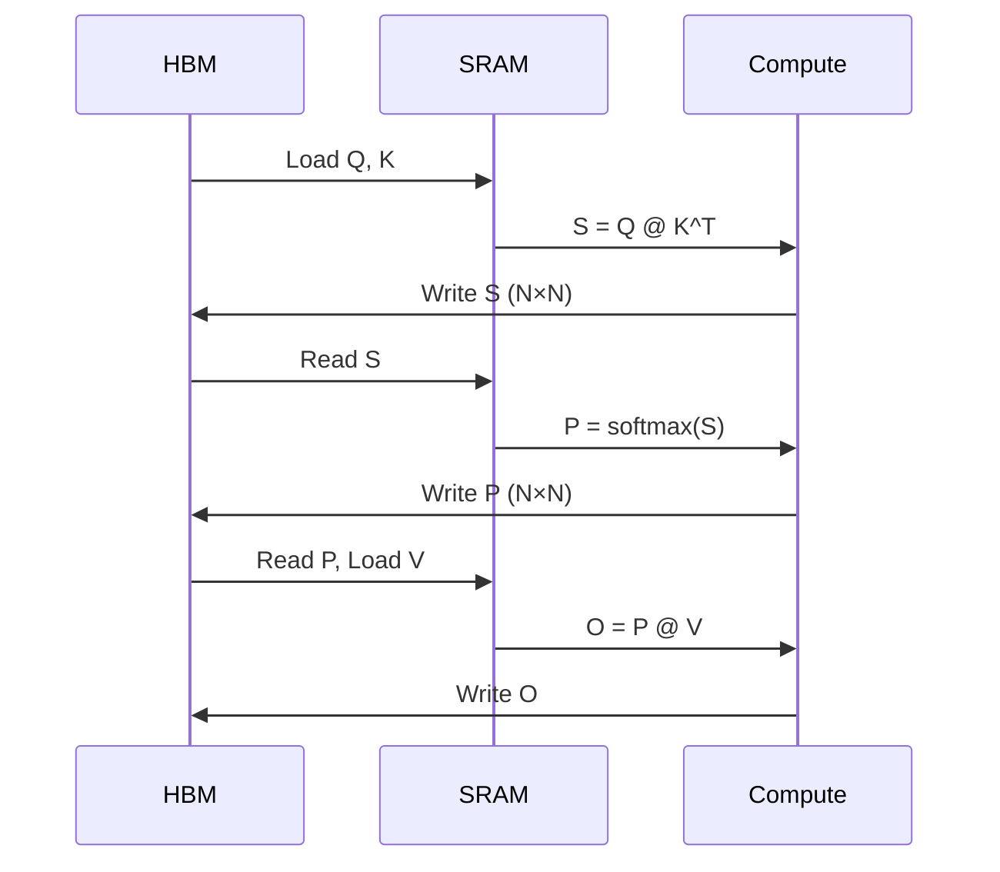
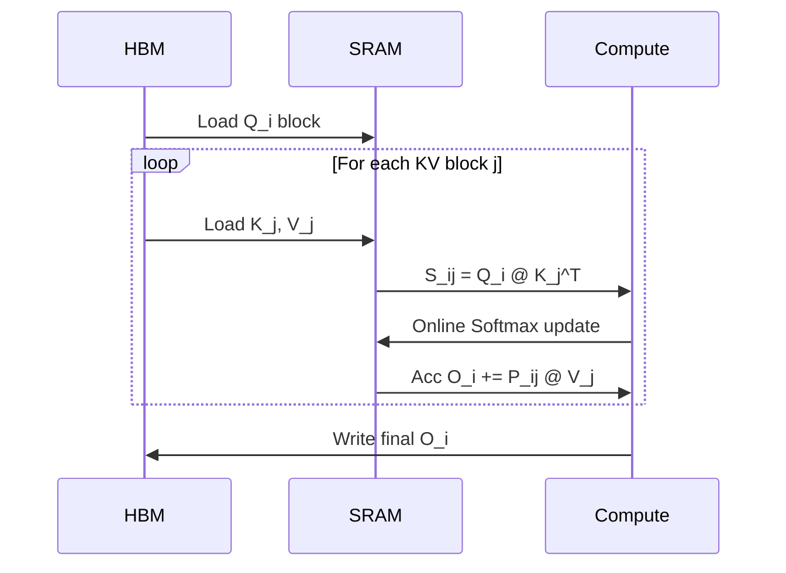
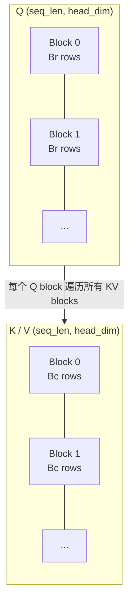
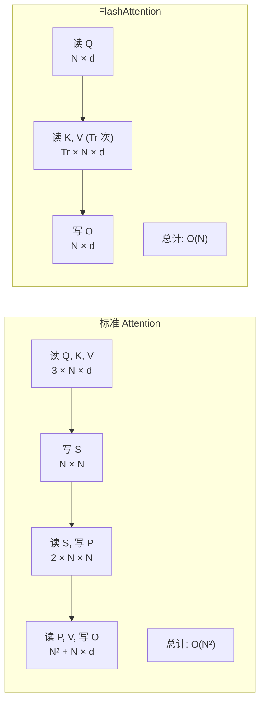

# FlashAttention 详解

::: warning 性能数字为教学占位
本页 TFLOPS、加速比和内存数字大多来自教学资料或特定硬件的参考值，并非本仓库在统一脚本、统一硬件上复现的结果。面试或文档引用前，请用自己的 GPU 重跑并记录复现命令与版本。
:::


本文档详细介绍 FlashAttention 的原理和实现。

## 1. 标准 Attention 的问题

### 标准 Attention 公式

```text
Attention(Q, K, V) = softmax(Q @ K^T / sqrt(d)) @ V
```

### 内存问题

Q @ K^T 产生 (seq_len × seq_len) 的注意力矩阵。

```text
seq_len = 2048, heads = 32, batch = 8
注意力矩阵大小 = 8 × 32 × 2048 × 2048 × 4 bytes = 4.3 GB!
```

### IO 瓶颈

标准实现的数据流：



总 HBM 访问: O(N²) 次。

## 2. FlashAttention 核心思想

### Tiling + Online Softmax

**核心思想**: 将 Q, K, V 分块加载到 SRAM (Shared Memory)，在 SRAM 中完成所有计算，避免写入 N×N 矩阵到 HBM。

FlashAttention 的数据流：



总 HBM 访问: O(N) 次（只读写原始 Q, K, V, O）。

### 分块策略



Br, Bc 选择使得块能放入 SRAM。

## 3. 算法详解

### FlashAttention Forward 伪代码

```python
def flash_attention_forward(Q, K, V, Br, Bc):
    N, d = Q.shape
    Tr = ceil(N / Br)
    Tc = ceil(N / Bc)

    O = zeros(N, d)
    l = zeros(N)       # softmax 分母
    m = full(N, -inf)  # 当前最大值

    for j in range(Tc):
        Kj = K[j*Bc : (j+1)*Bc]
        Vj = V[j*Bc : (j+1)*Bc]

        for i in range(Tr):
            Qi = Q[i*Br : (i+1)*Br]

            Sij = Qi @ Kj.T / sqrt(d)

            m_new = max(m[i*Br:(i+1)*Br], rowmax(Sij))
            P_tilde = exp(Sij - m_new[:, None])
            l_new = exp(m[i*Br:(i+1)*Br] - m_new) * l[i*Br:(i+1)*Br] + rowsum(P_tilde)

            O[i*Br:(i+1)*Br] = (
                exp(m[i*Br:(i+1)*Br] - m_new)[:, None] * O[i*Br:(i+1)*Br] +
                P_tilde @ Vj
            ) / l_new[:, None] * l[i*Br:(i+1)*Br][:, None]

            m[i*Br:(i+1)*Br] = m_new
            l[i*Br:(i+1)*Br] = l_new

    return O
```

## 4. CUDA 实现

### Kernel 结构

```cpp
__global__ void flash_attention_forward_kernel(
    const float* Q, const float* K, const float* V, float* O,
    int batch, int heads, int seq_len, int head_dim,
    int Br, int Bc) {

    int batch_idx = blockIdx.x / heads;
    int head_idx = blockIdx.x % heads;
    int q_block_idx = blockIdx.y;

    extern __shared__ float smem[];
    float* Qi = smem;
    float* Kj = Qi + Br * head_dim;
    float* Vj = Kj + Bc * head_dim;
    float* Sij = Vj + Bc * head_dim;
    float* Oi = Sij + Br * Bc;
    float* li = Oi + Br * head_dim;
    float* mi = li + Br;

    load_tile(Q, Qi, batch_idx, head_idx, q_block_idx * Br, Br, head_dim);

    int num_kv_blocks = (seq_len + Bc - 1) / Bc;
    for (int j = 0; j < num_kv_blocks; ++j) {
        load_tile(K, Kj, batch_idx, head_idx, j * Bc, Bc, head_dim);
        load_tile(V, Vj, batch_idx, head_idx, j * Bc, Bc, head_dim);
        __syncthreads();

        compute_qk(Qi, Kj, Sij, Br, Bc, head_dim);
        __syncthreads();

        online_softmax_update(Sij, Vj, Oi, li, mi, Br, Bc, head_dim);
        __syncthreads();
    }

    store_tile(Oi, O, batch_idx, head_idx, q_block_idx * Br, Br, head_dim);
}
```

## 5. 内存分析

### SRAM 使用

```text
Br = 64, Bc = 64, head_dim = 128

Qi:   64 × 128 × 4 = 32 KB
Kj:   64 × 128 × 4 = 32 KB
Vj:   64 × 128 × 4 = 32 KB
Sij:  64 × 64  × 4 = 16 KB
Oi:   64 × 128 × 4 = 32 KB
li, mi: 64 × 4 × 2 = 0.5 KB

总计: ~145 KB
```

### HBM 访问对比



<FlashAttentionViz />

## 6. 性能对比

### 内存使用

| 实现 | seq_len = 2048 | seq_len = 4096 | seq_len = 8192 |
|------|----------------|----------------|----------------|
| 标准 | 4.3 GB | 17.2 GB | 68.7 GB |
| FlashAttention | 0.5 GB | 0.5 GB | 0.5 GB |

### 速度对比

| 实现 | seq_len = 2048 | seq_len = 4096 |
|------|----------------|----------------|
| PyTorch | 45 ms | 180 ms |
| FlashAttention | 12 ms | 48 ms |
| 加速比 | 3.75× | 3.75× |

## References
