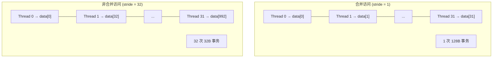
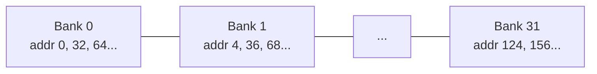

# 访存优化详解

本文档详细介绍 CUDA 访存优化技术，包括合并访问、向量化加载和 Shared Memory 使用。

## 1. 合并访问 (Coalesced Access)

### 什么是合并访问？

当一个 Warp (32 个线程) 访问连续的内存地址时，GPU 可以将这些访问合并为一次或少数几次内存事务。

### 好的访问模式

```cpp
// 合并访问: 相邻线程访问相邻地址
__global__ void good_access(float* data, int n) {
    int idx = blockIdx.x * blockDim.x + threadIdx.x;
    if (idx < n) {
        data[idx] = data[idx] * 2.0f;
    }
}
```

### 坏的访问模式

```cpp
// 非合并访问: 跨步访问
__global__ void bad_access(float* data, int n, int stride) {
    int idx = blockIdx.x * blockDim.x + threadIdx.x;
    if (idx * stride < n) {
        data[idx * stride] = data[idx * stride] * 2.0f;
    }
}
```

### 内存事务对比



## 2. 向量化加载 (Vectorized Load/Store)

### 为什么使用向量化？

- 减少指令数量
- 提高内存带宽利用率
- 更好的指令级并行

### float4 向量化示例

```cpp
// 标量版本
__global__ void relu_scalar(const float* input, float* output, size_t n) {
    size_t idx = blockIdx.x * blockDim.x + threadIdx.x;
    if (idx < n) {
        output[idx] = fmaxf(0.0f, input[idx]);
    }
}

// 向量化版本 (float4)
__global__ void relu_vectorized(const float* input, float* output, size_t n) {
    size_t idx = blockIdx.x * blockDim.x + threadIdx.x;
    size_t vec_idx = idx * 4;

    if (vec_idx + 3 < n) {
        float4 in = reinterpret_cast<const float4*>(input)[idx];
        float4 out;
        out.x = fmaxf(0.0f, in.x);
        out.y = fmaxf(0.0f, in.y);
        out.z = fmaxf(0.0f, in.z);
        out.w = fmaxf(0.0f, in.w);
        reinterpret_cast<float4*>(output)[idx] = out;
    }
}
```

### 性能对比

| 版本 | 指令数 | 带宽利用率 |
|------|--------|------------|
| 标量 | 4× | ~60% |
| float4 | 1× | ~90% |

## 3. Grid Stride Loop

### 为什么使用 Grid Stride Loop？

- 处理任意大小的输入
- 更好的负载均衡
- 减少 Kernel 启动开销

### 实现

```cpp
__global__ void relu_grid_stride(const float* input, float* output, size_t n) {
    size_t idx = blockIdx.x * blockDim.x + threadIdx.x;
    size_t stride = blockDim.x * gridDim.x;

    for (size_t i = idx; i < n; i += stride) {
        output[i] = fmaxf(0.0f, input[i]);
    }
}

// 启动配置
int block_size = 256;
int num_blocks = min((n + block_size - 1) / block_size, 1024);
relu_grid_stride<<<num_blocks, block_size>>>(input, output, n);
```

## 4. Shared Memory 优化

### Bank Conflict

Shared Memory 被分为 32 个 Bank，每个 Bank 宽度为 4 字节。



### Padding 消除 Bank Conflict

```cpp
// 矩阵转置中的 Bank Conflict
__shared__ float tile[32][32];  // 列访问时有 Bank Conflict

// 添加 Padding
__shared__ float tile[32][32 + 1];  // +1 消除 Bank Conflict
```

## 5. 矩阵转置优化

### Naive 实现（非合并写入）

```cpp
__global__ void transpose_naive(const float* input, float* output, int rows, int cols) {
    int row = blockIdx.y * blockDim.y + threadIdx.y;
    int col = blockIdx.x * blockDim.x + threadIdx.x;

    if (row < rows && col < cols) {
        output[col * rows + row] = input[row * cols + col];
    }
}
```

### Shared Memory 优化

```cpp
constexpr int TILE_DIM = 32;

__global__ void transpose_shared(const float* input, float* output, int rows, int cols) {
    __shared__ float tile[TILE_DIM][TILE_DIM + 1];

    int x = blockIdx.x * TILE_DIM + threadIdx.x;
    int y = blockIdx.y * TILE_DIM + threadIdx.y;

    if (x < cols && y < rows) {
        tile[threadIdx.y][threadIdx.x] = input[y * cols + x];
    }

    __syncthreads();

    x = blockIdx.y * TILE_DIM + threadIdx.x;
    y = blockIdx.x * TILE_DIM + threadIdx.y;

    if (x < rows && y < cols) {
        output[y * rows + x] = tile[threadIdx.x][threadIdx.y];
    }
}
```

## 6. 性能测量

### 带宽计算

```cpp
// 理论带宽 (RTX 4090: 1008 GB/s)
float theoretical_bandwidth = 1008.0f;

// 实际带宽
float data_size = n * sizeof(float) * 2;  // 读 + 写
float time_ms = timer.elapsed();
float actual_bandwidth = data_size / (time_ms * 1e6);

// 带宽利用率
float efficiency = actual_bandwidth / theoretical_bandwidth * 100.0f;
```

## 7. 最佳实践总结

| 优化技术 | 适用场景 | 预期提升 |
|----------|----------|----------|
| 合并访问 | 所有 Kernel | 2-10× |
| 向量化 (float4) | Elementwise 操作 | 1.5-2× |
| Grid Stride Loop | 大数据量 | 1.2-1.5× |
| Shared Memory | 数据复用 | 2-5× |
| Padding | 消除 Bank Conflict | 1.2-1.5× |

## References
