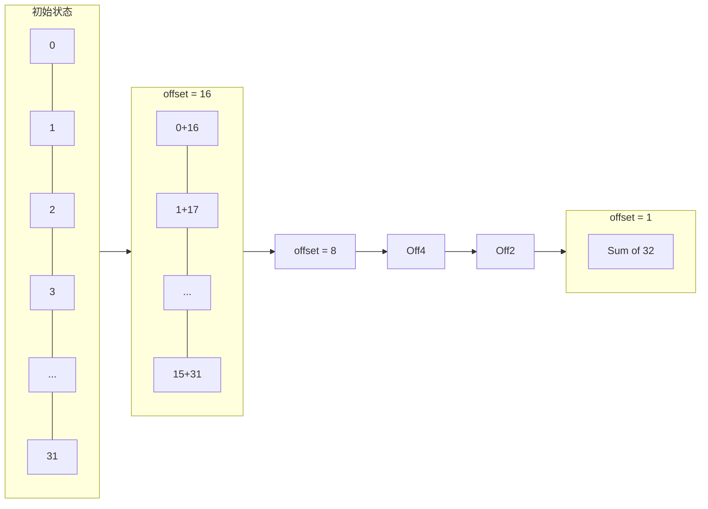

# 归约优化详解

::: warning 性能数字为教学占位
本页 TFLOPS、加速比和内存数字大多来自教学资料或特定硬件的参考值，并非本仓库在统一脚本、统一硬件上复现的结果。面试或文档引用前，请用自己的 GPU 重跑并记录复现命令与版本。
:::

本文档详细介绍 CUDA 归约操作的优化技术，包括 Warp Shuffle、Block Reduce 和 Online Softmax。

## 1. 归约基础

### 什么是归约？

归约是将一组数据通过某种操作（如求和、求最大值）合并为单个值的过程。

### Naive 实现（原子操作）

```cpp
__global__ void reduce_naive(const float* input, float* output, int n) {
    int idx = blockIdx.x * blockDim.x + threadIdx.x;
    if (idx < n) {
        atomicAdd(output, input[idx]);  // 极慢！所有线程竞争同一地址
    }
}
```

**问题**: 原子操作串行化，性能极差。

## 2. Warp Shuffle 归约

### Warp Shuffle 原语

Warp Shuffle 允许 Warp 内线程直接交换寄存器数据，无需 Shared Memory。

```cpp
float val = __shfl_down_sync(0xffffffff, var, delta);
```

### Warp 级归约

```cpp
__device__ float warp_reduce_sum(float val) {
    for (int offset = 16; offset > 0; offset /= 2) {
        val += __shfl_down_sync(0xffffffff, val, offset);
    }
    return val;
}
```

### 归约过程示意



## 3. Block 级归约

### 结合 Warp Shuffle 和 Shared Memory

```cpp
__device__ float block_reduce_sum(float val) {
    __shared__ float shared[32];  // 每个 Warp 一个槽位

    int lane = threadIdx.x % 32;
    int warp_id = threadIdx.x / 32;

    // Step 1: Warp 内归约
    val = warp_reduce_sum(val);

    // Step 2: Warp 0 的 lane 0 写入 Shared Memory
    if (lane == 0) {
        shared[warp_id] = val;
    }
    __syncthreads();

    // Step 3: 第一个 Warp 归约所有 Warp 的结果
    if (warp_id == 0) {
        val = (threadIdx.x < blockDim.x / 32) ? shared[lane] : 0.0f;
        val = warp_reduce_sum(val);
    }

    return val;
}
```

## 4. Softmax 优化

### Online Softmax（单次遍历）

**核心思想**: 在遍历过程中同时维护 max 和 sum。

```cpp
__device__ void online_softmax(const float* input, float* output, int n) {
    float max_val = -INFINITY;
    float sum = 0.0f;

    for (int i = 0; i < n; ++i) {
        float x = input[i];
        float old_max = max_val;
        max_val = fmaxf(max_val, x);
        sum = sum * expf(old_max - max_val) + expf(x - max_val);
    }

    for (int i = 0; i < n; ++i) {
        output[i] = expf(input[i] - max_val) / sum;
    }
}
```

## 5. LayerNorm 优化

### Welford 算法（数值稳定）

```cpp
__device__ void welford_update(float& mean, float& m2, float& count, float x) {
    count += 1.0f;
    float delta = x - mean;
    mean += delta / count;
    float delta2 = x - mean;
    m2 += delta * delta2;
}
```

## 6. 性能对比

### Softmax 性能

| 实现 | 遍历次数 | 相对性能 |
|------|----------|----------|
| Naive（原子操作） | 3 | 1× |
| Warp Shuffle | 3 | 10× |
| Online Softmax | 2 | 15× |
| Fused Online | 1 | 20× |

### LayerNorm vs RMSNorm

| 操作 | 计算量 | 相对性能 |
|------|--------|----------|
| LayerNorm | mean + var + norm | 1× |
| RMSNorm | rms + norm | 1.3× |

## References
