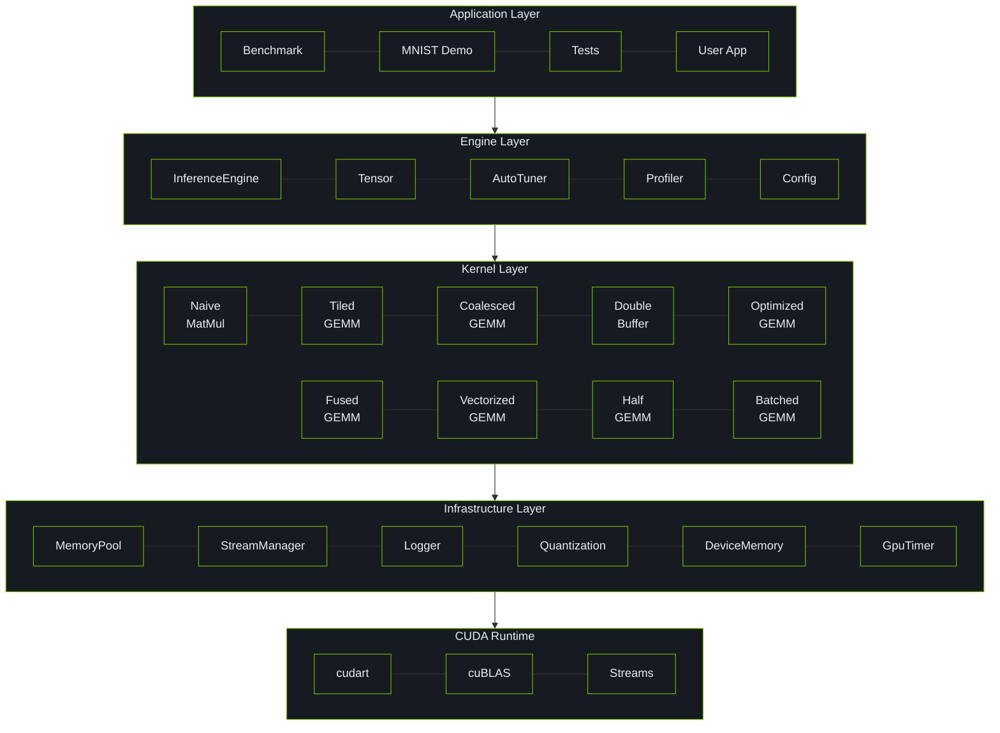
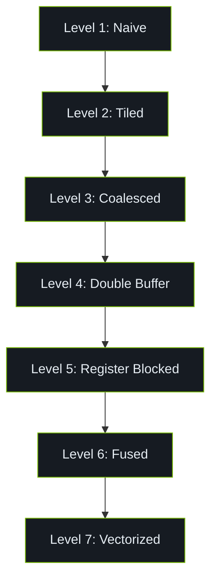
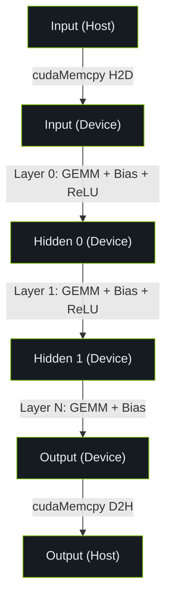

# Inference Engine 架构设计

本文档详细描述 Mini-Inference Engine 的架构设计。

## 系统架构



## 核心组件

### 1. InferenceEngine

推理引擎的核心类，负责管理神经网络的前向传播。

```cpp
class InferenceEngine {
    void init(int device_id);
    void cleanup();
    bool load_weights(const std::string& path);
    void forward(const float* input, float* output, int batch_size);
    void forward_with_timing(const float* input, float* output,
                              int batch_size, std::vector<float>& layer_times);
};
```

**设计决策**:

- 使用 RAII 模式管理 GPU 资源
- 支持多层网络的链式前向传播
- 使用融合 kernel 减少内存带宽消耗

### 2. Tensor

N 维张量类，提供 GPU 存储和基本操作。

```cpp
class Tensor {
    std::vector<int> shape_;
    std::vector<int> strides_;
    PooledMemory data_;

    void fill(float value);
    void zero();
    Tensor clone() const;
    void reshape(const std::vector<int>& new_shape);
};
```

**设计决策**:

- 使用内存池减少分配开销
- 禁用拷贝构造，强制使用移动语义
- 支持任意维度的张量

### 3. MemoryPool

GPU 内存池，通过缓存减少 cudaMalloc 调用。

```cpp
class MemoryPool {
    void* allocate(size_t size);      // 优先从缓存分配
    void deallocate(void* ptr);       // 返回缓存而非释放
    void clear_cache();                 // 释放缓存
};
```

**设计决策**:

- 使用 best-fit 策略匹配缓存块
- 256 字节对齐以支持向量化加载
- 线程安全设计

### 4. StreamManager

CUDA 流管理器，支持并发执行。

```cpp
class StreamManager {
    void init(int num_streams);
    cudaStream_t get_stream();        // 轮询分配
    cudaStream_t get_stream(int idx); // 指定索引
    void sync_all();
};
```

**设计决策**:

- 单例模式确保全局一致性
- 轮询分配实现负载均衡
- 支持细粒度同步

## GEMM Kernel 设计

### 优化层次



### 数据流



## 线程安全

| 组件 | 线程安全 | 机制 |
|------|----------|------|
| MemoryPool | 是 | std::mutex |
| StreamManager | 是 | std::mutex |
| Logger | 是 | std::mutex |
| Config | 是 | 只读访问 |
| Tensor | 否 | 单线程使用 |
| InferenceEngine | 否 | 单线程使用 |

## References

[^1]: NVIDIA. "CUDA C++ Programming Guide," v12.6. 2024. https://docs.nvidia.com/cuda/cuda-c-programming-guide/
[^2]: NVIDIA cuBLAS. https://docs.nvidia.com/cuda/cublas/
[^3]: NVIDIA CUTLASS. https://github.com/NVIDIA/cutlass
