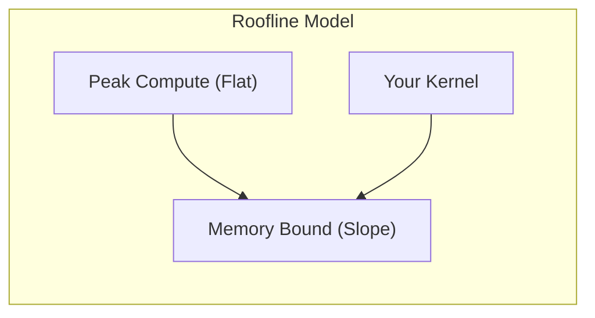

# Inference Engine 性能调优

本文档提供 Mini-Inference Engine 的性能调优指南。

## 性能指标

1. **GFLOPS** (Giga Floating Point Operations Per Second)
   - GEMM 计算量: `2 * M * N * K` FLOPs
   - GFLOPS = FLOPs / (time_ms * 1e6)

2. **内存带宽利用率**
   - 理论带宽 vs 实际带宽
   - 目标: >80% 带宽利用率

3. **计算强度** (Arithmetic Intensity)
   - AI = FLOPs / Bytes
   - GEMM AI ≈ M*N*K / (M*K + K*N + M*N) / 4

## Roofline 模型



## Block Size 选择

### 基本原则

| 参数 | 说明 | 典型值 |
|------|------|--------|
| BM | Block 处理的 M 维度 | 64-256 |
| BN | Block 处理的 N 维度 | 64-256 |
| BK | 每次迭代的 K 维度 | 8-32 |
| TM | 每线程处理的 M 维度 | 4-8 |
| TN | 每线程处理的 N 维度 | 4-8 |

### 矩阵大小建议

```cpp
// 小矩阵 (< 512)
GemmConfig small = {
    .BLOCK_M = 64,
    .BLOCK_N = 64,
    .BLOCK_K = 8,
    .use_double_buffer = false
};

// 中等矩阵 (512 - 2048)
GemmConfig medium = {
    .BLOCK_M = 128,
    .BLOCK_N = 128,
    .BLOCK_K = 8,
    .use_double_buffer = true
};

// 大矩阵 (> 2048)
GemmConfig large = {
    .BLOCK_M = 128,
    .BLOCK_N = 256,
    .BLOCK_K = 16,
    .use_double_buffer = true,
    .use_vectorized_load = true
};
```

### 约束条件

**共享内存限制**:

```
shared_mem = (BM * BK + BK * BN) * sizeof(float) * (double_buffer ? 2 : 1)
shared_mem <= 48KB (typical)
```

**线程数限制**:

```
threads_per_block = (BM / TM) * (BN / TN)
threads_per_block <= 1024
```

## 内存优化

### 1. 内存合并

```cpp
// 好: 连续访问
for (int i = 0; i < N; i++) {
    data[threadIdx.x + i * blockDim.x] = ...;
}

// 差: 跨步访问
for (int i = 0; i < N; i++) {
    data[threadIdx.x * N + i] = ...;
}
```

### 2. Bank Conflict 避免

```cpp
// 有 bank conflict
__shared__ float smem[32][32];
float val = smem[threadIdx.x][threadIdx.y];

// 无 bank conflict (padding)
__shared__ float smem[32][33];
float val = smem[threadIdx.x][threadIdx.y];
```

### 3. 向量化加载

```cpp
// 标量加载: 4 次内存事务
float a = A[idx];
float b = A[idx+1];
float c = A[idx+2];
float d = A[idx+3];

// 向量化加载: 1 次内存事务
float4 vec = *reinterpret_cast<float4*>(&A[idx]);
```

## GPU 架构特定优化

### Volta (SM 7.0)

- 独立线程调度
- L1 缓存配置灵活
- 建议: BM=128, BN=128

### Turing (SM 7.5)

- Tensor Core 支持
- 异步拷贝预览
- 建议: 考虑 FP16

### Ampere (SM 8.0)

- 异步拷贝 (`cp.async`)
- 更大的 L1 缓存
- 建议: 使用异步拷贝

```cpp
__pipeline_memcpy_async(&smem[idx], &gmem[idx], sizeof(float4));
__pipeline_commit();
__pipeline_wait_prior(0);
```

### Ada Lovelace (SM 8.9)

- 改进的 Tensor Core
- 更高的时钟频率
- 建议: 最大化计算密度

## 性能分析工具

### NVIDIA Nsight Systems

```bash
nsys profile -o report ./benchmark
nsys-ui report.nsys-rep
```

### NVIDIA Nsight Compute

```bash
ncu --set full -o report ./benchmark
ncu --kernel-name "optimized_gemm" ./benchmark
```

### 关键指标

1. **Occupancy**: 活跃 warp / 最大 warp，目标 >50%
2. **Memory Throughput**: 实际带宽 / 峰值带宽，目标 >80%
3. **Compute Throughput**: 实际 FLOPS / 峰值 FLOPS，目标 >70%
4. **Stall Reasons**: Memory dependency, Execution dependency, Synchronization

## References
