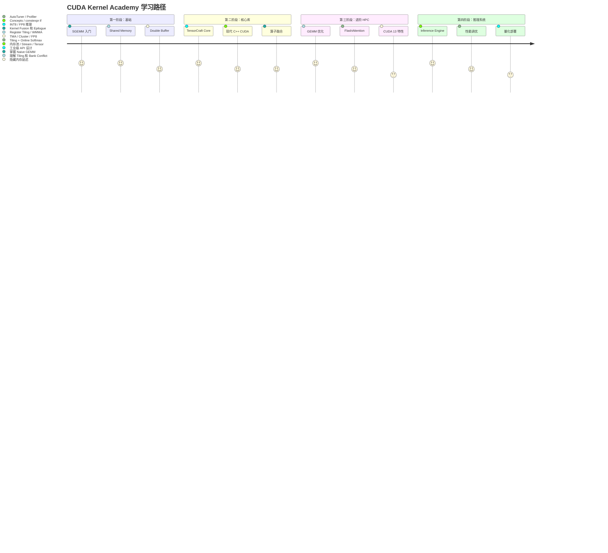
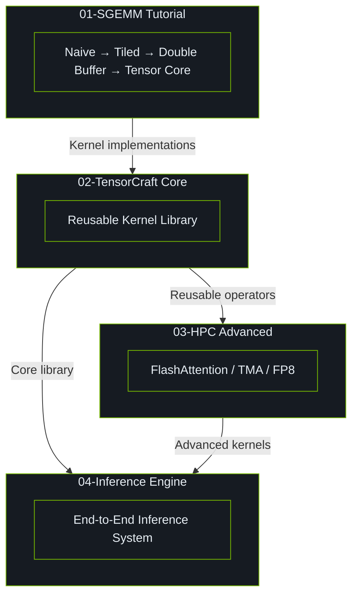

# 学习路线图

CUDA Kernel Academy 提供从入门到进阶的系统性 CUDA 算子工程学习路径。

## 学习阶段

## 阶段详情

### 第一阶段：Fundamentals（约 2-3 周）

**预计学习时长**: 40-60 小时

**关键技能点**:

- CUDA 编程模型（Grid / Block / Thread / Warp）
- 全局内存 vs Shared Memory
- 合并访问与 Bank Conflict
- 双缓冲技术
- 基本性能分析（nsys / ncu）

**目标**: 能够独立编写并优化一个 Tiled GEMM，达到 cuBLAS 10-20% 性能。

### 第二阶段：Core Library（约 2-3 周）

**预计学习时长**: 40-60 小时

**关键技能点**:

- Header-Only 库设计
- C++17/20 现代特性在 CUDA 中的应用
- 模板元编程与编译时优化
- 算子融合（GEMM + Bias + Activation）
- 内存池与 RAII 资源管理

**目标**: 能够设计和实现一个可复用的高性能 CUDA 算子库。

### 第三阶段：Advanced HPC（约 3-4 周）

**预计学习时长**: 60-80 小时

**关键技能点**:

- Register Tiling 与软件流水线
- Tensor Core (WMMA / MMA PTX)
- FlashAttention 算法与实现
- 归约优化（Warp Shuffle / Online Softmax）
- Hopper 新特性（TMA / Cluster / FP8）

**目标**: 能够针对特定 GPU 架构编写接近 cuBLAS 80%+ 性能的生产级 kernel。

### 第四阶段：Inference System（约 2-3 周）

**预计学习时长**: 40-60 小时

**关键技能点**:

- 推理引擎架构设计
- 多 Stream 并发与异步执行
- 内存池与缓存策略
- 量化推理（INT8 / FP8）
- 端到端性能 profiling 与调优

**目标**: 能够将优化后的 kernel 集成到完整的推理系统中，实现端到端加速。

## 整体架构

## References

[^1]: NVIDIA. "CUDA C++ Programming Guide," v12.6. 2024. https://docs.nvidia.com/cuda/cuda-c-programming-guide/
[^2]: Simon Boehm. "How to Optimize a CUDA Matmul Kernel." 2022. https://siboehm.com/articles/22/CUDA-MMM
[^3]: Dao, T., et al. "FlashAttention: Fast and Memory-Efficient Exact Attention with IO-Awareness." *NeurIPS* 2022. https://arxiv.org/abs/2205.14135
[^4]: NVIDIA CUTLASS. https://github.com/NVIDIA/cutlass
