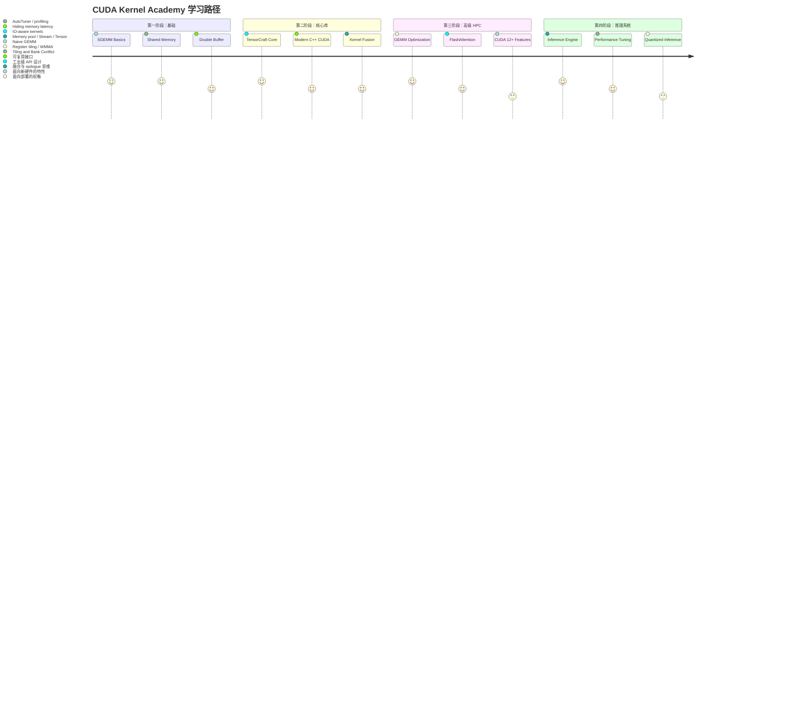

# 学习路线图

请把这张路线图当成“选择学习轨道”的页面，而不只是一个时间顺序列表。

- **如果你只想先拿到一个最快的收获**，看完入口表后可以先停在与你目标最匹配的第一阶段。
- **如果你想完整走完 academy 路径**，就按四个阶段顺序阅读。
- **如果你更关心系统视角**，请把模块页、benchmark 页和白皮书页一起读，而不要把这页当成孤立说明。

## 先选择你的入口

| 如果你当前更想... | 建议先读 | 为什么 | 然后再读 |
| --- | --- | --- | --- |
| 熟悉 CUDA kernel 的阅读方式 | [01-SGEMM 教程](/zh/modules/01-sgemm) | 它把优化故事保持在最直接、最局部的代码层。 | [Benchmarks](/zh/benchmarks/) |
| 设计可复用的 CUDA 抽象 | [02-TensorCraft Core](/zh/modules/02-tensorcraft) | 它把 kernel 技巧推进成可复用接口与运行时辅助设施。 | [TensorCraft 设计](/zh/whitepaper/tensorcraft-design) |
| 冲击更高的性能技术 | [03-HPC 进阶](/zh/modules/03-hpc) | 仓库在这里才开始讨论更敏感于架构的高级思路。 | [高级技术展示](/zh/whitepaper/advanced-showcase) |
| 理解端到端推理系统如何搭起来 | [04-Inference Engine](/zh/modules/04-inference) | 它把优化 kernel 连接到 memory pool、stream 和运行时调度。 | [推理引擎设计](/zh/whitepaper/inference-engine-design) |

## 阶段地图

## 每个阶段到底在教什么

| 阶段 | 核心问题 | 仓库中的主页面 | 应该关注什么证据 | 对应的重要论文或资料 |
| --- | --- | --- | --- | --- |
| 1. 基础 | 一个简单 kernel 是怎样一步步变快的？ | [01-SGEMM 教程](/zh/modules/01-sgemm)、[Benchmarks](/zh/benchmarks/) | TFLOPS、带宽与正确性信心的逐步提升 | Boehm matmul 文章；CUDA Programming Guide |
| 2. 核心库 | 哪些优化思路值得沉淀为可复用抽象？ | [02-TensorCraft Core](/zh/modules/02-tensorcraft)、[系统架构](/zh/whitepaper/architecture)、[TensorCraft 设计](/zh/whitepaper/tensorcraft-design) | 库边界在保持可读的同时不丢掉优化故事 | CUDA C++ Programming Guide；CUTLASS 思维模型 |
| 3. 高级 HPC | 怎样继续逼近硬件性能上限？ | [03-HPC 进阶](/zh/modules/03-hpc)、[高级技术展示](/zh/whitepaper/advanced-showcase) | 来自寄存器分块、WMMA、FlashAttention 类思路或新 CUDA 特性的更大收益 | FlashAttention 论文；CUDA 新特性文档 |
| 4. 推理系统 | 优化后的 kernel 放进真实 runtime 后还能成立吗？ | [04-Inference Engine](/zh/modules/04-inference)、[推理引擎设计](/zh/whitepaper/inference-engine-design) | 证明系统整体仍然受益于前面 kernel 工作的吞吐与调度证据 | 系统设计文档与 benchmark 解读 |

## 模块如何随时间串起来

路线图的意义不只是“越来越难”，而是“成功标准在变化”：

- **阶段 1** 的成功标准，是理解每一步优化为什么存在。
- **阶段 2** 的成功标准，是把这些思路变得可复用却不失清晰。
- **阶段 3** 的成功标准，是知道什么时候值得为架构特定技术付出复杂度。
- **阶段 4** 的成功标准，是证明前面的工作在系统集成后仍然有效。

## 建议的学习方案

### 3 天定向熟悉版

- 第 1 天：[快速开始](/zh/guides/getting-started) + [01-SGEMM 教程](/zh/modules/01-sgemm)
- 第 2 天：[Benchmarks](/zh/benchmarks/) + [系统架构](/zh/whitepaper/architecture)
- 第 3 天：根据你更关心库设计还是运行时集成，在 [02-TensorCraft Core](/zh/modules/02-tensorcraft) 和 [04-Inference Engine](/zh/modules/04-inference) 之间二选一继续读。

### 2 周 kernel 工程路径

- 第 1 周：完成第一阶段，并把优化阶梯整理成你自己的笔记。
- 第 2 周：阅读第二阶段与对应白皮书，再挑选与你 GPU 和兴趣最匹配的第三阶段主题。

### 完整 academy 路径

- 按四个阶段顺序阅读。
- 每完成一个阶段，都用对应 benchmark 或白皮书页面校验理解，再继续往下走。
- 除非你只关心系统视角，否则不要直接从阶段 1 跳到阶段 4；你会错过抽象为何存在的原因。

## 分阶段最值得看的外部参考

<ReferenceBlock
  :references="[
    {
      id: '1',
      authors: 'Boehm, Simon',
      title: 'How to Optimize a CUDA Matmul Kernel',
      venue: 'Technical article',
      year: 2022,
      url: 'https://siboehm.com/articles/22/CUDA-MMM'
    },
    {
      id: '2',
      authors: 'Volkov, V. and Demmel, J. W.',
      title: 'Benchmarking GPUs to Tune Dense Linear Algebra',
      venue: 'SC',
      year: 2008
    },
    {
      id: '3',
      authors: 'Dao, Tri et al.',
      title: 'FlashAttention: Fast and Memory-Efficient Exact Attention with IO-Awareness',
      venue: 'NeurIPS',
      year: 2022,
      url: 'https://arxiv.org/abs/2205.14135'
    },
    {
      id: '4',
      authors: 'NVIDIA',
      title: 'CUDA C++ Programming Guide',
      venue: 'CUDA Toolkit documentation',
      year: 2024,
      url: 'https://docs.nvidia.com/cuda/cuda-c-programming-guide/'
    }
  ]"
/>

## 看完这页之后建议去哪里

- 想先建立全局理由：打开 [系统架构](/zh/whitepaper/architecture)。
- 想先看性能证据：配合 [Benchmarks](/zh/benchmarks/) 一起读。
- 想立刻针对具体目标行动：直接跳到上方入口表对应的模块页面。
