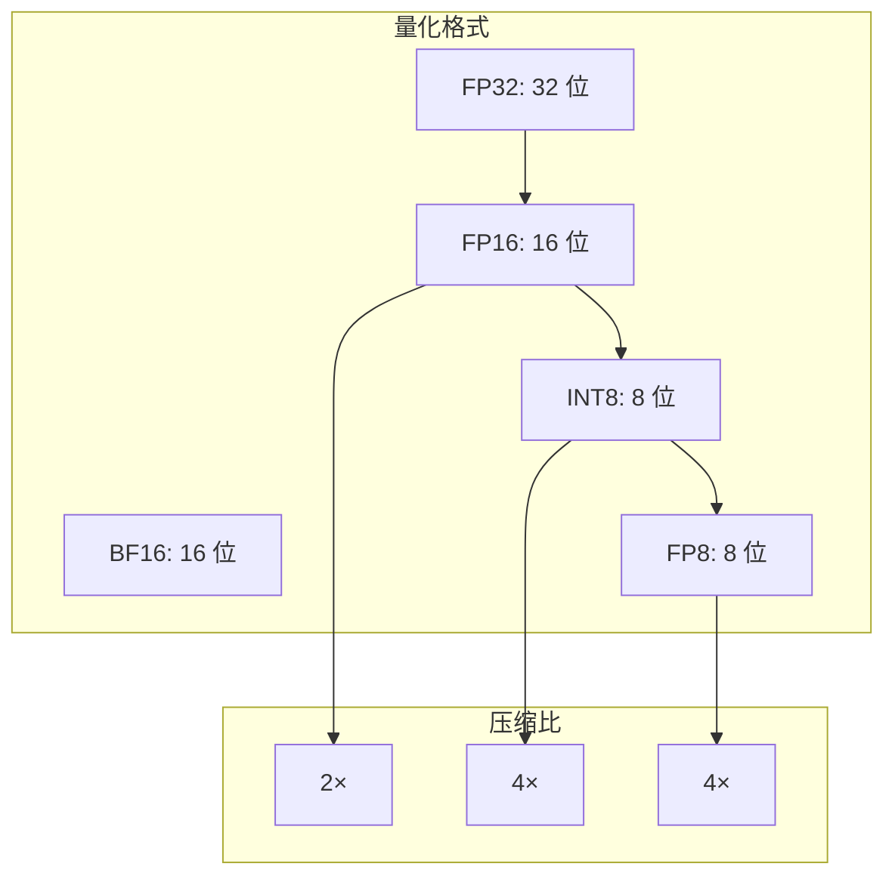

# 高级技术展示

本文档展示 CUDA Kernel Academy 中的前沿技术实现，包括 FlashAttention、CUDA 12/13 新特性、量化技术以及高级卷积算法。

## FlashAttention 算法

### 问题背景

标准 Attention 计算需要实例化完整的 N×N 注意力矩阵：

```mermaid
flowchart TB
    subgraph 内存问题
        Q[Query: N×d]
        K[Key: N×d]
        V[Value: N×d]
        ATTN[Attention: N×N<br/>O(N²) 内存!]
    end
    
    Q --> ATTN
    K --> ATTN
    V --> ATTN
    
    ATTN -->|内存瓶颈| PROB[无法处理长序列]
```

### FlashAttention 核心思想

**分块计算 + 重计算策略**：

```mermaid
flowchart TB
    subgraph 分块策略
        Q1[Q 块: Br×d]
        K1[K 块: Bc×d]
        V1[V 块: Bc×d]
        
        Q1 --> S[S 块: Br×Bc]
        K1 --> S
        S --> O[输出块: Br×d]
        V1 --> O
    end
    
    Note: 内存从 O(N²) 降到 O(N)
```

### 算法实现

```cpp
namespace tensorcraft::kernels {

template<int Br, int Bc, int d>
__global__ void flash_attention_kernel(
    const float* __restrict__ Q,    // [N, d]
    const float* __restrict__ K,    // [N, d]
    const float* __restrict__ V,    // [N, d]
    float* __restrict__ O,          // [N, d]
    int N) {
    
    // Shared Memory 分块
    __shared__ float Qs[Br][d];
    __shared__ float Ks[Bc][d];
    __shared__ float Vs[Bc][d];
    
    int i = blockIdx.x * Br + threadIdx.y;
    int j = threadIdx.y;
    int t = threadIdx.x;
    
    // 加载 Q 块到 Shared Memory
    if (i < N) {
        Qs[j][t] = Q[i * d + t];
    }
    
    float Oi[d] = {0};        // 输出累加器
    float mi = -INFINITY;     // 最大值（用于数值稳定）
    float li = 0.0f;          // 归一化因子
    
    // 遍历 K, V 块
    for (int k_start = 0; k_start < N; k_start += Bc) {
        // 加载 K, V 块
        int k_idx = k_start + j;
        if (k_idx < N) {
            Ks[j][t] = K[k_idx * d + t];
            Vs[j][t] = V[k_idx * d + t];
        }
        __syncthreads();
        
        // 计算 QK^T 分块
        float Sij[Br] = {0};
        for (int kk = 0; kk < Bc && (k_start + kk) < N; kk++) {
            float dot = 0;
            for (int dd = 0; dd < d; dd++) {
                dot += Qs[j][dd] * Ks[kk][dd];
            }
            Sij[kk] = dot / sqrtf(d);
        }
        
        // 在线 Softmax 更新
        float m_new = max(mi, max(Sij));
        float l_new = expf(mi - m_new) * li;
        for (int kk = 0; kk < Bc && (k_start + kk) < N; kk++) {
            l_new += expf(Sij[kk] - m_new);
        }
        
        // 更新输出
        for (int dd = 0; dd < d; dd++) {
            float v_sum = 0;
            for (int kk = 0; kk < Bc && (k_start + kk) < N; kk++) {
                v_sum += expf(Sij[kk] - m_new) * Vs[kk][dd];
            }
            Oi[dd] = Oi[dd] * expf(mi - m_new) * li / l_new + v_sum / l_new;
        }
        
        mi = m_new;
        li = l_new;
        __syncthreads();
    }
    
    // 写回结果
    if (i < N) {
        for (int dd = 0; dd < d; dd++) {
            O[i * d + dd] = Oi[dd];
        }
    }
}

} // namespace tensorcraft::kernels
```

### 性能对比

| 实现 | 内存复杂度 | 长序列支持 |
|------|------------|------------|
| 标准 Attention | O(N²) | N ≤ 1024 |
| FlashAttention | O(N) | N ≥ 64K |

---

## CUDA 12/13 新特性

### 1. Tensor Memory Accelerator (TMA)

TMA 是 Hopper 架构新增的异步内存传输单元：

```mermaid
flowchart TB
    subgraph 传统方式
        CODE[代码]
        CODE -->|同步| LDCPY[cuMemcpy]
        LDCPY -->|阻塞| GPU[GPU 计算]
    end
    
    subgraph TMA 方式
        CODE2[代码]
        CODE2 -->|异步| TMA[TMA 单元]
        TMA -->|独立| GPU2[GPU 计算]
        Note: TMA 与计算并行
    end
```

#### TMA API 使用

```cpp
#include <cuda_pipeline.h>

// TMA 描述符
CUtensorMap desc;
cuTensorMapEncodeAsArray2D(&desc,
    CU_TENSOR_MAP_DATA_TYPE_FLOAT_32,
    2,                    // 维度
    d_A,                  // 内存地址
    M,                    // 外维度
    K * sizeof(float),    // 步长
    BM * sizeof(float),   // 分块大小
    BK * sizeof(float),   // 内维度
    1,                    // 元素步长
    0);                   // 交错模式

// TMA 加载
__global__ void tma_kernel(const CUtensorMap* desc, float* shared_buf) {
    // 协作加载
    cub::Pipeline pipeline;
    cub::PipelineCommitResult result = pipeline.commit_arrive(
        shared_buf, desc, blockIdx.x);
    
    // 等待完成
    pipeline.arrive();
    pipeline.wait();
}
```

### 2. Thread Block Clusters

Cluster 允许多个线程块协作：

```cpp
__cluster_launch__(2)  // 2 个 block 组成 cluster
__global__ void cluster_kernel() {
    // Cluster 内同步
    cluster_barrier::wait();
    
    // 跨 block 共享内存访问（新特性）
    extern __cluster__ float shared_mem[];
}
```

### 3. FP8 支持

Hopper 架构原生支持 FP8 计算：

```cpp
#include <cuda_fp8.h>

__global__ void fp8_gemm(
    const __nv_fp8_e4m3* A,
    const __nv_fp8_e4m3* B,
    __nv_bf16* C,
    int M, int N, int K) {
    
    // FP8 Tensor Core 操作
    // E4M3 格式: 1 符号位 + 4 指数位 + 3 尾数位
    // 范围: ±448，精度: ~3 位
    
    // WMMA FP8
    wmma::fragment<wmma::matrix_a, 16, 16, 16, __nv_fp8_e4m3, row_major> a_frag;
    // ...
}
```

---

## 量化技术

### 量化类型



### INT8 量化实现

```cpp
// 对称量化
struct QuantizedTensor {
    int8_t* data;
    float scale;      // 缩放因子
    int size;
    
    // 从 FP32 量化
    static QuantizedTensor from_fp32(const float* src, int size) {
        // 1. 计算最大绝对值
        float max_abs = 0;
        for (int i = 0; i < size; i++) {
            max_abs = max(max_abs, fabsf(src[i]));
        }
        
        // 2. 计算缩放因子
        float scale = max_abs / 127.0f;
        
        // 3. 量化
        auto* data = new int8_t[size];
        for (int i = 0; i < size; i++) {
            data[i] = static_cast<int8_t>(round(src[i] / scale));
        }
        
        return {data, scale, size};
    }
    
    // 反量化
    void to_fp32(float* dst) const {
        for (int i = 0; i < size; i++) {
            dst[i] = data[i] * scale;
        }
    }
};

// INT8 GEMM
__global__ void int8_gemm(
    const int8_t* A, const int8_t* B,
    int32_t* C,  // 累加用 INT32
    float scale_a, float scale_b,
    int M, int N, int K) {
    
    // INT8 矩阵乘 → INT32 累加
    int sum = 0;
    for (int k = 0; k < K; k++) {
        sum += A[i * K + k] * B[k * N + j];
    }
    
    // 反量化到 FP32
    C[i * N + j] = sum;  // 后续乘以 scale_a * scale_b
}
```

### FP8 量化

```cpp
// E4M3 格式 (Hopper)
__device__ __nv_fp8_e4m3 quantize_fp8_e4m3(float val) {
    return __nv_fp8_e4m3(val);  // 硬件转换
}

// E5M2 格式 (更大范围)
__device__ __nv_fp8_e5m2 quantize_fp8_e5m2(float val) {
    return __nv_fp8_e5m2(val);
}
```

---

## Winograd 卷积

### 算法原理

Winograd 算法将卷积转换为矩阵乘法：

```
标准卷积: m×r 次乘法
Winograd: m×m 次乘法 (当输出块为 m×m，卷积核为 r×r)

加速比: r×r / m×m
对于 3×3 卷积，m=2: 加速比 = 9/4 ≈ 2.25×
```

### F(2×2, 3×3) 实现

```cpp
// Winograd 变换矩阵
constexpr float B[4][4] = {  // 输入变换
    {1, 0, -1, 0},
    {0, 1, 1, 0},
    {0, -1, 1, 0},
    {0, 1, 0, -1}
};

constexpr float G[4][3] = {  // 卷积核变换
    {0.5, 0, 0},
    {0.5, 0.5, 0.5},
    {0.5, 0.5, -0.5},
    {0, 0, 1}
};

constexpr float A[2][4] = {  // 输出变换
    {1, 1, 1, 0},
    {0, 1, -1, 1}
};

__global__ void winograd_conv2d(
    const float* input,   // [N, C, H, W]
    const float* kernel,  // [C_out, C_in, 3, 3]
    float* output) {
    
    // 1. 输入变换: d' = B^T * d * B
    float tile[4][4];  // 输入分块
    float transformed[4][4];
    
    // 矩阵乘法: B^T * tile * B
    // ...
    
    // 2. 卷积核变换: g' = G * g * G^T
    float k_transformed[4][4];
    // ...
    
    // 3. 逐元素乘法（取代卷积）
    float product[4][4];
    for (int i = 0; i < 4; i++) {
        for (int j = 0; j < 4; j++) {
            product[i][j] = transformed[i][j] * k_transformed[i][j];
        }
    }
    
    // 4. 输出变换: y = A^T * product * A
    float out[2][2];  // 输出 2×2 块
    // ...
}
```

---

## RoPE (Rotary Position Embedding)

### 原理

RoPE 通过旋转编码位置信息：

```mermaid
flowchart LR
    X[输入向量 x]
    POS[位置 m]
    ROT[旋转矩阵 Rm]
    OUT[位置编码输出]
    
    X --> ROT
    POS --> ROT
    ROT --> OUT
    
    Note: Rm = 旋转角度 θi * m
```

### 实现

```cpp
__global__ void rope_kernel(
    float* x,           // [seq_len, dim]
    int seq_len,
    int dim,
    int max_position) {
    
    int seq = blockIdx.x;
    int i = threadIdx.x * 2;  // 维度对
    
    if (seq < seq_len && i < dim) {
        // 计算旋转角度
        float theta = powf(10000.0f, -2.0f * (i / 2) / dim);
        float angle = seq * theta;
        
        // 旋转
        float x0 = x[seq * dim + i];
        float x1 = x[seq * dim + i + 1];
        
        float cos_angle = cosf(angle);
        float sin_angle = sinf(angle);
        
        x[seq * dim + i] = x0 * cos_angle - x1 * sin_angle;
        x[seq * dim + i + 1] = x0 * sin_angle + x1 * cos_angle;
    }
}
```

---

## 总结

本文档展示了 CUDA Kernel Academy 中的前沿技术：

1. **FlashAttention**：O(N) 内存的注意力计算
2. **TMA**：Hopper 异步内存传输
3. **Thread Block Clusters**：跨 block 协作
4. **FP8**：新一代量化格式
5. **Winograd**：高效卷积算法
6. **RoPE**：旋转位置编码

这些技术代表了 CUDA kernel 优化的前沿方向，值得深入学习和实践。
