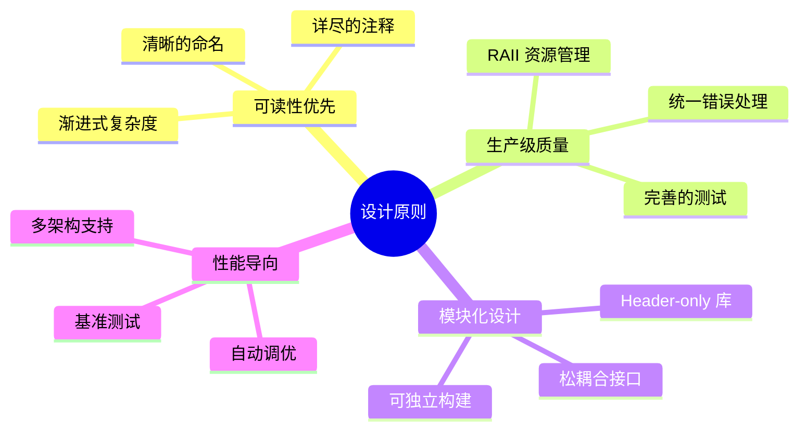
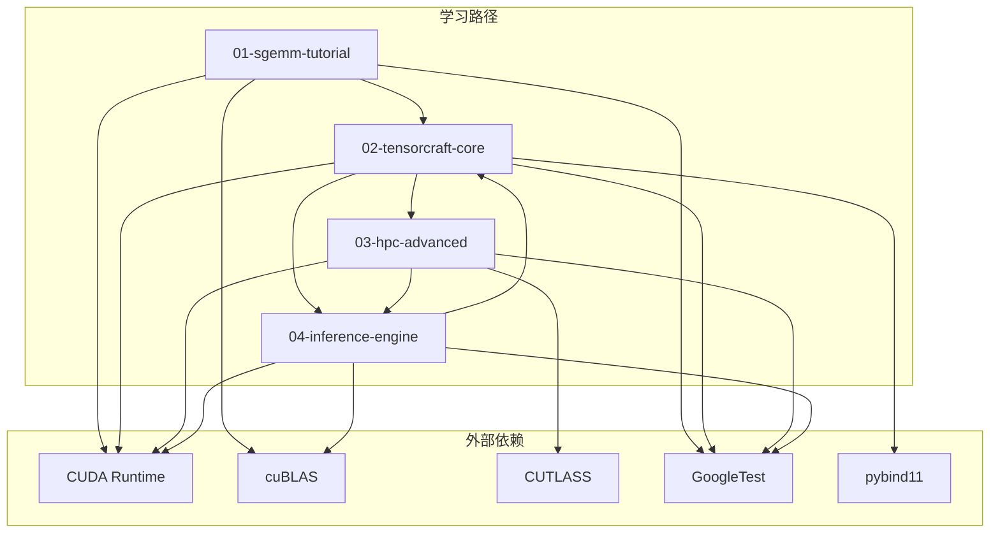
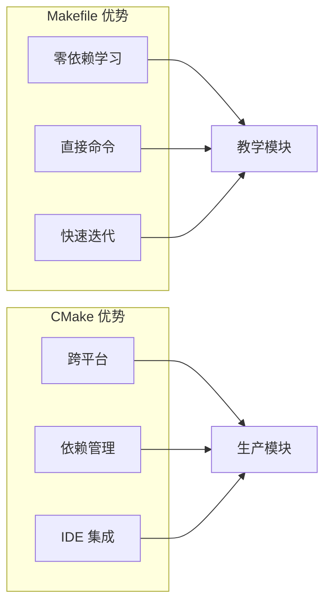
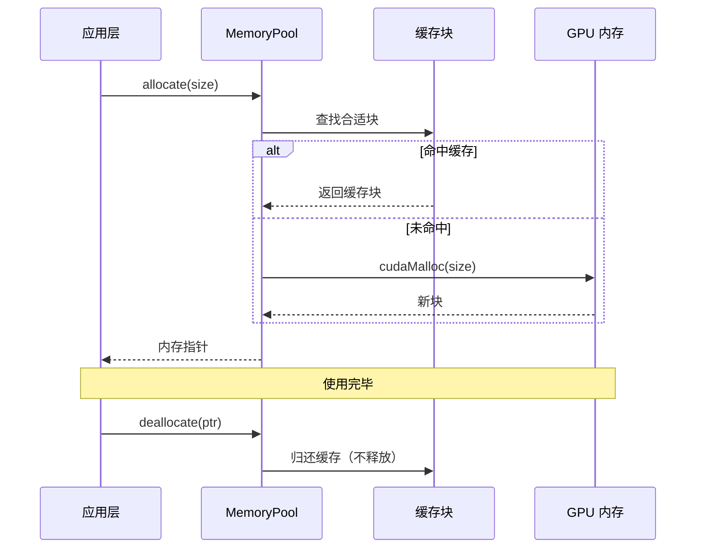
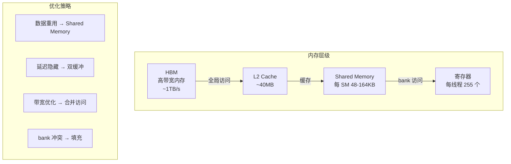
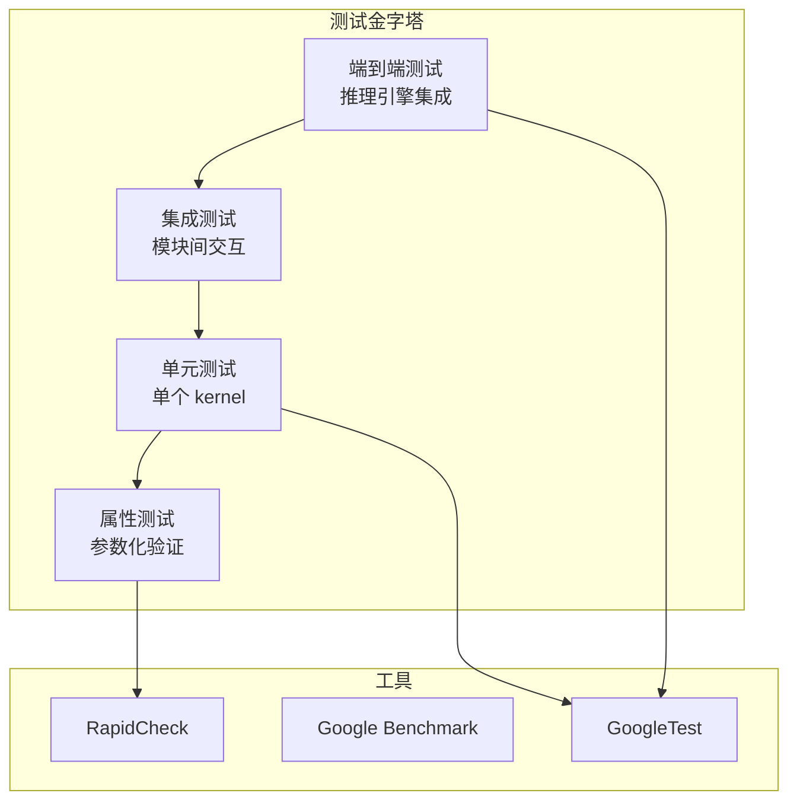
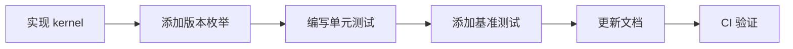

# 系统架构设计

CUDA Kernel Academy 的系统架构设计遵循"渐进式学习"与"生产级实践"双重原则。本文档深入解析整体架构、模块依赖关系、构建系统设计以及核心设计模式。

## 设计哲学

### 核心定位

本项目定位于 **"介于入门示例与生产框架之间"** 的学习型项目：

- **非玩具项目**：代码质量、错误处理、API 设计遵循生产标准
- **非重量级框架**：保持可读性，避免过度抽象
- **渐进式路径**：从 naive 实现逐步演进到优化版本

### 架构原则



## 模块架构

### 整体依赖关系



### 模块职责划分

| 模块 | 职责 | 构建系统 | 关键特性 |
|------|------|----------|----------|
| **01-sgemm-tutorial** | SGEMM 优化入门 | Makefile | 独立、自包含、教学导向 |
| **02-tensorcraft-core** | 可复用算子库 | CMake | Header-only、多架构、Python 绑定 |
| **03-hpc-advanced** | 高级优化模式 | CMake | CUTLASS 集成、CUDA 12/13 特性 |
| **04-inference-engine** | 端到端推理 | CMake | 内存池、流管理、AutoTuner |

## 构建系统设计

### 双构建系统策略

项目采用 **混合构建系统** 设计：

```
项目根目录
├── CMakeLists.txt          # 主构建系统（模块 02-04）
├── cmake/                  # 共享 CMake 模块
│   ├── CudaArch.cmake      # CUDA 架构检测
│   ├── Dependencies.cmake  # 依赖管理
│   └── Testing.cmake       # 测试配置
└── 01-sgemm-tutorial/
    └── Makefile            # 独立构建系统（教学导向）
```

#### 为什么保留 Makefile？



### CMake 预设配置

```json
{
  "configurePresets": [
    {
      "name": "default",
      "cacheVariables": {
        "CMAKE_BUILD_TYPE": "Release",
        "CUDAARCHS": "70;75;80;86",
        "BUILD_TENSORCRAFT": "ON",
        "BUILD_HPC_ADVANCED": "ON",
        "BUILD_INFERENCE_ENGINE": "ON"
      }
    },
    {
      "name": "minimal",
      "cacheVariables": {
        "BUILD_TENSORCRAFT": "ON",
        "BUILD_HPC_ADVANCED": "OFF",
        "BUILD_INFERENCE_ENGINE": "OFF"
      }
    }
  ]
}
```

## 核心设计模式

### 1. RAII 资源管理

所有 GPU 资源采用 RAII 模式管理：

```cpp
// Tensor 类：自动管理 GPU 内存
class Tensor {
public:
    Tensor(size_t size) : data_(cuda_malloc(size)), size_(size) {}
    ~Tensor() { cudaFree(data_); }
    
    // 移动语义
    Tensor(Tensor&& other) noexcept;
    Tensor& operator=(Tensor&& other) noexcept;
    
    // 禁止拷贝
    Tensor(const Tensor&) = delete;
    Tensor& operator=(const Tensor&) = delete;
    
private:
    void* data_;
    size_t size_;
};
```

### 2. 统一错误处理

```cpp
// 错误检查宏层级
#define TC_CUDA_CHECK(call)          // 检查返回值
#define TC_CUDA_CHECK_LAST()         // 检查最后一个错误
#define TC_CUDA_SYNC_CHECK()         // 同步并检查（调试用）

// 使用示例
TC_CUDA_CHECK(cudaMemcpy(dst, src, size, cudaMemcpyDeviceToDevice));
TC_CUDA_SYNC_CHECK();  // 调试时捕获异步错误
```

### 3. 版本枚举模式

```cpp
enum class GemmVersion {
    Naive,           // 基础实现
    Tiled,           // 分块优化
    DoubleBuffer,    // 双缓冲
    TensorCore,      // Tensor Core 加速
    Auto             // 自动选择最优
};

// 运行时选择
template<GemmVersion V>
void gemm(const Tensor& A, const Tensor& B, Tensor& C);
```

### 4. 内存池模式



## 内存层级优化策略

### GPU 内存层级



### 优化约束计算

GEMM 分块参数必须满足以下约束：

```
threads_per_block = (BM/TM) * (BN/TN) ≤ 1024
shared_memory = (BM*BK + BK*BN) * sizeof(float) ≤ 48KB
registers_per_thread = TM*TN + TM + TN + overhead ≤ 255
```

典型配置示例：

| 配置 | BM×BN×BK | TM×TN | 线程数 | Shared Mem |
|------|----------|-------|--------|------------|
| 小块 | 64×64×8 | 4×4 | 256 | 8KB |
| 中块 | 128×128×8 | 8×8 | 256 | 32KB |
| 大块 | 128×128×16 | 8×8 | 256 | 64KB (动态) |

## 测试策略

### 测试层级



### 正确性验证

所有 GEMM 实现必须通过 cuBLAS 对比验证：

```cpp
TEST(SgemmTest, Correctness) {
    // 生成随机矩阵
    auto A = random_matrix(M, K);
    auto B = random_matrix(K, N);
    
    // 计算
    auto C_custom = gemm_custom(A, B);
    auto C_cublas = gemm_cublas(A, B);
    
    // 验证相对误差
    EXPECT_NEAR(C_custom, C_cublas, 1e-5);
}
```

## 扩展性设计

### 添加新 Kernel 的流程



### 插件式架构

TensorCraft Core 支持运行时加载自定义 kernel：

```cpp
// kernel 注册机制
struct KernelRegistry {
    template<typename Func>
    void register_kernel(const std::string& name, Func func);
    
    auto get_kernel(const std::string& name);
};

// 使用示例
registry.register_kernel("custom_gemm", my_custom_gemm);
```

---

## 总结

CUDA Kernel Academy 的架构设计平衡了 **教学清晰度** 与 **工程质量**：

1. **模块化**：清晰的职责划分，渐进式依赖
2. **双构建系统**：教学用 Makefile + 生产用 CMake
3. **RAII 优先**：所有资源自动管理，无内存泄漏
4. **可测试性**：单元测试、集成测试、属性测试三层覆盖
5. **可扩展性**：版本枚举、注册机制、插件架构

这套架构既适合学习 CUDA 优化原理，也可作为生产级代码的参考模板。
