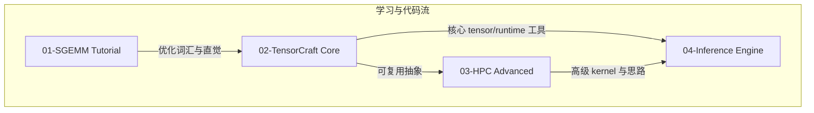
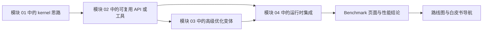

# 系统架构设计

这个页面适合已经知道仓库有四个模块、但还想进一步理解它们之间“技术契约”的读者。

- **当你需要全局视图时**，先看这里，再进入具体实现页面。
- **建议配合** [01-SGEMM 教程](/zh/modules/01-sgemm)、[TensorCraft 设计](/zh/whitepaper/tensorcraft-design) 和 [推理引擎设计](/zh/whitepaper/inference-engine-design) 一起阅读。
- **把它当作阅读地图**：重点不是“有哪些文件”，而是“为什么这个仓库要按这样的顺序教 CUDA kernel 工程”。

## 架构总览

<SystemArchitectureDiagram />

CUDA Kernel Academy 刻意处在两个极端之间：

- **比“CUDA 代码片段集合”更有结构**：每个模块都有明确的教学职责，也都服务于更大的系统故事。
- **比重量级生产框架更轻**：抽象层数被控制在可读范围内，让优化思路和代码之间的联系不被隐藏。

因此，这个仓库的架构路径是从 **单个 kernel 的推理**，逐步走向 **可复用库设计**、**高级优化模式**，再到 **系统级推理集成**。

## 按架构层阅读仓库

| 层次 | 主要模块 | 这一层教什么 | 为后续层提供什么 | 下一步建议 |
| --- | --- | --- | --- | --- |
| Kernel 基础 | [01-SGEMM 教程](/zh/modules/01-sgemm) | 分块、内存层级、bank conflict、double buffering、向量化、Tensor Core 过渡 | 一套具体的优化词汇表 | [Benchmarks](/zh/benchmarks/) |
| 可复用基础设施 | [02-TensorCraft Core](/zh/modules/02-tensorcraft) | 如何把一次性 kernel 提炼成可复用 API、资源管理和算子边界 | 后续模块共享的库骨架 | [TensorCraft 设计](/zh/whitepaper/tensorcraft-design) |
| 性能前沿 | [03-HPC 进阶](/zh/modules/03-hpc) | CUTLASS 风格思维、FlashAttention、寄存器分块和新 CUDA 特性 | 更高级的 kernel 模式与性能直觉 | [高级技术展示](/zh/whitepaper/advanced-showcase) |
| 系统集成 | [04-Inference Engine](/zh/modules/04-inference) | 优化后的 kernel 如何进入带 stream 与 memory pool 的推理链路 | 证明前面模块真的能组合成端到端系统 | [推理引擎设计](/zh/whitepaper/inference-engine-design) |

## 为什么模块关系要这样设计

这个依赖图里最重要的部分其实是 **概念依赖**，不只是构建依赖：

- 模块 01 解释的是“为什么这些 kernel 变换有效”。
- 模块 02 决定哪些变换值得沉淀成稳定接口。
- 模块 03 继续探索那些对初学路径来说过早、但对高性能很关键的技术。
- 模块 04 则验证：当执行链路变成异步、系统化之后，这些抽象是否仍然成立。

## 为什么仓库保留两套构建系统

这里的构建拆分是教学选择，而不是历史包袱。

| 构建路径 | 使用范围 | 为什么在这个仓库里存在 | 读者应该得到什么结论 |
| --- | --- | --- | --- |
| 独立 `Makefile` | `01-sgemm-tutorial/` | 让第一模块尽量贴近底层、可单独运行。 | 初学阶段应尽量减少构建系统噪音。 |
| 根目录 / 模块 CMake | `02`–`04`、`common/`、`examples/` | 支持跨模块依赖、presets、测试和共享基础设施。 | 后续模块关注的是工程复用，而不是单个 kernel 演示。 |

::: info 这个仓库里的直接含义
`01-sgemm-tutorial/` 故意不进入根目录 CMake 图谱。这样做是为了明确它的角色：先打开代码理解 kernel；而后面的模块才开始模拟真实工程中的共享基础设施。
:::

## 证据如何在仓库里流动

这里的关键点是：仓库不会把 benchmark 视为孤立图表。

1. **优化思路先作为教学示例出现。**
2. **真正可复用的部分再被提升为共享基础设施。**
3. **高级模块检验这些思路能否继续放大。**
4. **推理引擎检验这些优化在系统场景下是否仍然有意义。**
5. **Benchmark 负责记录证据，同时说明证据的边界。**

## 如何把架构判断和 benchmark 证据一起看

架构页面和 benchmark 页面应该配套阅读。

- 一个更快的 SGEMM kernel，只有在 [benchmark 方法说明](/zh/benchmarks/) 清楚交代对比基线和限制时才有意义。
- 一个“可复用抽象”只有在后续模块仍然使用它、又没有掩盖优化思路时才值得信任。
- 一个推理引擎层面的结论，只有在 stream 调度、内存复用和 kernel 选择可以一起工作时才更有说服力。

阅读时建议持续问两个问题：

1. **这里正在教哪一个优化概念？**
2. **这个概念后来在哪个模块里再次出现，并变成了可复用代码或可测量证据？**

## 与这套架构最相关的外部论文与资料

<ReferenceBlock
  :references="[
    {
      id: '1',
      authors: 'Volkov, V. and Demmel, J. W.',
      title: 'Benchmarking GPUs to Tune Dense Linear Algebra',
      venue: 'SC',
      year: 2008
    },
    {
      id: '2',
      authors: 'Boehm, Simon',
      title: 'How to Optimize a CUDA Matmul Kernel',
      venue: 'Technical article',
      year: 2022,
      url: 'https://siboehm.com/articles/22/CUDA-MMM'
    },
    {
      id: '3',
      authors: 'Dao, Tri et al.',
      title: 'FlashAttention: Fast and Memory-Efficient Exact Attention with IO-Awareness',
      venue: 'NeurIPS',
      year: 2022,
      url: 'https://arxiv.org/abs/2205.14135'
    },
    {
      id: '4',
      authors: 'NVIDIA',
      title: 'CUDA C++ Programming Guide',
      venue: 'CUDA Toolkit documentation',
      year: 2024,
      url: 'https://docs.nvidia.com/cuda/cuda-c-programming-guide/'
    }
  ]"
/>

## 下一步建议

- 想沿着代码优先路径前进：回到 [01-SGEMM 教程](/zh/modules/01-sgemm)。
- 想继续看库边界设计：读 [TensorCraft 设计](/zh/whitepaper/tensorcraft-design)。
- 想理解这套架构最终换来了什么：把 [Benchmarks](/zh/benchmarks/) 和 [路线图](/zh/roadmap) 对照着看。
