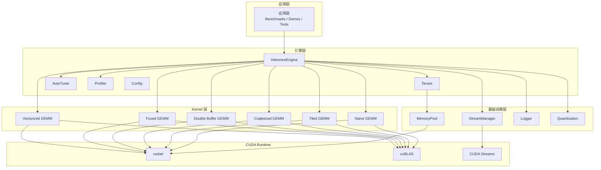
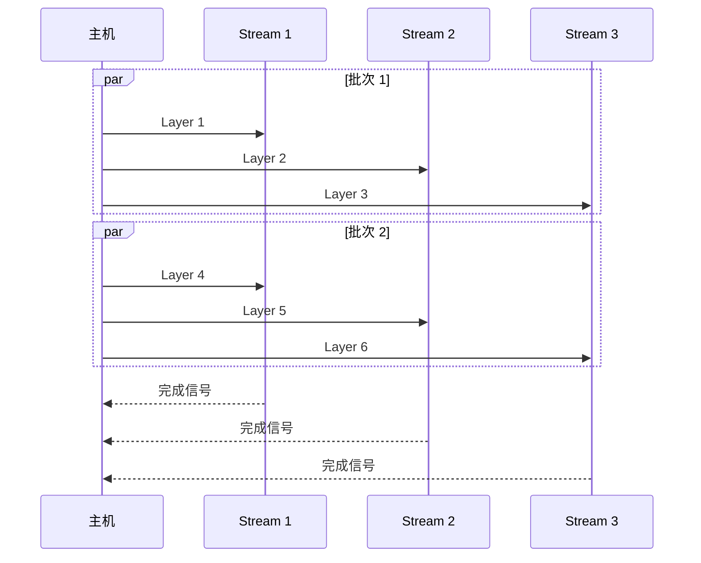
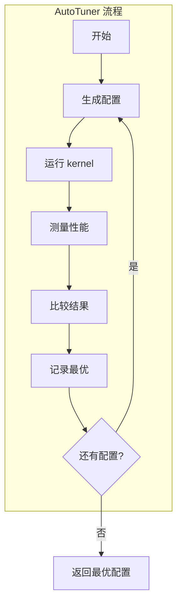
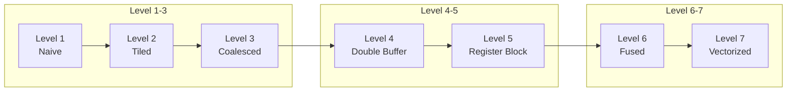

# 推理引擎设计

本文档详细解析 04-Inference Engine 模块的架构设计、核心组件实现以及性能优化策略。

## 整体架构

### 分层设计



### 核心组件职责

| 组件 | 职责 | 关键特性 |
|------|------|----------|
| InferenceEngine | 推理协调器 | 权重加载、前向传播、层管理 |
| Tensor | GPU 张量抽象 | N 维数组、移动语义、自动释放 |
| MemoryPool | 内存池管理 | 缓存分配、256 字节对齐、Best-fit 策略 |
| StreamManager | 流管理 | 多流并发、轮询分配、同步 |
| AutoTuner | 参数自动调优 | Kernel 参数搜索、性能记录 |
| Profiler | 性能分析 | 时间戳记录、开销统计 |

## 内存池设计

### 设计动机

频繁的 `cudaMalloc`/`cudaFree` 会带来巨大开销：

```
cudaMalloc 延迟: ~10-50 μs
cudaFree 延迟: ~5-20 μs
推理批次: 每秒数千次
```

### 实现架构

```mermaid
flowchart TB
    subgraph MemoryPool
        REQ[分配请求]
        CACHE[缓存块列表]
        GPU[GPU 内存]
    end
    
    REQ -->|查找| CACHE
    
    alt 命中缓存
        CACHE -->|返回| PTR[指针]
    else 未命中
        CACHE -->|申请新块| GPU
        GPU -->|返回| PTR
    end
    
    subgraph 缓存块结构
        BLOCK[Block]
        SIZE[大小: 256B 对齐]
        INUSE[使用状态]
        NEXT[下一块指针]
    end
    
    BLOCK --> SIZE & INUSE & NEXT
```

### 核心实现

```cpp
class MemoryPool {
public:
    // 分配内存（256 字节对齐）
    void* allocate(size_t size) {
        size = align256(size);
        
        // Best-fit 搜索
        Block* best = find_best_fit(size);
        if (best) {
            best->in_use = true;
            return best->ptr;
        }
        
        // 创建新块
        return create_block(size);
    }
    
    // 释放内存（归还缓存）
    void deallocate(void* ptr) {
        Block* block = find_block(ptr);
        if (block) {
            block->in_use = false;
            // 可选：合并相邻空闲块
        }
    }
    
private:
    struct Block {
        void* ptr;
        size_t size;
        bool in_use;
        Block* next;
    };
    
    Block* free_list_ = nullptr;
    size_t align256(size_t n) { return (n + 255) & ~255; }
};
```

### RAII 包装

```cpp
class PooledMemory {
public:
    PooledMemory(MemoryPool& pool, size_t size)
        : pool_(pool), ptr_(pool.allocate(size)) {}
    
    ~PooledMemory() { pool_.deallocate(ptr_); }
    
    // 移动语义
    PooledMemory(PooledMemory&& other) noexcept
        : pool_(other.pool_), ptr_(other.ptr_) {
        other.ptr_ = nullptr;
    }
    
    // 禁止拷贝
    PooledMemory(const PooledMemory&) = delete;
    
    void* get() const { return ptr_; }
    
private:
    MemoryPool& pool_;
    void* ptr_;
};
```

## 流管理设计

### 多流并发



### 轮询分配策略

```cpp
class StreamManager {
public:
    StreamManager(size_t num_streams) {
        for (size_t i = 0; i < num_streams; i++) {
            cudaStream_t stream;
            cudaStreamCreate(&stream);
            streams_.push_back(stream);
        }
    }
    
    // 轮询获取流
    cudaStream_t get_stream() {
        return streams_[next_stream_++ % streams_.size()];
    }
    
    // 等待所有流完成
    void synchronize_all() {
        for (auto& s : streams_) {
            cudaStreamSynchronize(s);
        }
    }
    
    ~StreamManager() {
        for (auto& s : streams_) {
            cudaStreamDestroy(s);
        }
    }
    
private:
    std::vector<cudaStream_t> streams_;
    size_t next_stream_ = 0;
};
```

## Tensor 设计

### N 维张量抽象

```cpp
template<typename T>
class Tensor {
public:
    // 构造
    Tensor(std::vector<size_t> shape)
        : shape_(std::move(shape)),
          data_(allocate(size())) {}
    
    // 移动语义
    Tensor(Tensor&& other) noexcept
        : shape_(std::move(other.shape_)),
          data_(other.data_) {
        other.data_ = nullptr;
    }
    
    Tensor& operator=(Tensor&& other) noexcept {
        if (this != &other) {
            release();
            shape_ = std::move(other.shape_);
            data_ = other.data_;
            other.data_ = nullptr;
        }
        return *this;
    }
    
    // 禁止拷贝
    Tensor(const Tensor&) = delete;
    Tensor& operator=(const Tensor&) = delete;
    
    // 访问器
    T* data() { return data_; }
    const T* data() const { return data_; }
    size_t size() const {
        return std::accumulate(shape_.begin(), shape_.end(),
                               1, std::multiplies<>());
    }
    
    // 维度操作
    Tensor reshape(std::vector<size_t> new_shape);
    Tensor slice(const std::vector<std::pair<size_t, size_t>>& ranges);
    
    ~Tensor() { release(); }
    
private:
    std::vector<size_t> shape_;
    T* data_;
    
    T* allocate(size_t n) {
        void* ptr;
        cudaMalloc(&ptr, n * sizeof(T));
        return static_cast<T*>(ptr);
    }
    
    void release() {
        if (data_) {
            cudaFree(data_);
            data_ = nullptr;
        }
    }
};
```

## AutoTuner 设计

### 参数搜索策略



### 实现示例

```cpp
class AutoTuner {
public:
    struct GemmConfig {
        int BM, BN, BK;
        int TM, TN;
    };
    
    GemmConfig tune(int M, int N, int K) {
        GemmConfig best_config;
        float best_time = INFINITY;
        
        // 参数空间
        std::vector<GemmConfig> configs = generate_configs();
        
        for (const auto& cfg : configs) {
            // 预热
            run_gemm<M, N, K>(cfg, 3);
            
            // 测量
            auto time = benchmark([&]() {
                run_gemm<M, N, K>(cfg, 100);
            });
            
            if (time < best_time) {
                best_time = time;
                best_config = cfg;
            }
        }
        
        // 缓存结果
        cache_[{M, N, K}] = best_config;
        return best_config;
    }
    
private:
    std::map<std::tuple<int,int,int>, GemmConfig> cache_;
    
    std::vector<GemmConfig> generate_configs() {
        return {
            {64, 64, 8, 4, 4},
            {128, 128, 8, 8, 8},
            {128, 128, 16, 8, 8},
            {64, 64, 16, 4, 4},
            // ... 更多配置
        };
    }
};
```

## Kernel 层级演进

### 七级优化阶梯



### Kernel 选择逻辑

```cpp
enum class GemmLevel {
    Naive = 1,
    Tiled = 2,
    Coalesced = 3,
    DoubleBuffer = 4,
    RegisterBlocked = 5,
    Fused = 6,
    Vectorized = 7
};

void InferenceEngine::gemm(const Tensor& A, const Tensor& B, Tensor& C,
                           GemmLevel level) {
    switch (level) {
        case GemmLevel::Naive:
            gemm_naive<<<...>>>(A.data(), B.data(), C.data(), ...);
            break;
        case GemmLevel::Tiled:
            gemm_tiled<128, 128, 8><<<...>>>(...);
            break;
        case GemmLevel::Vectorized:
            gemm_vectorized<...><<<...>>>(...);
            break;
    }
}
```

## 性能调优指南

### 内存带宽优化

| 优化技术 | 效果 | 适用场景 |
|----------|------|----------|
| Shared Memory 分块 | 16× 访问减少 | 所有 GEMM |
| Bank Conflict 消除 | +25% 性能 | 大矩阵分块 |
| 双缓冲 | +20% 性能 | 计算密集型 |
| 向量化加载 | +15% 性能 | 连续内存访问 |

### 计算优化

| 优化技术 | 效果 | 适用场景 |
|----------|------|----------|
| 寄存器分块 | +40% 性能 | 所有 GEMM |
| Tensor Core | 4× 性能 | SM70+ GPU |
| Kernel 融合 | +30% 性能 | 连续操作 |
| 算子融合 | +50% 性能 | 推理场景 |

## 线程安全

### 并发访问控制

```cpp
class ThreadSafeEngine {
public:
    Tensor forward(const Tensor& input) {
        std::lock_guard<std::mutex> lock(mutex_);
        return engine_.forward(input);
    }
    
private:
    InferenceEngine engine_;
    std::mutex mutex_;
};
```

### 组件线程安全性

| 组件 | 线程安全 | 说明 |
|------|----------|------|
| InferenceEngine | 否 | 需外部同步 |
| Tensor | 是 | 无共享状态 |
| MemoryPool | 是 | 内部锁保护 |
| StreamManager | 是 | 原子计数器 |
| AutoTuner | 是 | 结果缓存线程安全 |

---

## 总结

04-Inference Engine 展示了从基础 CUDA kernel 到生产级推理引擎的完整架构：

1. **分层设计**：清晰的职责划分，易于理解和扩展
2. **RAII 资源管理**：所有 GPU 资源自动管理，无泄漏
3. **内存池**：消除分配开销，提升吞吐
4. **多流并发**：最大化 GPU 利用率
5. **自动调优**：适应不同硬件和输入尺寸
6. **渐进式优化**：七级 kernel 演进路径

这套架构可作为实际推理系统的参考模板。
