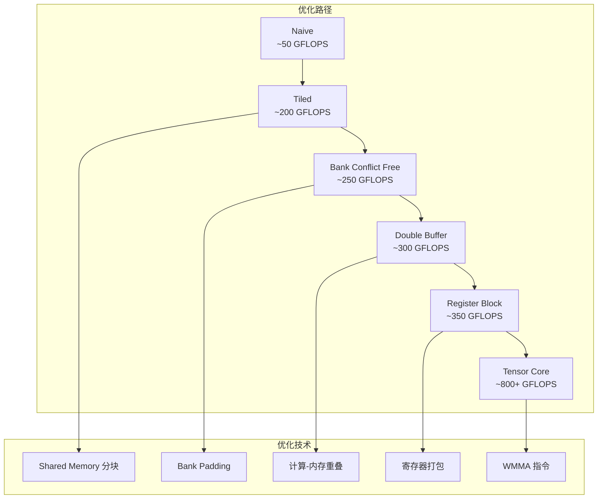
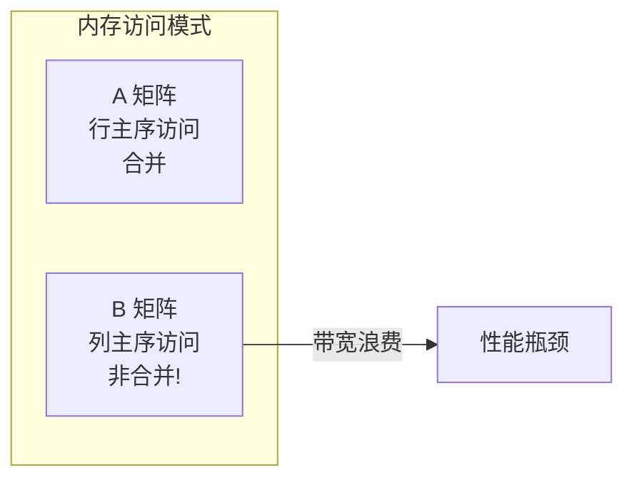
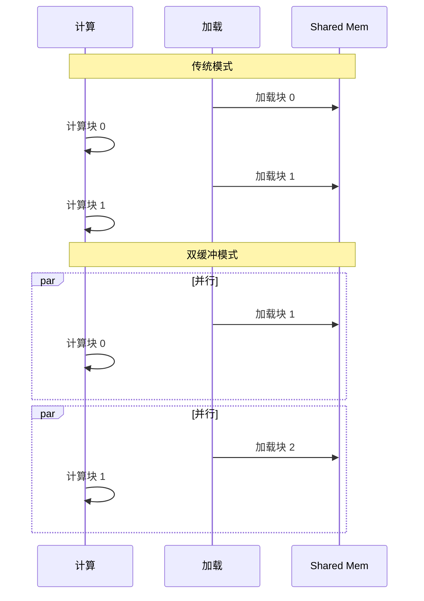

# SGEMM 优化旅程

本文档记录从最基础的 SGEMM 实现到高性能 Tensor Core 版本的完整优化路径。每一步都包含原理分析、代码实现和性能对比。

## 优化阶梯概览



## Level 1: Naive 实现

### 原理

最直接的矩阵乘法实现，每个线程计算输出矩阵的一个元素：

```
C[i,j] = Σ A[i,k] * B[k,j]  for k = 0 to K-1
```

### 实现

```cpp
__global__ void sgemm_naive(int M, int N, int K,
                            const float* A, const float* B, float* C) {
    int i = blockIdx.y * blockDim.y + threadIdx.y;
    int j = blockIdx.x * blockDim.x + threadIdx.x;
    
    if (i < M && j < N) {
        float sum = 0.0f;
        for (int k = 0; k < K; k++) {
            sum += A[i * K + k] * B[k * N + j];
        }
        C[i * N + j] = sum;
    }
}
```

### 性能分析

| 指标 | 数值 |
|------|------|
| 全局内存访问 | 2 × M × N × K 次 |
| 访问模式 | 非合并（B 矩阵） |
| 性能 | ~50 GFLOPS |
| 相对 cuBLAS | ~5% |

### 瓶颈



---

## Level 2: Shared Memory 分块

### 原理

将矩阵分块到 Shared Memory，利用数据局部性：

- 每个线程块计算 `BM × BN` 的输出块
- 分块从全局内存加载到 Shared Memory
- 线程在 Shared Memory 中计算，减少全局访问

### 实现

```cpp
template<int BM, int BN, int BK>
__global__ void sgemm_tiled(int M, int N, int K,
                            const float* A, const float* B, float* C) {
    __shared__ float As[BM][BK];
    __shared__ float Bs[BK][BN];
    
    int tx = threadIdx.x, ty = threadIdx.y;
    int i = blockIdx.y * BM + ty;
    int j = blockIdx.x * BN + tx;
    
    float sum = 0.0f;
    
    for (int k = 0; k < K; k += BK) {
        // 协作加载到 Shared Memory
        As[ty][tx] = A[i * K + k + tx];
        Bs[ty][tx] = B[(k + ty) * N + j];
        __syncthreads();
        
        // 在 Shared Memory 中计算
        for (int kk = 0; kk < BK; kk++) {
            sum += As[ty][kk] * Bs[kk][tx];
        }
        __syncthreads();
    }
    
    if (i < M && j < N) {
        C[i * N + j] = sum;
    }
}
```

### 性能分析

| 指标 | Naive | Tiled |
|------|-------|-------|
| 全局访问次数 | 2MNK | 2MNK/(BM×BN) × (BM + BN) |
| 性能 | ~50 GFLOPS | ~200 GFLOPS |
| 加速比 | 1× | 4× |

### 关键洞察

```
全局访问减少比例 ≈ (BM × BN) / (BM + BN)

对于 BM=BN=32: 减少约 16 倍
```

---

## Level 3: Bank Conflict 消除

### 问题

Shared Memory 有 32 个 bank，连续 4 字节映射到不同 bank：

```mermaid
flowchart TB
    subgraph Bank 冲突场景
        A[As[ty][0..BK-1]] -->|同一行| B[访问同一 bank]
        B -->|串行化| C[性能下降]
    end
```

### 解决方案：Padding

```cpp
// 添加一列填充，避免 bank 冲突
template<int BM, int BN, int BK>
__global__ void sgemm_bank_free(...) {
    // 关键：BK + 1 消除 bank 冲突
    __shared__ float As[BM][BK + 1];
    __shared__ float Bs[BK + 1][BN];
    
    // 其余代码相同...
}
```

### Bank 映射分析

```
地址 → Bank: (地址 / 4) % 32

无填充:
  As[0][0] → Bank 0
  As[1][0] → Bank 0  ← 冲突！

有填充 (BK+1):
  As[0][0] → Bank 0
  As[1][0] → Bank (BK+1) % 32  ← 无冲突
```

### 性能提升

| 版本 | 性能 | 提升 |
|------|------|------|
| Tiled | ~200 GFLOPS | - |
| Bank Conflict Free | ~250 GFLOPS | +25% |

---

## Level 4: 双缓冲

### 原理

将计算与内存加载重叠：



### 实现

```cpp
template<int BM, int BN, int BK>
__global__ void sgemm_double_buffer(...) {
    // 双倍 Shared Memory
    __shared__ float As[2][BM][BK + 1];
    __shared__ float Bs[2][BK + 1][BN];
    
    float sum = 0.0f;
    int load_phase = 0, compute_phase = 1;
    
    // 预加载第一块
    load_tile<0>(A, B, As, Bs, ...);
    __syncthreads();
    
    for (int k = BK; k < K; k += BK) {
        // 交换缓冲区
        load_phase = 1 - load_phase;
        compute_phase = 1 - compute_phase;
        
        // 并行：加载下一块 + 计算当前块
        load_tile(A, B, As, Bs, k, load_phase);
        compute_tile(As, Bs, sum, compute_phase);
        __syncthreads();
    }
    
    // 计算最后一块
    compute_tile(As, Bs, sum, load_phase);
    
    C[i * N + j] = sum;
}
```

### 性能提升

| 版本 | 性能 | 提升 |
|------|------|------|
| Bank Conflict Free | ~250 GFLOPS | - |
| Double Buffer | ~300 GFLOPS | +20% |

---

## Level 5: 寄存器分块

### 原理

每个线程计算 `TM × TN` 个输出元素，最大化寄存器利用率：

```cpp
// 每个线程持有 TM×TN 个累加器
float regC[TM][TN] = {0};

// 每个线程持有 TM 个 A 元素
float regA[TM];

// 每个线程持有 TN 个 B 元素
float regB[TN];
```

### 实现

```cpp
template<int BM, int BN, int BK, int TM, int TN>
__global__ void sgemm_register_block(...) {
    __shared__ float As[BM][BK + 1];
    __shared__ float Bs[BK][BN + 1];
    
    // 寄存器累加器
    float regC[TM][TN] = {0};
    
    int tx = threadIdx.x, ty = threadIdx.y;
    int threadRow = ty * TM;
    int threadCol = tx * TN;
    
    for (int k = 0; k < K; k += BK) {
        // 加载到 Shared Memory
        for (int i = 0; i < BM; i += TM) {
            for (int j = 0; j < BK; j++) {
                As[threadRow + i][j] = A[...];
            }
        }
        __syncthreads();
        
        // 计算使用寄存器
        for (int kk = 0; kk < BK; kk++) {
            // 加载 A 到寄存器
            for (int i = 0; i < TM; i++) {
                regA[i] = As[threadRow + i][kk];
            }
            // 加载 B 到寄存器
            for (int j = 0; j < TN; j++) {
                regB[j] = Bs[kk][threadCol + j];
            }
            // 矩阵乘法在寄存器中
            for (int i = 0; i < TM; i++) {
                for (int j = 0; j < TN; j++) {
                    regC[i][j] += regA[i] * regB[j];
                }
            }
        }
        __syncthreads();
    }
    
    // 写回全局内存
    for (int i = 0; i < TM; i++) {
        for (int j = 0; j < TN; j++) {
            C[...] = regC[i][j];
        }
    }
}
```

### 约束计算

```
线程数 = (BM/TM) × (BN/TN) ≤ 1024
Shared Mem = (BM×BK + BK×BN) × 4 ≤ 48KB
寄存器 = TM×TN + TM + TN + 开销 ≤ 255

典型配置: BM=128, BN=128, BK=8, TM=8, TN=8
→ 线程数 = 256
→ Shared Mem = 8KB
→ 寄存器 = 64 + 8 + 8 = 80 ✓
```

---

## Level 6: Tensor Core (WMMA)

### 原理

使用 Tensor Core 硬件加速矩阵乘法：

```mermaid
flowchart LR
    subgraph WMMA 操作
        A[16×16 矩阵 A] --> TC[Tensor Core]
        B[16×16 矩阵 B] --> TC
        C[16×16 累加器] --> TC
        TC --> D[16×16 结果]
    end
    
    Note: 单指令完成 16×16×16 = 4096 次乘加
```

### 实现

```cpp
#include <mma.h>
using namespace nvcuda::wmma;

template<int BM, int BN, int BK>
__global__ void sgemm_tensor_core(...) {
    // WMMA 累加器
    fragment<accumulator, 16, 16, 16, float> acc[BM/16][BN/16];
    
    // 初始化累加器
    for (int i = 0; i < BM/16; i++) {
        for (int j = 0; j < BN/16; j++) {
            fill_fragment(acc[i][j], 0.0f);
        }
    }
    
    for (int k = 0; k < K; k += BK) {
        // 加载 A 矩阵片段
        fragment<matrix_a, 16, 16, 16, half, row_major> a_frag;
        load_matrix_sync(a_frag, A + ..., 16);
        
        // 加载 B 矩阵片段
        fragment<matrix_b, 16, 16, 16, half, col_major> b_frag;
        load_matrix_sync(b_frag, B + ..., 16);
        
        // Tensor Core 计算
        mma_sync(acc[i][j], a_frag, b_frag, acc[i][j]);
    }
    
    // 存储结果
    store_matrix_sync(C + ..., acc[i][j], 16, mem_row_major);
}
```

### 性能对比

| 版本 | 性能 | 相对 cuBLAS |
|------|------|-------------|
| Naive | ~50 GFLOPS | 5% |
| Tiled | ~200 GFLOPS | 20% |
| Bank Conflict Free | ~250 GFLOPS | 25% |
| Double Buffer | ~300 GFLOPS | 30% |
| Register Block | ~350 GFLOPS | 35% |
| Tensor Core | ~800+ GFLOPS | 80%+ |

---

## 性能基准测试

<GemmPerformanceChart />

## 总结

SGEMM 优化遵循 **"减少全局访问 → 优化局部访问 → 利用硬件特性"** 的路径：

1. **Naive → Tiled**: 利用 Shared Memory 减少全局访问
2. **Tiled → Bank Free**: 消除 Shared Memory bank 冲突
3. **Bank Free → Double Buffer**: 隐藏内存延迟
4. **Double Buffer → Register Block**: 最大化寄存器利用
5. **Register Block → Tensor Core**: 利用专用硬件

每一步都针对特定的性能瓶颈，最终达到 cuBLAS 80%+ 的性能。
