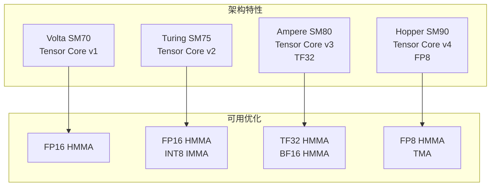

# TensorCraft Core 设计

TensorCraft Core (02-tensorcraft-core) 是一份**教学级设计研究**，主题是可复用 CUDA 算子库。本文描述的是设计模式；可执行头文件才是事实来源，文中的设计草图并不全部实现。

## 设计哲学

### Header-only 架构

```mermaid
flowchart TB
    subgraph 传统库
        SRC[源文件]
        HDR[头文件]
        LIB[编译产物 .so/.a]
        APP[应用程序]
    end
    
    SRC --> LIB
    HDR --> APP
    LIB --> APP
    
    subgraph Header-only
        HDR2[头文件]
        APP2[应用程序]
    end
    
    HDR2 -->|直接包含| APP2
    
    Note: 无需编译库，直接集成
```

### 核心优势

| 特性 | 传统库 | Header-only |
|------|--------|-------------|
| 集成复杂度 | 需编译链接 | 仅包含头文件 |
| 依赖管理 | 需安装依赖 | 零依赖 |
| 模板支持 | 受限 | 完全支持 |
| 编译时间 | 快 | 较慢 |
| 二进制大小 | 小 | 较大 |

## 目录结构

```
02-tensorcraft-core/
├── include/tensorcraft/
│   ├── core/                    # 核心基础设施
│   │   ├── cuda_check.hpp       # 错误检查宏
│   │   ├── features.hpp         # 特性检测
│   │   └── type_traits.hpp      # 类型萃取
│   ├── kernels/                 # Kernel 实现
│   │   ├── gemm.hpp             # GEMM 系列
│   │   ├── attention.hpp        # Attention 机制
│   │   ├── normalization.hpp    # LayerNorm/RMSNorm
│   │   ├── elementwise.hpp      # 逐元素操作
│   │   ├── softmax.hpp          # Softmax
│   │   ├── conv2d.hpp           # 2D 卷积
│   │   ├── sparse.hpp           # 稀疏操作
│   │   └── fusion.hpp           # 算子融合
│   └── memory/                  # 内存管理
│       ├── tensor.hpp           # 张量抽象
│       └── memory_pool.hpp      # 内存池
├── tests/                       # 单元测试
├── benchmarks/                  # 性能基准
├── python/                      # Python 绑定
└── CMakeLists.txt
```

## 多架构支持

### CUDA 架构枚举

```cpp
namespace tensorcraft {

enum class CudaArch {
    Volta = 70,       // SM_70: Volta
    Turing = 75,      // SM_75: Turing
    Ampere = 80,      // SM_80: A100
    Ampere86 = 86,    // SM_86: RTX 3090
    Ada = 89,         // SM_89: RTX 4090
    Hopper = 90       // SM_90: H100
};

// 运行时检测
CudaArch detect_arch() {
    int device;
    cudaGetDevice(&device);
    
    cudaDeviceProp prop;
    cudaGetDeviceProperties(&prop, device);
    
    return static_cast<CudaArch>(prop.major * 10 + prop.minor);
}

} // namespace tensorcraft
```

### 架构特定优化



### 条件编译

```cpp
#if defined(__CUDA_ARCH__)
    #if __CUDA_ARCH__ >= 800
        // Ampere+ 特定代码
        #define TC_HAS_BF16 1
        #define TC_HAS_TF32 1
    #endif
    #if __CUDA_ARCH__ >= 900
        // Hopper 特定代码
        #define TC_HAS_FP8 1
        #define TC_HAS_TMA 1
    #endif
#endif
```

## 统一错误处理

### 错误检查宏层级

```cpp
namespace tensorcraft {

// 基础检查：返回值
#define TC_CUDA_CHECK(call)                                          \
    do {                                                              \
        cudaError_t err = call;                                       \
        if (err != cudaSuccess) {                                     \
            throw CudaError(err, __FILE__, __LINE__, #call);          \
        }                                                             \
    } while (0)

// 最后错误检查：异步错误
#define TC_CUDA_CHECK_LAST()                                         \
    do {                                                              \
        cudaError_t err = cudaGetLastError();                         \
        if (err != cudaSuccess) {                                     \
            throw CudaError(err, __FILE__, __LINE__, "last error");   \
        }                                                             \
    } while (0)

// 同步检查：捕获异步错误（调试用）
#define TC_CUDA_SYNC_CHECK()                                         \
    do {                                                              \
        cudaError_t err = cudaDeviceSynchronize();                    \
        if (err != cudaSuccess) {                                     \
            throw CudaError(err, __FILE__, __LINE__, "sync");         \
        }                                                             \
    } while (0)

// 错误类
class CudaError : public std::runtime_error {
public:
    CudaError(cudaError_t err, const char* file, int line, const char* msg)
        : std::runtime_error(format_message(err, file, line, msg)),
          error_(err), file_(file), line_(line) {}
    
    cudaError_t error() const { return error_; }
    
private:
    static std::string format_message(cudaError_t err, 
                                      const char* file, 
                                      int line, 
                                      const char* msg) {
        return fmt::format("CUDA Error {} at {}:{}: {} ({})",
                          cudaGetErrorString(err), file, line, msg,
                          cudaGetErrorName(err));
    }
    
    cudaError_t error_;
    const char* file_;
    int line_;
};

} // namespace tensorcraft
```

### 使用示例

```cpp
#include <tensorcraft/core/cuda_check.hpp>

void example() {
    void* ptr;
    TC_CUDA_CHECK(cudaMalloc(&ptr, 1024));  // 检查返回值
    
    // ... kernel 启动 ...
    
    TC_CUDA_CHECK_LAST();  // 检查启动错误
    
    // 调试时捕获异步错误
    TC_CUDA_SYNC_CHECK();
}
```

## GEMM 接口设计

### 版本枚举

```cpp
namespace tensorcraft {

enum class GemmVersion {
    Naive,          // 基础实现
    Tiled,          // Shared Memory 分块
    DoubleBuffer,   // 双缓冲
    // Tensor Core / 自动调优故意不放进通用枚举；
    // WMMA 通过 launch_gemm_wmma(half*, half*, float*) 单独暴露。
};

} // namespace tensorcraft
```

### 统一接口

```cpp
namespace tensorcraft {

template<typename T>
class Gemm {
public:
    // 配置
    struct Config {
        GemmVersion version = GemmVersion::Tiled;
        int BM = 128, BN = 128, BK = 8;  // 分块大小
        int TM = 8, TN = 8;               // 线程分块
        cudaStream_t stream = 0;          // CUDA 流
    };
    
    // 执行 GEMM: C = alpha * A * B + beta * C
    void operator()(const Tensor<T>& A,
                    const Tensor<T>& B,
                    Tensor<T>& C,
                    const Config& config = {},
                    float alpha = 1.0f,
                    float beta = 0.0f);
    
private:
    // 版本分发
    template<GemmVersion V>
    void dispatch(const Tensor<T>& A, const Tensor<T>& B, Tensor<T>& C, ...);
    
    // 自动选择仅为设计草图，当前头文件没有实现 auto-tune
    GemmVersion select_best(int M, int N, int K);
};

} // namespace tensorcraft
```

### 模板特化

```cpp
// Naive 版本
template<>
void Gemm<float>::dispatch<GemmVersion::Naive>(
    const Tensor<float>& A,
    const Tensor<float>& B,
    Tensor<float>& C,
    const Config& config) {
    
    dim3 block(16, 16);
    dim3 grid((C.cols() + 15) / 16, (C.rows() + 15) / 16);
    
    kernels::sgemm_naive<<<grid, block, 0, config.stream>>>(
        A.rows(), B.cols(), A.cols(),
        A.data(), B.data(), C.data()
    );
}

// Tensor Core 设计草图（当前实现是独立的 launch_gemm_wmma，
// 而不是 GemmVersion 枚举成员）
template<>
void Gemm<half>::dispatch<GemmVersion::TensorCore>(
    const Tensor<half>& A,
    const Tensor<half>& B,
    Tensor<half>& C,
    const Config& config) {
    
    // WMMA kernel
    kernels::sgemm_wmma<128, 128, 16><<<...>>>(
        A.rows(), B.cols(), A.cols(),
        A.data(), B.data(), C.data()
    );
}
```

## 算子融合

### 融合模式

```mermaid
flowchart LR
    subgraph 未融合
        A1[输入] --> GEMM1[GEMM]
        GEMM1 --> BIAS[Bias Add]
        BIAS --> ACT[Activation]
        ACT --> OUT1[输出]
    end
    
    subgraph 融合
        A2[输入] --> FUSED[Fused GEMM+Bias+Act]
        FUSED --> OUT2[输出]
    end
    
    Note: 融合减少一次全局内存访问
```

### 融合接口

```cpp
namespace tensorcraft::fusion {

template<typename T>
struct FusedGemmConfig {
    bool add_bias = false;
    bool apply_relu = false;
    bool apply_gelu = false;
    // ... 更多融合选项
};

template<typename T>
void fused_gemm_bias_act(const Tensor<T>& A,
                         const Tensor<T>& B,
                         const Tensor<T>& bias,  // 可选
                         Tensor<T>& C,
                         const FusedGemmConfig<T>& config);

} // namespace tensorcraft::fusion
```

### Kernel 实现

```cpp
template<int BM, int BN, int BK, bool HAS_BIAS, bool HAS_RELU>
__global__ void fused_gemm_bias_act_kernel(
    const float* __restrict__ A,
    const float* __restrict__ B,
    const float* __restrict__ bias,
    float* __restrict__ C,
    int M, int N, int K) {
    
    // ... GEMM 计算 ...
    
    // 融合 Bias
    if constexpr (HAS_BIAS) {
        sum += bias[j];
    }
    
    // 融合 ReLU
    if constexpr (HAS_RELU) {
        sum = fmaxf(0.0f, sum);
    }
    
    C[i * N + j] = sum;
}
```

## Python 绑定

### pybind11 集成

```cpp
// python/bindings.cpp
#include <pybind11/pybind11.h>
#include <pybind11/numpy.h>
#include <tensorcraft/tensorcraft.hpp>

namespace py = pybind11;

PYBIND11_MODULE(tensorcraft, m) {
    m.doc() = "TensorCraft Core - CUDA kernel library";
    
    // Tensor 类
    py::class_<Tensor<float>>(m, "TensorF32")
        .def(py::init<std::vector<size_t>>())
        .def("data", [](Tensor<float>& t) {
            return py::array_t<float>(t.shape(), t.data(), py::none());
        })
        .def("shape", &Tensor<float>::shape);
    
    // GEMM
    py::class_<Gemm<float>>(m, "GemmF32")
        .def(py::init<>())
        .def("__call__", &Gemm<float>::operator());
    
    // 便捷函数
    m.def("matmul", [](py::array_t<float> a, py::array_t<float> b) {
        // NumPy 数组 → Tensor
        auto A = from_numpy(a);
        auto B = from_numpy(b);
        auto C = Tensor<float>({A.rows(), B.cols()});
        
        Gemm<float>()(A, B, C);
        return to_numpy(C);
    });
}
```

### Python 使用示例

```python
import tensorcraft as tc
import numpy as np

# 创建张量
A = tc.TensorF32([1024, 512])
B = tc.TensorF32([512, 768])

# GEMM
gemm = tc.GemmF32()
C = gemm(A, B)

# 或使用便捷函数
A_np = np.random.randn(1024, 512).astype(np.float32)
B_np = np.random.randn(512, 768).astype(np.float32)
C_np = tc.matmul(A_np, B_np)
```

## 测试策略

### GoogleTest 框架

```cpp
#include <gtest/gtest.h>
#include <tensorcraft/kernels/gemm.hpp>

class GemmTest : public ::testing::Test {
protected:
    void SetUp() override {
        // 初始化 cuBLAS 用于验证
        cublasCreate(&handle_);
    }
    
    void TearDown() override {
        cublasDestroy(handle_);
    }
    
    // 正确性验证
    void verify_correctness(const Tensor<float>& C_test,
                           const Tensor<float>& C_ref) {
        auto diff = max_abs_diff(C_test, C_ref);
        EXPECT_LT(diff, 1e-5);
    }
    
    cublasHandle_t handle_;
};

TEST_F(GemmTest, NaiveCorrectness) {
    auto A = random_tensor<float>(128, 64);
    auto B = random_tensor<float>(64, 256);
    auto C_test = Tensor<float>({128, 256});
    auto C_ref = Tensor<float>({128, 256});
    
    // 测试版本
    Gemm<float> gemm;
    gemm(A, B, C_test, {.version = GemmVersion::Naive});
    
    // 参考版本 (cuBLAS)
    cublas_gemm(handle_, A, B, C_ref);
    
    verify_correctness(C_test, C_ref);
}

TEST_F(GemmTest, TensorCorePerformanceDesignSketch) {
    // 设计草图，不是仓库内可直接运行的测试
    auto A = random_tensor<half>(4096, 4096);
    auto B = random_tensor<half>(4096, 4096);
    auto C = Tensor<half>({4096, 4096});
    
    Gemm<half> gemm;
    
    auto time = benchmark([&]() {
        launch_gemm_wmma(A.data(), B.data(), C_float.data(), 4096, 4096, 4096);
    });
    
    double gflops = 2.0 * 4096 * 4096 * 4096 / time / 1e9;
    std::cout << "Performance: " << gflops << " GFLOPS\n";
}
```

---

## 总结

TensorCraft Core 展示了在动手做生产级 CUDA 算子库之前值得学习的设计模式：

1. **Header-only**：零依赖集成，直接包含使用
2. **多架构支持**：从 Volta 到 Hopper 的完整支持
3. **统一错误处理**：三层宏检查，清晰的错误信息
4. **版本枚举**：运行时选择不同实现
5. **算子融合**：减少内存访问，提升性能
6. **Python 绑定**：无缝集成 Python 生态
7. **完善测试**：正确性验证 + 性能基准

这套设计可作为实际算子库开发的参考模板。
